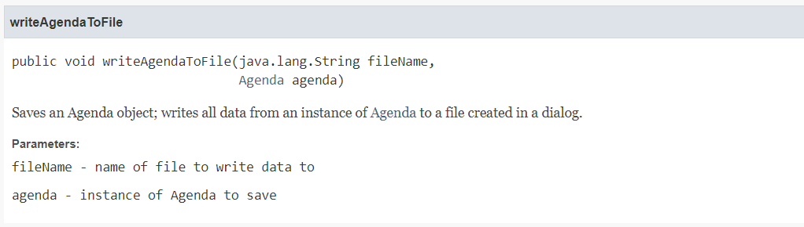

#Individueel Assignment
### Berend de Groot 2166496 TI 1.3 A3

In dit document kunt u reflecties vinden van mij op mijn eigen werk.
---
Dit document is bedoeld om een eerste indruk
te geven aan anderen wat ik heb gedaan en waarom, maar is **NIET** bedoeld om een compleet beeld te verschaffen aan de lezer
en mag dan ook niet gebruikt worden als naslagwerk buiten de individuele assignment van de proftaak van Avans Hogeschool.

##Week 3
#### Reflectie
In week 3 hebben we gewerkt aan het ontwerp van de AgendaModule 
van de proftaak. Ik heb hele dagen gewerkt aan het herstructureren van de code;
ik heb veel tijd besteed aan het zo simpel en overzichtelijk mogelijk maken van
onze software. Dit heb ik gedaan omdat:
* Het oplossen van bugs hierdoor verbijsterend snel gaat. De code is goed in
functies onderverdeeld en klassen delen een bepaalde structuur waardoor
het zoeken naar de regels die jij wilt vinden kinderspel is.
* Het optimaliseren van de software eenvoudig is. Klassen hebben vrijwel allemaal
één eigen functie, waardoor het bij het lezen van alle code
makkelijk is om verbeterpunten te spotten.
* Dit het werktempo bevordert van onze projectgroep.
* In theorie nieuwe werknemers op deze manier vrijwel gelijk aan het werk kunnen
gaan, ondanks dat ze niet aanwezig waren bij het schrijven van de rest van
het programma. [^1]

[^1]: Omdat er in het bedrijfsleven nu eenmaal snel en efficient gewerkt 
moet worden moeten andere mensen je code in een oogopslag kunnen begrijpen.

Dit is dan ook de reden dat ik van de groep eis documentatie te schrijven
bij de code. Wij maken gebruik van JavaDoc, wat er als volgt uit ziet in
onze code:
```
    /**
     * Saves an Agenda object; writes all data from an instance of
     * <a href="{@docRoot}/FestivalPlanner/Agenda/Agenda.html">Agenda</a> to a file created
     * in a dialog.
     * @param fileName  name of file to write data to
     * @param agenda  instance of Agenda to save
     */
    public void writeAgendaToFile(String fileName, Agenda agenda){
        try(ObjectOutputStream output = new ObjectOutputStream(new FileOutputStream(fileName))){
            output.writeObject(new Agenda(agenda.getName(), agenda.getShows()));
        } catch (Exception e){
            showExceptionPopUp(e);
        }
    }
```

En als volgt als gegenereerde documentatie (in html formaat):


Om een voorbeeld te geven van de structuur in de code, zal ik uitleggen hoe onze GUI klassen werken.
#####GUI Ontwerp
Al onze GUI klassen overerven van AbstractGUI, een abstracte klasse die zelf overerfd van AbstractDialogPopUp.
AbstractDialogPopUp bevat methodes die een PopUp venster openen. Om deze methodes in elke GUI te kunnen gebruiken
hebben we besloten om elke GUI klasse deze te laten overerven.
```
public abstract class AbstractGUI extends AbstractDialogPopUp {
    protected final int HBOX_SPACING = 5;
    protected final int VBOX_SPACING = 5;
    protected final int GRIDPANE_HGAP = 10;
    protected final int GRIDPANE_VGAP = 10;

    private ResourceBundle messages = LanguageHandler.getMessages();

    protected GridPane gridPane = new GridPane();
    protected HBox buttonHBox = new HBox();
    Button applyButton = new Button(messages.getString("apply"));
    protected Button closeButton = new Button(messages.getString("close"));

    /**
     * Runs initialisation methods and sets general stage settings.
     */
    public abstract void load();

    /**
     * Sets the values, alignment and spacing and children on initialisation.
     * Finally, the method setups the main layout, rarely anything else than a <code>GridPane</code>.
     */
    public abstract void setup();

    /**
     * Sets EventHandling of JavaFX <code>Nodes</code>. Mostly <code>setOnAction</code>s.
     */
    public abstract void actionHandlingSetup();
}
```
---
Nu ga ik de code stukje voor stukje uitleggen.

Als eerste de attributen:
```
    protected final int HBOX_SPACING = 5;
    protected final int VBOX_SPACING = 5;
    protected final int GRIDPANE_HGAP = 10;
    protected final int GRIDPANE_VGAP = 10;
```
Dit zijn waardes die we gebruiken voor wat JavaFX componenten om ervoor te zorgen dat ons programma
consequent is qua uiterlijk. Er zijn bepaalde onderdelen die afwijken van deze waardes. Je kan dit
dus zien als een soort van standaard-waarde.
---
```
    private ResourceBundle messages = LanguageHandler.getMessages();
```
Dit gebruiken we om meerdere talen te ondersteunen. Dit zal in de toekomst waarschijnlijk anders afgehandeld worden;
nu is dit private en wordt dit alleen voor deze klasse gebruikt, maar dit kan efficienter en zal dus anders moeten.
---
```
    protected GridPane gridPane = new GridPane();
    protected HBox buttonHBox = new HBox();
    Button applyButton = new Button(messages.getString("apply"));
    protected Button closeButton = new Button(messages.getString("close"));
```
Dit zijn componenten die de meeste GUI klassen gebruiken. Op deze manier hoeven wij deze knoppen niet
te initialiseren in elke klasse, wat ons ruimte bespaard.
---
Nu komen we bij de methodes... Nu wordt het leuk!

```
    public abstract void load();
```
In deze methode roepen we de andere methoden (in de meeste gevallen alleen setup() en actionHandlingSetup())
aan, en declareren we de waarden van de Stage (zoals titel, hoogte, of de grootte instelbaar is etc.).
---
```
    public abstract void setup();
```
In deze methode declareren we de volgende waarden:
* Initialisatie van waarden van elementen gebruikt in de klasse. Dit kan bijvoorbeeld een tekstveld vullen met
de naam van een podium zijn als je podia gaat aanpassen.
* Uitlijning en spatiëring <sup>(ja, dit is een woord)</sup> van elementen gebruikt in de klasse.
Dit kan bijvoorbeeld te spatiëring van een VBox zijn.
* Knopinfo (Tooltips) voor elementen. Op het moment van schrijven wordt dit alleen in de PreferencesGUI klasse gedaan.
* Het toevoegen van kinderen aan elementen gebruikt in de klasse. Dit kan bijvoorbeeld het toevoegen
van knoppen zijn in een HBox.
* Alles bij elkaar toevoegen. Dit is het toevoegen van kinderen aan een pane die als parameter wordt
meegegeven bij het initialiseren van de scene in de klasse.
```
    public abstract void actionHandlingSetup();
```
In deze methode stellen we in wat er moet gebeuren op het moment dat de gebruiker op een bepaalde manier
interacteert met grafische elementen in de scene. Het meest voorkomende voorbeeld hiervan is het klikken op knoppen.