# Individueel Assignment
### Berend de Groot 2166496 TI 1.3 A3

In dit document kunt mijn reflecties op mijn eigen werk.

---
Dit document is bedoeld om een eerste indruk
te geven aan anderen wat ik heb gedaan en waarom, maar is **NIET** bedoeld om een compleet beeld te verschaffen aan de lezer
en mag dan ook niet gebruikt worden als naslagwerk buiten de individuele assignment van de proftaak van Avans Hogeschool.

## Week 3
#### Reflectie
In week 3 hebben we gewerkt aan het ontwerp van de AgendaModule 
van de proftaak. Ik heb hele dagen gewerkt aan het herstructureren van de code;
ik heb veel tijd besteed aan het zo simpel en overzichtelijk mogelijk maken van
onze software. Dit heb ik gedaan omdat:
* Het oplossen van bugs hierdoor verbijsterend snel gaat. De code is goed in
functies onderverdeeld en klassen delen een bepaalde structuur waardoor
het zoeken naar de regels die jij wilt vinden kinderspel is.
* Het optimaliseren van de software eenvoudig is. Klassen hebben vrijwel allemaal
één eigen functie, waardoor het bij het lezen van alle code
makkelijk is om verbeterpunten te spotten.
* Dit het werktempo bevordert van onze projectgroep.
* In theorie nieuwe werknemers op deze manier vrijwel gelijk aan het werk kunnen
gaan, ondanks dat ze niet aanwezig waren bij het schrijven van de rest van
het programma.<sup>1</sup>

<sup>1: Omdat er in het bedrijfsleven nu eenmaal snel en efficient gewerkt 
moet worden moeten andere mensen je code in een oogopslag kunnen begrijpen.</sup>

Dit is dan ook de reden dat ik van de groep eis documentatie te schrijven
bij de code. Wij maken gebruik van JavaDoc, wat er als volgt uit ziet in
onze code:
```
    /**
     * Saves an Agenda object; writes all data from an instance of
     * <a href="{@docRoot}/FestivalPlanner/Agenda/Agenda.html">Agenda</a> to a file created
     * in a dialog.
     * @param fileName  name of file to write data to
     * @param agenda  instance of Agenda to save
     */
    public void writeAgendaToFile(String fileName, Agenda agenda){
        try(ObjectOutputStream output = new ObjectOutputStream(new FileOutputStream(fileName))){
            output.writeObject(new Agenda(agenda.getName(), agenda.getShows()));
        } catch (Exception e){
            showExceptionPopUp(e);
        }
    }
```

En als volgt als gegenereerde documentatie (in html formaat):
<br>


Om een voorbeeld te geven van de structuur in de code, zal ik uitleggen hoe onze GUI klassen werken.
##### GUI Ontwerp
Al onze GUI klassen overerven van AbstractGUI, een abstracte klasse die zelf overerfd van AbstractDialogPopUp.
AbstractDialogPopUp bevat methodes die een PopUp venster openen. Om deze methodes in elke GUI te kunnen gebruiken
hebben we besloten om elke GUI klasse deze te laten overerven.
```
public abstract class AbstractGUI extends AbstractDialogPopUp {
    protected final int HBOX_SPACING = 5;
    protected final int VBOX_SPACING = 5;
    protected final int GRIDPANE_HGAP = 10;
    protected final int GRIDPANE_VGAP = 10;

    private ResourceBundle messages = LanguageHandler.getMessages();

    protected GridPane gridPane = new GridPane();
    protected HBox buttonHBox = new HBox();
    Button applyButton = new Button(messages.getString("apply"));
    protected Button closeButton = new Button(messages.getString("close"));

    /**
     * Runs initialisation methods and sets general stage settings.
     */
    public abstract void load();

    /**
     * Sets the values, alignment and spacing and children on initialisation.
     * Finally, the method setups the main layout, rarely anything else than a <code>GridPane</code>.
     */
    public abstract void setup();

    /**
     * Sets EventHandling of JavaFX <code>Nodes</code>. Mostly <code>setOnAction</code>s.
     */
    public abstract void actionHandlingSetup();
}
```

---
Nu ga ik de code stukje voor stukje uitleggen.

Als eerste de attributen:
```
    protected final int HBOX_SPACING = 5;
    protected final int VBOX_SPACING = 5;
    protected final int GRIDPANE_HGAP = 10;
    protected final int GRIDPANE_VGAP = 10;
```
Dit zijn waardes die we gebruiken voor wat JavaFX componenten om ervoor te zorgen dat ons programma
consequent is qua uiterlijk. Er zijn bepaalde onderdelen die afwijken van deze waardes. Je kan dit
dus zien als een soort van standaard-waarde.

---
```
    private ResourceBundle messages = LanguageHandler.getMessages();
```
Dit gebruiken we om meerdere talen te ondersteunen. Dit zal in de toekomst waarschijnlijk anders afgehandeld worden;
nu is dit private en wordt dit alleen voor deze klasse gebruikt, maar dit kan efficienter en zal dus anders moeten.

---
```
    protected GridPane gridPane = new GridPane();
    protected HBox buttonHBox = new HBox();
    Button applyButton = new Button(messages.getString("apply"));
    protected Button closeButton = new Button(messages.getString("close"));
```
Dit zijn componenten die de meeste GUI klassen gebruiken. Op deze manier hoeven wij deze knoppen niet
te initialiseren in elke klasse, wat ons ruimte bespaard.

---
Nu komen we bij de methodes... Nu wordt het leuk!

```
    public abstract void load();
```
In deze methode roepen we de andere methoden (in de meeste gevallen alleen setup() en actionHandlingSetup())
aan, en declareren we de waarden van de Stage (zoals titel, hoogte, of de grootte instelbaar is etc.).

---
```
    public abstract void setup();
```
In deze methode declareren we de volgende waarden:
* Initialisatie van waarden van elementen gebruikt in de klasse. Dit kan bijvoorbeeld een tekstveld vullen met
de naam van een podium zijn als je podia gaat aanpassen.
* Uitlijning en spatiëring <sup>(ja, dit is een woord)</sup> van elementen gebruikt in de klasse.
Dit kan bijvoorbeeld te spatiëring van een VBox zijn.
* Knopinfo (Tooltips) voor elementen. Op het moment van schrijven wordt dit alleen in de PreferencesGUI klasse gedaan.
* Het toevoegen van kinderen aan elementen gebruikt in de klasse. Dit kan bijvoorbeeld het toevoegen
van knoppen zijn in een HBox.
* Alles bij elkaar toevoegen. Dit is het toevoegen van kinderen aan een pane die als parameter wordt
meegegeven bij het initialiseren van de scene in de klasse.
```
    public abstract void actionHandlingSetup();
```
In deze methode stellen we in wat er moet gebeuren op het moment dat de gebruiker op een bepaalde manier
interacteert met grafische elementen in de scene. Het meest voorkomende voorbeeld hiervan is het klikken op knoppen.


## Week 4
#### Reflectie
In week 4 heb ik de puntjes op de i gezet in onze software. Ik heb onder andere een knop gemaakt om de cache
te verwijderen, om shows qua tijden om te draaien door middel van een context menu, en een implementatie van de voorkeuren
omtrent kleuren. Verder heb ik natuurlijk gewerkt aan de documentatie en heb ik de code schoongehouden. Als
dit programmeerg-gebeuren niks wordt kan ik altijd nog schoonmaker worden!

#### Discord webhook
Ik streef er altijd naar de arbeidsethos van mijn groep te verhogen. Ik merkte dat de groep en ik soms
niet door hadden of iemand nou al wat gedaan had of niet, ondanks dat dit vaak verteld was. Ik moest dus een manier vinden
om te zorgen dat we dit makkelijk terug konden vinden...

Ik realiseerde me dat we dit al hadden; ik besefte me dat we al die tijd beschrijvingen bij commits geschreven hebben!
Wij gebruiken Discord voor de communicatie, dus moest ik ervoor zorgen dat we een kanaal hadden waar alleen
de commits van onze GitHub repository te zien is.

GitHub en Discord ondersteunen beide het gebruik van zogenaamde webhooks.<sup>2</sup> Ik heb deze toegevoegd aan de server, en het werkte meteen.
Dit heeft ons erg geholpen tijdens het project.
Dit is hoe het er uit kwam te zien:
<br>

Er staat een link bij naar de commit, waardoor we voor meer informatie alleen maar hoeven te klikken.

<sup>2: Een methode om het gedrag van een webpagina of webtoepassing te vergroten of te wijzigen met aangepaste callbacks.</sup>

#### Context Menu
De gebruiker kan nu meerdere shows selecteren door de knoppen shift en ctrl te gebruiken bij het klikken
van de linker-muisknop. Als er twee shows geselecteerd zijn kan de gebruiker op *swap* drukken. Hierdoor zullen de tijden van de shows
omgewisseld worden.
<br>
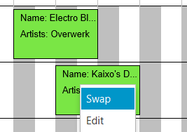

Verder kan de gebruiker de show aanpassen. Als de gebruiker één show geselecteerd heeft en op *edit* drukt zal er een nieuw venster
verschijnen op het scherm van de gebruiker.
<br>
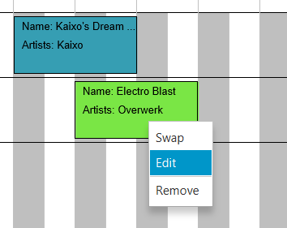
<br>
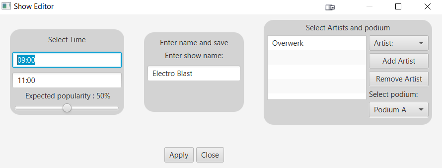

#### Voorkeuren - Kleuren
Ik heb natuurlijk een prachtig system geïntegreerd in ons programma om voorkeuren op te slaan in een *.XML*
bestand. Ik heb deze week gewerkt aan het ondersteunen van door de gebruiker geselecteerde kleuren.

Wij hebben twee verschillende kleuren nodig:
* Één kleur voor geselecteerde shows.
* Één kleur voor **NIET** geselecteerde shows.


Dit is hoe de standaard kleuren eruit zien:
<br>


Dit is hoe het voorkeuren scherm eruit ziet:
<br>
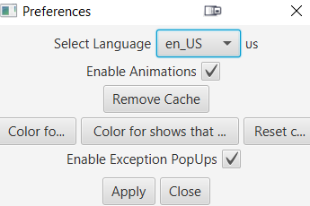

Om de gebruiker kleuren te laten selecteren heb ik een simpele GUI gemaakt die een ColorPicker opent.
Dit is hoe de ColorPicker GUI eruit ziet:
<br>
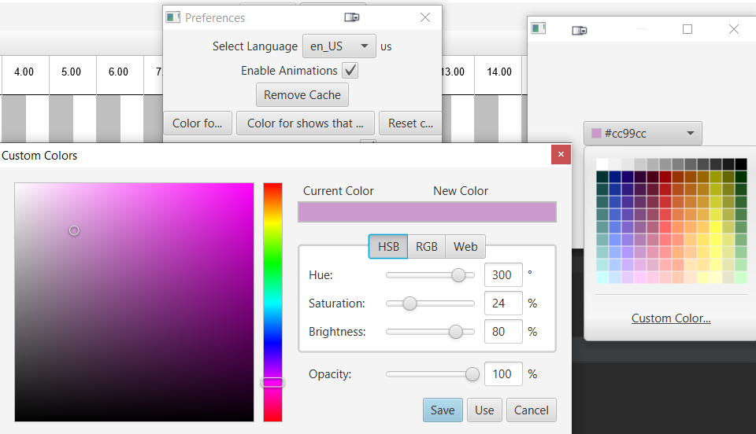

Dit is hoe de shows eruit zien nadat ik deze kleur geselecteerd heb:
<br>
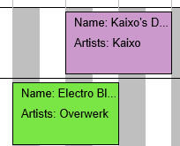

Dit is de code die de kleuren opslaat:
```
@NotNull
public static void setSelectedColor(javafx.scene.paint.Color colorInput){
    Color color = ColorConverter.fromJavaFXToAwt(colorInput);
    setPreference("selected_show_color", String.valueOf(color.getRGB()));
    Color.decode(getPreference("selected_show_color"));
}
```

Dit is de code die de kleuren zet naar de standaard waarden:
```
public static void restoreDefaultColors(){
    Color selectedColor = Color.getHSBColor(190 / 360f, .7f, .7f);
    Color unselectedColor = Color.getHSBColor(100 / 360f, .7f, .9f);

    setPreference("selected_show_color", String.valueOf(selectedColor.getRGB()));
    setPreference("unselected_show_color", String.valueOf(unselectedColor.getRGB()));
}
```

#### Cache Verwijderen
Jesse Krijgsman en ik hadden overlegd over het opslaan van afbeeldingen en hebben besloten dit te doen in de gebruiker
zijn / haar / hun / het (?) appdata. 


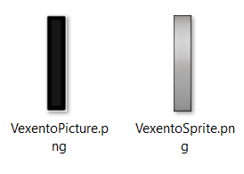

Dit is de code die de afbeeldingen schrijft:
```
try {
    File pictureFile = new File(System.getenv("LOCALAPPDATA") + "/A3/Resources/" + "AgendaName/" + this.toString() + "Picture.png");
    pictureFile.mkdirs();
    File spriteFile = new File(System.getenv("LOCALAPPDATA") + "/A3/Resources/" + "AgendaName/" + this.toString() + "Sprite.png");
    spriteFile.mkdirs();
    ImageIO.write(this.picture, "png", pictureFile);
    ImageIO.write(this.sprite, "png", spriteFile);
} catch (Exception e) {
    e.printStackTrace();
    AbstractDialogPopUp.showExceptionPopUp(e);
}
```

## Week 5
### Reflectie
In week 5 heb ik voornamelijk de bezem door de code geslingerd. Verder heb ik de structuur
voor de NPCs <small>(non-playable character(s))</small> toegevoegd en documentatie geschreven, bijgewerkt
gefixt (ten opzichte van de StyleGuide).

---
#### NPC-structuur
Ik heb klassen gemaakt en basis-functionaliteiten toegevoegd bij alles omtrent NPCs.
Een gedeelte hiervan was in samenwerking met Max van Gils.<br>

We zijn begonnen met het ontwerpen met de groep, en zijn daarna aan de slag gegaan.
Dit is het klassendiagram:

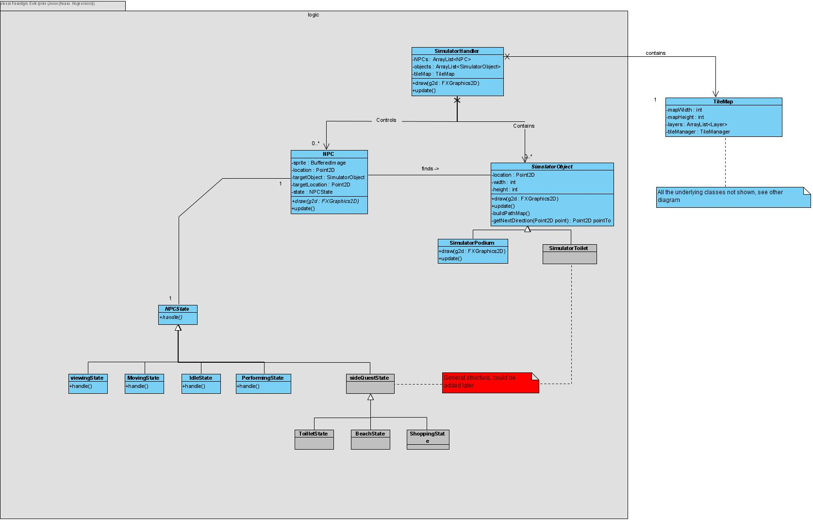

Dit zijn de klassen:


In deze afbeelding is ook goed te zien dat niet iedereen even duidelijk is in zijn/haar/hun/het (?) commits.
Dit is erg spijtig.

---
#### Schoonmaak
##### Kleuren-conversie
In onze software utiliseren wij uiteraard met regelmaat kleuren.
Om de kleuren aan te passen kan de gebruiker kleuren kiezen in het voorkeuren-scherm.
Dit scherm maakt gebruik van <i>javaFX</i> nodes, zoals een <i>ColorPicker</i>.
<br>
<sub>Zie week 4</sub>

We willen natuurlijk dat de kleuren dan gebruikt worden
bij het tekenen van die objecten waarvoor de gebruiker de kleuren instelt, maar daar zit een probleem:
<br>
JavaFX en AWT kleuren zijn niet direct compitabel met elkaar, waardoor we het moeten omrekenen.
Eerst deden we dit handmatig... zoals hieronder te zien.

Hieronder het bovenste gedeelte van een actie waarin we de kleur(en) instellen:
```
this.selectedColorButton.setOnAction(e -> {
        Stage stage = new Stage();
        java.awt.Color c = SaveSettingsHandler.getSelectedColor();
        ColorPicker colorPicker = new ColorPicker(Color.rgb(c.getRed(), c.getGreen(), c.getBlue(), c.getAlpha() / 255.0)); //TODO: show currently saved color.
```

Omdat we dit regelmatig moeten (en <b>zeker</b> zouden moeten kunnen)<sup>3</sup> heb
ik een klasse gemaakt die <i>static</i> methoden bevat om de kleuren te converteren.

Dit is de klasse om kleuren te converteren:
```
public class ColorConverter {

    public static Color fromAwtToJavaFX(java.awt.Color colorInput){
        return Color.rgb(colorInput.getRed(), colorInput.getGreen(), colorInput.getBlue(), colorInput.getAlpha() / 255.0);
    }

    public static java.awt.Color fromJavaFXToAwt(Color colorInput){
        return new java.awt.Color((float) colorInput.getRed(), (float) colorInput.getGreen(), (float) colorInput.getBlue(), (float) colorInput.getOpacity());
    }
}
```

<sup>3: Ik streef ernaar code zo dynamisch en duidelijk mogelijk te maken.</sup>

##### Geen abstracte DialogPopUp
Elke klasse die GUI elementen bevatte erfde direct of indirect over van AbstractDialogPopUp,
zodat alle PopUps aangeroepen konden worden in de klasse zelf. Dit is erg onnodig, want we
kunnen gewoon statische methoden schrijven waardoor we overal PopUps kunnen aanroepen.

Dus dit:
```
showExceptionPopUp(e);
```
Werd dit:
```
AbstractDialogPopUp.showExceptionPopUp(e);
```
Uiteraard klopt de naam van de klasse niet meer. Dit zal dan ook aangepast worden.

---
#### Documentatie
##### Uitbreiden
Soms veranderen klassen omdat ik het project herstructureer, of <i>vergeet</i> iemand
om documentatie te schrijven. Hierdoor kan het voorkomen dat je later documentatie maakt
en/of aanpast van code die eerder geschreven is.

Vaak is het handig om concrete voorbeelden (of alles, afhankelijk van de grootte)
van functionaliteiten te benoemen.
Een voorbeeld:
Dit:
```
/**
 * Contains the main methods and attributes all our GUI classes use.
 */
public abstract class AbstractGUI {
```

Werd dit:
```
/**
 * Contains the main methods and attributes all our GUI classes use.
 * <p>
 * This class contains final attributes used by GUI classes for spacing, to ensure consistency in our graphical user interface.
 * <p>
 * Furthermore, this class contains a buttonHBox, applyButton and closeButton, to avoid duplicate code in subclasses.
 */
public abstract class AbstractGUI {
```

##### Links
Ik heb onder andere links toegevoegd waar dit van toepassing was, met als doel het navigeren
door de documentatie zo snel mogelijk te maken.
Dus dit:
```
/**
 * Removes the <code>Artist</code> object from the artists ArrayList.
 * @param artistName  String representing the key of the object that should be removed from the HashMap
 */
```
Werd dit:
```
/**
 * Removes the <a href="{@docRoot}/FestivalPlanner/Agenda/Artist.html">Artist</a> object from the artists ArrayList.
 * @param artistName  String representing the key of the object that should be removed from the HashMap
 */
```

##### Grammatica

Verder heb ik ervoor gezorgd dat de grammatica consequent is.
Dus dit:
```
/**
 * Writing the sprite and image of the artist to the saveFile.
 * @param out  the stream the images needs to be written to
 */
```
Werd dit:
```
/**
 * Writes the sprite and image of the artist to the saveFile.
 * @param out  the stream the images needs to be written to
 */
```

##### Style
Naast het toepassen van de StyleGuide moet de documentatie netjes zijn. Het utiliseren
van schuingedrukte en/of vetgedrukte tekst kan de leesbaarheid van een tekst sterk vergroten.

Dus dit:
```
* <li>This podium to null.
* <li>This artists to null.
```
Werd dit:
```
* <li>This podium to <i>null</i>.
* <li>This artists to <i>null</i>.
```

## Week 6
### Reflectie
In deze week heb ik gewerkt aan het testen door middel van <i>JUnit5</i>. Dit was een opdracht bij
OGP2 die we moesten toepassen
in de proftaak.<br>
Ik heb besloten om tests te schrijven voor het ophalen van strings uit de language files, en
voor het converteren van kleuren van <i>java.awt</i> naar <i>javafx.scene.paint.Color</i>.

---
#### Automatisch testen
##### LanguageHandlerTest
LanguageHandlerTest bevat twee test methoden. 
De eerste methode probeert van messages de apply waarde te krijgen, en de tweede methode probeert
het met de close waarde. Deze test wordt gebruikt om te kijken of we nog steeds de 
waarden uit de <i>“lang”</i> resource bundle kunnen lezen. 
<br>

Hier een voorbeeld:
```
@Test
void testGetMessages_withClose_returnsClose() {
    // Act
    String actualValue = LanguageHandler.getMessages().getString("close");
    String returnValue = "Close";
    // Assert
    Assertions.assertEquals(returnValue, actualValue, getMessagesCloseMessage);
}
```

---
##### ColorConverterTest
ColorConverterTest bevat vier methodes; 
deze klasse bevat twee methodes voor het converteren van JavaAWT naar JavaFX kleuren
en twee methodes voor JavaFX naar JavaAWT kleuren. 
We testen of we de kleuren zwart en wit beide kanten op kunnen lezen.
<br>

Hier een voorbeeld:
```
@Test
void testFromAwtToJavaFX_withBlack_returnsBlack() {
    // Act
    Color colorAWT = Color.BLACK;
    javafx.scene.paint.Color colorJavaFX = javafx.scene.paint.Color.color(0, 0, 0);
    javafx.scene.paint.Color resultColorJavaFX = ColorConverter.fromAwtToJavaFX(colorAWT);
    // Assert
    Assertions.assertEquals(resultColorJavaFX, colorJavaFX, fromAwtToJavaFXMessage);
}
```

## Week 7
### Reflectie
In week 7 heb ik voornamelijk meegedaan met vergaderingen.
Ik heb verder geen noemenswaardige aanpassingen gedaan aan het project.

## Week 8
### Reflectie

#### Schoonmaken
De codestructuur was niet naar wens, ondanks alle inzet die ik getoond had. Ik heb consequent moeite gestoken in het oplossen
van andermans code, en het bijwerken van de documentatie.

Ik heb dus grote stukken code geherstructureerd, documentatie geschreven, bugs gefixt en wat finishing touches toegevoegd.
Een van de hoogtepunten is het maken van onderstaande klasse die met statische methoden werkt, waardoor andere klassen
minder (gedeelde) code hoeven te bevatten.

Code:
```
package FestivalPlanner.GUI;

import FestivalPlanner.GUI.AgendaGUI.PopUpGUI.AboutPopUp;
import FestivalPlanner.GUI.AgendaGUI.PopUpGUI.AbstractDialogPopUp;
import FestivalPlanner.Util.LanguageHandling.LanguageHandler;
import FestivalPlanner.Util.MathHandling.ColorConverter;
import FestivalPlanner.Util.PreferencesHandling.SaveSettingsHandler;
import javafx.event.ActionEvent;
import javafx.event.EventHandler;
import javafx.geometry.Insets;
import javafx.geometry.Pos;
import javafx.scene.Scene;
import javafx.scene.control.*;
import javafx.scene.layout.*;
import javafx.scene.paint.Color;
import javafx.stage.Modality;
import javafx.stage.Stage;

import java.net.URI;
import java.util.ResourceBundle;

/**
 * Contains static methods for retrieval of common GUI elements such as the helpMenu, since it is used in both modules of our software.
 */
public class CommonNodeRetriever {

    //LanguageHandling.
    private static ResourceBundle messages = LanguageHandler.getMessages();

    /**
     * Creates the helpMenu used in both our modules, and returns it.
     * @param stage  stage used by the AboutPopUp
     * @return  newly generated Menu
     */
    public static Menu getHelpMenu(Stage stage){
        //HelpMenu Value Initialising.
        Menu helpMenu = new Menu(messages.getString("help"));
        MenuItem gitHubMenuItem = new MenuItem(messages.getString("github"));
        MenuItem javaDocMenuItem = new MenuItem(messages.getString("javadoc"));
        MenuItem aboutMenuItem = new MenuItem(messages.getString("about"));

        //HelpMenu setOnAction Methods.
        gitHubMenuItem.setOnAction(e -> {
            try {
                java.awt.Desktop.getDesktop().browse(new URI("https://github.com/ZimonIsHim/FestivalPlannerSimA3/tree/devAftermath"));
            } catch (Exception ex){
                AbstractDialogPopUp.showExceptionPopUp(ex);
            }
        });

        aboutMenuItem.setOnAction(e -> {
            AboutPopUp aboutPopUp = new AboutPopUp(stage);
            aboutPopUp.load();
        });

        //Adding all the children.
        helpMenu.getItems().addAll(gitHubMenuItem, javaDocMenuItem, aboutMenuItem);
        return helpMenu;
    }

    /**
     * Applies a variety of properties to a stage given as a parameter. It also sets the scene of this
     * stage to a new instance of <b>Scene</b> with the <code>gridPane</code> as the parameter.
     * @param stage  stage to apply properties to
     * @param gridPane  gridPane to set the new <b>Scene</b> to
     */
    public static void processEditGUIStage(Stage stage, GridPane gridPane){
        //Stage Settings.
        stage.setTitle(messages.getString("show_editor"));
        stage.setScene(new Scene(gridPane));
        stage.setResizable(true);
        stage.setWidth(450);
        stage.setHeight(250);
        stage.setIconified(false);
        stage.initModality(Modality.APPLICATION_MODAL);
        stage.showAndWait();
    }

    /**
     * Returns a newly created VBox with some some properties applied to it.
     * @return  a newly created VBox
     */
    public static VBox getEditGUIMainPanel(){
        //Initialising Values.
        VBox mainPanel = new VBox();

        //Alignment & spacing.
        mainPanel.setBackground(new Background(new BackgroundFill(Color.LIGHTGRAY, new CornerRadii(20), new Insets(-5))));
        mainPanel.setMaxHeight(150);
        mainPanel.setAlignment(Pos.BASELINE_CENTER);
        mainPanel.setSpacing(10);
        return mainPanel;
    }

    /**
     * Returns a newly created HBox with some some properties applied to it.
     * @return  a newly created HBox
     */
    public static HBox getEditGUIHBox(){
        //Initialising Values.
        HBox hBox = new HBox();

        //Alignment & spacing.
        hBox.setBackground(new Background(new BackgroundFill(Color.LIGHTGRAY, new CornerRadii(20), new Insets(-5))));
        hBox.setMaxHeight(150);
        hBox.setAlignment(Pos.BASELINE_CENTER);
        hBox.setSpacing(10);
        return hBox;
    }

    /**
     * Returns a newly created VBox with some some properties applied to it.
     * <p>
     * This method is used by the <a href="{@docRoot}/FestivalPlanner/GUI/ShowEditorGUI.html">ShowEditorGUI</a> class.
     * @return  a newly created VBox
     */
    public static VBox getShowEditorVBox(){
        //Initialising Values.
        VBox vBoxToReturn = new VBox();

        //Alignment & spacing.
        vBoxToReturn.setSpacing(5);
        vBoxToReturn.setBackground(new Background(new BackgroundFill(Color.LIGHTGRAY, new CornerRadii(20), new Insets(-5))));
        vBoxToReturn.setPadding(new Insets(0, 2, 10, 2));
        vBoxToReturn.setMaxHeight(150);
        vBoxToReturn.setAlignment(Pos.BASELINE_CENTER);
        return vBoxToReturn;
    }

    /**
     * Creates a <a href="https://docs.oracle.com/javase/8/javafx/api/javafx/scene/layout/VBox.html">VBox</a>
     * that contains the parts of the GUI responsible for selecting a podium for an event.
     * @return a <a href="https://docs.oracle.com/javase/8/javafx/api/javafx/scene/layout/VBox.html">VBox</a> with
     * the parts of the GUI responsible for selecting a podium for an event
     */
    public static VBox getShowEditorMainPane(VBox artistVBox, VBox artistAtEventSetterVBox) {
        //Initialising Values.
        VBox mainVBox = new VBox();
        HBox hBox = new HBox();

        //Alignment & spacing.
        hBox.setSpacing(5);
        hBox.setAlignment(Pos.CENTER);
        mainVBox.setBackground(new Background(new BackgroundFill(Color.LIGHTGRAY, new CornerRadii(20), new Insets(-5))));
        mainVBox.setMaxHeight(150);
        mainVBox.setPadding(new Insets(0,2,10,2));
        mainVBox.setAlignment(Pos.CENTER);
        mainVBox.setSpacing(5);

        //Adding all the children.
        hBox.getChildren().addAll(artistVBox, artistAtEventSetterVBox);
        mainVBox.getChildren().addAll(new Label(messages.getString("select_artists_and_podium")), hBox);
        return mainVBox;
    }

    /**
     * Returns a stage with a fully setup GUI for the ColorPickerGUI.
     * This method is used for the unselected shows.
     * @param ownerStage  stage that should be set as the owner of the new stage
     * @return  stage for ColorPickerGUI
     */
    static Stage getUnselectedColorPickerStage(Stage ownerStage){
        java.awt.Color c = SaveSettingsHandler.getUnselectedColor();
        ColorPicker colorPicker = new ColorPicker(ColorConverter.fromAwtToJavaFX(c));

        colorPicker.setOnAction(new EventHandler<ActionEvent>() {
            @Override
            public void handle(ActionEvent event) {
                SaveSettingsHandler.setUnselectedColor(colorPicker.getValue());
            }
        });

        return getColorPickerStage(ownerStage, colorPicker);
    }

    /**
     * Returns a stage with a fully setup GUI for the ColorPickerGUI.
     * This method is used for the selected shows.
     * @param ownerStage  stage that should be set as the owner of the new stage
     * @return  stage for ColorPickerGUI
     */
    static Stage getSelectedColorPickerStage(Stage ownerStage){
        java.awt.Color c = SaveSettingsHandler.getSelectedColor();
        ColorPicker colorPicker = new ColorPicker(ColorConverter.fromAwtToJavaFX(c));

        colorPicker.setOnAction(new EventHandler<ActionEvent>() {
            @Override
            public void handle(ActionEvent event) {
                SaveSettingsHandler.setSelectedColor(colorPicker.getValue());
            }
        });

        return getColorPickerStage(ownerStage, colorPicker);
    }
    
    private static Stage getColorPickerStage(Stage ownerStage, ColorPicker colorPicker){
        //Initialising Values.
        Stage stage = new Stage();
        VBox vBox = new VBox();
        Button closeButton =  new Button(messages.getString("close"));

        //Actions.
        closeButton.setOnAction(actionEvent -> {
            stage.close();
        });

        //Alignment & spacing.
        closeButton.setAlignment(Pos.CENTER);
        vBox.setAlignment(Pos.CENTER);

        //Adding all the children.
        vBox.getChildren().addAll(colorPicker, closeButton);

        //Stage Settings.
        stage.setScene(new Scene(vBox));
        stage.setResizable(true);
        stage.setHeight(300);
        stage.setWidth(300);
        stage.setIconified(false);
        stage.setAlwaysOnTop(true);
        stage.initOwner(ownerStage);
        stage.initModality(Modality.APPLICATION_MODAL);
        stage.showAndWait();

        return stage;
    }
}
```

<br>

# Stellingen & Onderzoek naar JSON
## Oordeel over “In het bedrijfsleven wordt gebruik gemaakt van JavaFX”
In het bedrijfsleven wordt wel degelijk gebruik gemaakt van JavaFX.

Volgens StackShare gebruiken Biting Bit, Business Manager, Keylord, Technologies,
CaseFleet, Full Stack, Open Lowcode, Endeeper en HyperSoft JavaFX. Zie onderstaande afbeelding.

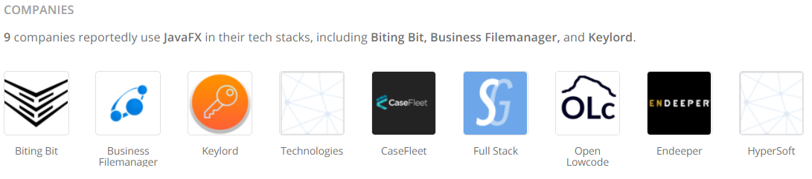

Het was de bedoeling dat de library Swing zou vervangen als standaard GUI library, maar dit is nooit gebeurd.
JavaFX is niet meer beschikbaar als standaard package in de nieuwere versies van Java SE, in tegenstelling
tot Swing en AWT. JavaFX is niet meer onderdeel van Java SE na JDK 11.

JavaFX is ontworpen voor business application software. Dit zijn dan ook het type applicatie dat genoemd werd.

JavaFX is dan ook erg makkelijk om mee te werken en bezit over de gewenste functionaliteiten. Zo kunnen
gebruikers animaties, keyboard shortcuts en nog meer toevoegen.

## Applicaties die gebruik maken van .JSON bestanden
|Applicatie|Over|Gebruik|
|---|---|---|
|Minecraft|Wereldbekend spel bestaande uit blokken|Resource packs, items, language files etc.|
|Steam Web API|Game library software|Ophalen data spellen & gebruikers|
|Tiled|Flexibele map editor|Exporteren van maps|
|VK API|Social media platform|Ophalen data gebruikers|
|CurseForge API|Gaming website die modificaties van videospellen bevat|Data ophalen & automatiseren project management|


Hieronder zijn de eerste twee voorbeelden uitgewerkt.

#### Minecraft
Minecraft is een populair videospel met meer dan 200 miljoen verkochte kopieën. Het spel
wordt beschreven als een sandbox game. Het grafische aspect van het spel bestaat uit kubussen.


Minecraft is een videospel van <a href="https://www.mojang.com/">Mojang Studios</a>, 
een bedrijf dat werd gesticht in 2009, in Stockholm, Zweden,
door Markus (Notch) Persson. Persson verliet het bedrijf in november 2014, toen het bedrijf overgenomen werd
door <a href="https://www.microsoft.com/">Microsoft</a> voor $2.5 biljoen dollar.
<br>

Het spel slaat een groot deel van de data op in <i>.JSON</i> bestanden. 
Onder andere items & blokken worden opgeslagen op deze manier.

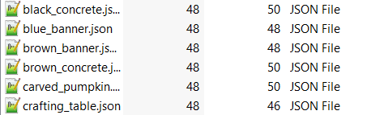

Inhoud item:
```
{
  "parent": "minecraft:item/template_banner"
}
```

Inhoud blok:
```
{
  "textures": {
    "particle": "minecraft:block/warped_planks"
  }
}
```

Gedeelte inhoud language file:
```
{
  "language.name": "English",
  "language.region": "United States",
  "language.code": "en_us",
  "narrator.button.accessibility": "Accessibility",
  "narrator.button.language": "Language",
  "narrator.button.difficulty_lock": "Difficulty lock",
  "narrator.button.difficulty_lock.unlocked": "Unlocked",
  "narrator.button.difficulty_lock.locked": "Locked",
  "narrator.screen.title": "Title Screen",
  "narrator.controls.reset": "Reset %s button",
  "narrator.controls.bound": "%s is bound to %s",
  "narrator.controls.unbound": "%s is not bound",
  "narrator.select": "Selected: %s",
  "narrator.select.world": "Selected %s, last played: %s, %s, %s, version: %s",
  "narrator.loading": "Loading: %s",
  "narrator.loading.done": "Done",
  "narrator.joining": "Joining",
  "narration.suggestion.tooltip": "Selected suggestion %d out of %d: %s (%s)",
```

<br>

#### Steam Web API
Steam is een gratis service waar gebruikers games kunnen kopen, installeren en spelen. Een goede beschrijving van
Steam is <i>Game Library Software</i>. 


Steam is een product van <a href="https://www.valvesoftware.com/nl/">Valve</a>, 
een bedrijf dat werd gesticht op 24 augustus 1996, in Kirkland, Washington, VS,
door Gabe Newell en Mike Harrington. Harrington verliet het bedrijf in januari 2000.

De API geeft informatie terug in een formaat naar keuze. De keuze bestaat uit
<i>.JSON</i>, <i>.XML</i> & <i>.VDF</i>. Het standaardformaat is <i>.JSON</i>.

De Steam Web API laat ontwikkelaars data ophalen over:
- News feeds van spellen en applicaties op Steam.
- Statistieken van spellen en applicaties op Steam.
- Informatie van gebruikers van Steam.
- Items van spelers van het spel <a href="https://wiki.teamfortress.com/wiki/WebAPI">Team Fortress 2</a>.

Dat wordt opgehaald in de volgende vorm: <br>
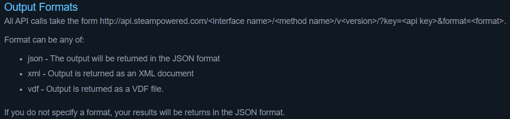

Klik <a href="http://api.steampowered.com/ISteamNews/GetNewsForApp/v0002/?appid=440&count=3&maxlength=300&format=json">hier</a> voor
een voorbeeld.

Voor verdere uitleg kunt u refereren naar <a href="https://developer.valvesoftware.com/wiki/Steam_Web_API#JSON">deze pagina</a>.

<br>

#### Conclusie .JSON
Ik denk dat <i>.JSON</i> gebruikt wordt omdat...:
- De syntax makkelijk te begrijpen is voor mensen.
- Het eenvoudig leesbaar is voor mensen.
- Het het key-value concept gebruikt, wat een gangbaar principe is.
- Het ondersteund wordt in heel veel programmeertalen.