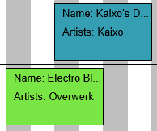

#Individueel Assignment
### Berend de Groot 2166496 TI 1.3 A3

In dit document kunt u reflecties vinden van mij op mijn eigen werk.
---
Dit document is bedoeld om een eerste indruk
te geven aan anderen wat ik heb gedaan en waarom, maar is **NIET** bedoeld om een compleet beeld te verschaffen aan de lezer
en mag dan ook niet gebruikt worden als naslagwerk buiten de individuele assignment van de proftaak van Avans Hogeschool.

##Week 3
#### Reflectie
In week 3 hebben we gewerkt aan het ontwerp van de AgendaModule 
van de proftaak. Ik heb hele dagen gewerkt aan het herstructureren van de code;
ik heb veel tijd besteed aan het zo simpel en overzichtelijk mogelijk maken van
onze software. Dit heb ik gedaan omdat:
* Het oplossen van bugs hierdoor verbijsterend snel gaat. De code is goed in
functies onderverdeeld en klassen delen een bepaalde structuur waardoor
het zoeken naar de regels die jij wilt vinden kinderspel is.
* Het optimaliseren van de software eenvoudig is. Klassen hebben vrijwel allemaal
één eigen functie, waardoor het bij het lezen van alle code
makkelijk is om verbeterpunten te spotten.
* Dit het werktempo bevordert van onze projectgroep.
* In theorie nieuwe werknemers op deze manier vrijwel gelijk aan het werk kunnen
gaan, ondanks dat ze niet aanwezig waren bij het schrijven van de rest van
het programma. [^1]

[^1]: Omdat er in het bedrijfsleven nu eenmaal snel en efficient gewerkt 
moet worden moeten andere mensen je code in een oogopslag kunnen begrijpen.

Dit is dan ook de reden dat ik van de groep eis documentatie te schrijven
bij de code. Wij maken gebruik van JavaDoc, wat er als volgt uit ziet in
onze code:
```
    /**
     * Saves an Agenda object; writes all data from an instance of
     * <a href="{@docRoot}/FestivalPlanner/Agenda/Agenda.html">Agenda</a> to a file created
     * in a dialog.
     * @param fileName  name of file to write data to
     * @param agenda  instance of Agenda to save
     */
    public void writeAgendaToFile(String fileName, Agenda agenda){
        try(ObjectOutputStream output = new ObjectOutputStream(new FileOutputStream(fileName))){
            output.writeObject(new Agenda(agenda.getName(), agenda.getShows()));
        } catch (Exception e){
            showExceptionPopUp(e);
        }
    }
```

En als volgt als gegenereerde documentatie (in html formaat):


Om een voorbeeld te geven van de structuur in de code, zal ik uitleggen hoe onze GUI klassen werken.
#####GUI Ontwerp
Al onze GUI klassen overerven van AbstractGUI, een abstracte klasse die zelf overerfd van AbstractDialogPopUp.
AbstractDialogPopUp bevat methodes die een PopUp venster openen. Om deze methodes in elke GUI te kunnen gebruiken
hebben we besloten om elke GUI klasse deze te laten overerven.
```
public abstract class AbstractGUI extends AbstractDialogPopUp {
    protected final int HBOX_SPACING = 5;
    protected final int VBOX_SPACING = 5;
    protected final int GRIDPANE_HGAP = 10;
    protected final int GRIDPANE_VGAP = 10;

    private ResourceBundle messages = LanguageHandler.getMessages();

    protected GridPane gridPane = new GridPane();
    protected HBox buttonHBox = new HBox();
    Button applyButton = new Button(messages.getString("apply"));
    protected Button closeButton = new Button(messages.getString("close"));

    /**
     * Runs initialisation methods and sets general stage settings.
     */
    public abstract void load();

    /**
     * Sets the values, alignment and spacing and children on initialisation.
     * Finally, the method setups the main layout, rarely anything else than a <code>GridPane</code>.
     */
    public abstract void setup();

    /**
     * Sets EventHandling of JavaFX <code>Nodes</code>. Mostly <code>setOnAction</code>s.
     */
    public abstract void actionHandlingSetup();
}
```
---
Nu ga ik de code stukje voor stukje uitleggen.

Als eerste de attributen:
```
    protected final int HBOX_SPACING = 5;
    protected final int VBOX_SPACING = 5;
    protected final int GRIDPANE_HGAP = 10;
    protected final int GRIDPANE_VGAP = 10;
```
Dit zijn waardes die we gebruiken voor wat JavaFX componenten om ervoor te zorgen dat ons programma
consequent is qua uiterlijk. Er zijn bepaalde onderdelen die afwijken van deze waardes. Je kan dit
dus zien als een soort van standaard-waarde.
---
```
    private ResourceBundle messages = LanguageHandler.getMessages();
```
Dit gebruiken we om meerdere talen te ondersteunen. Dit zal in de toekomst waarschijnlijk anders afgehandeld worden;
nu is dit private en wordt dit alleen voor deze klasse gebruikt, maar dit kan efficienter en zal dus anders moeten.
---
```
    protected GridPane gridPane = new GridPane();
    protected HBox buttonHBox = new HBox();
    Button applyButton = new Button(messages.getString("apply"));
    protected Button closeButton = new Button(messages.getString("close"));
```
Dit zijn componenten die de meeste GUI klassen gebruiken. Op deze manier hoeven wij deze knoppen niet
te initialiseren in elke klasse, wat ons ruimte bespaard.
---
Nu komen we bij de methodes... Nu wordt het leuk!

```
    public abstract void load();
```
In deze methode roepen we de andere methoden (in de meeste gevallen alleen setup() en actionHandlingSetup())
aan, en declareren we de waarden van de Stage (zoals titel, hoogte, of de grootte instelbaar is etc.).
---
```
    public abstract void setup();
```
In deze methode declareren we de volgende waarden:
* Initialisatie van waarden van elementen gebruikt in de klasse. Dit kan bijvoorbeeld een tekstveld vullen met
de naam van een podium zijn als je podia gaat aanpassen.
* Uitlijning en spatiëring <sup>(ja, dit is een woord)</sup> van elementen gebruikt in de klasse.
Dit kan bijvoorbeeld te spatiëring van een VBox zijn.
* Knopinfo (Tooltips) voor elementen. Op het moment van schrijven wordt dit alleen in de PreferencesGUI klasse gedaan.
* Het toevoegen van kinderen aan elementen gebruikt in de klasse. Dit kan bijvoorbeeld het toevoegen
van knoppen zijn in een HBox.
* Alles bij elkaar toevoegen. Dit is het toevoegen van kinderen aan een pane die als parameter wordt
meegegeven bij het initialiseren van de scene in de klasse.
```
    public abstract void actionHandlingSetup();
```
In deze methode stellen we in wat er moet gebeuren op het moment dat de gebruiker op een bepaalde manier
interacteert met grafische elementen in de scene. Het meest voorkomende voorbeeld hiervan is het klikken op knoppen.


##Week 4
#### Reflectie
In week 4 heb ik de puntjes op de i gezet in onze software. Ik heb onder andere een knop gemaakt om de cache
te verwijderen, om shows qua tijden om te draaien door middel van een context menu, en een implementatie van de voorkeuren
omtrent kleuren. Verder heb ik natuurlijk gewerkt aan de documentatie en heb ik de code schoongehouden. Als
dit programmeerg-gebeuren niks wordt kan ik altijd nog schoonmaker worden!

####Discord webhook
Ik streef er altijd naar de arbeidsethos van mijn groep te verhogen. Ik merkte dat de groep en ik soms
niet door hadden of iemand nou al wat gedaan had of niet, ondanks dat dit vaak verteld was. Ik moest dus een manier vinden
om te zorgen dat we dit makkelijk terug konden vinden...

Ik realiseerde me dat we dit al hadden; ik besefte me dat we al die tijd beschrijvingen bij commits geschreven hebben!
Wij gebruiken Discord voor de communicatie, dus moest ik ervoor zorgen dat we een kanaal hadden waar alleen
de commits van onze GitHub repository te zien is.

GitHub en Discord ondersteunen beide het gebruik van zogenaamde webhooks.[^2] Ik heb deze toegevoegd aan de server, en het werkte meteen.
Dit heeft ons erg geholpen tijdens het project.
Dit is hoe het er uit kwam te zien:

Er staat een link bij naar de commit, waardoor we voor meer informatie alleen maar hoeven te klikken.

[^2]: Een methode om het gedrag van een webpagina of webtoepassing te vergroten of te wijzigen met aangepaste callbacks.

####Context Menu
De gebruiker kan nu meerdere shows selecteren door de knoppen shift en ctrl te gebruiken bij het klikken
van de linker-muisknop. Als er twee shows geselecteerd zijn kan de gebruiker op *swap* drukken. Hierdoor zullen de tijden van de shows
omgewisseld worden.


Verder kan de gebruiker de show aanpassen. Als de gebruiker één show geselecteerd heeft en op *edit* drukt zal er een nieuw venster
verschijnen op het scherm van de gebruiker.


####Voorkeuren - Kleuren
Ik heb natuurlijk een prachtig system geïntegreerd in ons programma om voorkeuren op te slaan in een *.XML*
bestand. Ik heb deze week gewerkt aan het ondersteunen van door de gebruiker geselecteerde kleuren.

Wij hebben twee verschillende kleuren nodig:
* Één kleur voor geselecteerde shows.
* Één kleur voor **NIET** geselecteerde shows.


Dit is hoe de standaard kleuren eruit zien:


Dit is hoe het voorkeuren scherm eruit ziet:


Om de gebruiker kleuren te laten selecteren heb ik een simpele GUI gemaakt die een ColorPicker opent.
Dit is hoe de ColorPicker GUI eruit ziet:


Dit is hoe de shows eruit zien nadat ik deze kleur geselecteerd heb:


Dit is de code die de kleuren opslaat:
```
@NotNull
public static void setSelectedColor(javafx.scene.paint.Color colorInput){
    Color color = ColorConverter.fromJavaFXToAwt(colorInput);
    setPreference("selected_show_color", String.valueOf(color.getRGB()));
    Color.decode(getPreference("selected_show_color"));
}
```

Dit is de code die de kleuren zet naar de standaard waarden:
```
public static void restoreDefaultColors(){
    Color selectedColor = Color.getHSBColor(190 / 360f, .7f, .7f);
    Color unselectedColor = Color.getHSBColor(100 / 360f, .7f, .9f);

    setPreference("selected_show_color", String.valueOf(selectedColor.getRGB()));
    setPreference("unselected_show_color", String.valueOf(unselectedColor.getRGB()));
}
```

####Cache Verwijderen
Jesse en ik hadden overlegd over het opslaan van afbeeldingen en hebben besloten dit te doen in de gebruiker
zijn / haar / hun / het (?) appdata. 

//TODO: Afbeeldingen hier.

Dit is de code die de afbeeldingen schrijft:
```
try {
    File pictureFile = new File(System.getenv("LOCALAPPDATA") + "/A3/Resources/" + "AgendaName/" + this.toString() + "Picture.png");
    pictureFile.mkdirs();
    File spriteFile = new File(System.getenv("LOCALAPPDATA") + "/A3/Resources/" + "AgendaName/" + this.toString() + "Sprite.png");
    spriteFile.mkdirs();
    ImageIO.write(this.picture, "png", pictureFile);
    ImageIO.write(this.sprite, "png", spriteFile);
} catch (Exception e) {
    e.printStackTrace();
    AbstractDialogPopUp.showExceptionPopUp(e);
}
```

##Week 5
###Reflectie
In week 5 heb ik voornamelijk de bezem door de code geslingerd. Verder heb ik de structuur
voor de NPCs <small>(non-playable character(s))</small> toegevoegd en documentatie geschreven, bijgewerkt
gefixt (ten opzichte van de StyleGuide).

####Schoonmaak
#####Kleuren-conversie
In onze software utiliseren wij uiteraard met regelmaat kleuren.
Om de kleuren aan te passen kan de gebruiker kleuren kiezen in het voorkeuren-scherm.
Dit scherm maakt gebruik van <i>javaFX</i> nodes, zoals een <i>ColorPicker</i>.
<br>
<sub>Zie week 4</sub>

We willen natuurlijk dat de kleuren dan gebruikt worden
bij het tekenen van die objecten waarvoor de gebruiker de kleuren instelt, maar daar zit een probleem:
<br>
JavaFX en AWT kleuren zijn niet direct compitabel met elkaar, waardoor we het moeten omrekenen.
Eerst deden we dit handmatig... zoals hieronder te zien.

Hieronder het bovenste gedeelte van een actie waarin we de kleur(en) instellen:
```
this.selectedColorButton.setOnAction(e -> {
        Stage stage = new Stage();
        java.awt.Color c = SaveSettingsHandler.getSelectedColor();
        ColorPicker colorPicker = new ColorPicker(Color.rgb(c.getRed(), c.getGreen(), c.getBlue(), c.getAlpha() / 255.0)); //TODO: show currently saved color.
```

Omdat we dit regelmatig moeten (en <b>zeker</b>[^3] zouden moeten kunnen)

Dit is de klasse om kleuren te converteren:
```
public class ColorConverter {

    public static Color fromAwtToJavaFX(java.awt.Color colorInput){
        return Color.rgb(colorInput.getRed(), colorInput.getGreen(), colorInput.getBlue(), colorInput.getAlpha() / 255.0);
    }

    public static java.awt.Color fromJavaFXToAwt(Color colorInput){
        return new java.awt.Color((float) colorInput.getRed(), (float) colorInput.getGreen(), (float) colorInput.getBlue(), (float) colorInput.getOpacity());
    }
}
```

[^3]:
##Week 6
###Reflectie
In deze week heb ik gewerkt aan het testen door middel van <i>JUnit5</i>. Dit was een opdracht bij
OGP2 die we moesten toepassen
in de proftaak.<br>
Ik heb besloten om tests te schrijven voor het ophalen van strings uit de language files, en
voor het converteren van kleuren van <i>java.awt</i> naar <i>javafx.scene.paint.Color</i>.

####Automatisch testen
#####LanguageHandlerTest
LanguageHandlerTest bevat twee test methoden. 
De eerste methode probeert van messages de apply waarde te krijgen, en de tweede methode probeert
het met de close waarde. Deze test wordt gebruikt om te kijken of we nog steeds de 
waarden uit de <i>“lang”</i> resource bundle kunnen lezen. 
<br>

Hier een voorbeeld:
```
@Test
void testGetMessages_withClose_returnsClose() {
    // Act
    String actualValue = LanguageHandler.getMessages().getString("close");
    String returnValue = "Close";
    // Assert
    Assertions.assertEquals(returnValue, actualValue, getMessagesCloseMessage);
}
```
---
#####ColorConverterTest
ColorConverterTest bevat vier methodes; 
deze klasse bevat twee methodes voor het converteren van JavaAWT naar JavaFX kleuren
en twee methodes voor JavaFX naar JavaAWT kleuren. 
We testen of we de kleuren zwart en wit beide kanten op kunnen lezen.
<br>

Hier een voorbeeld:
```
@Test
void testFromAwtToJavaFX_withBlack_returnsBlack() {
    // Act
    Color colorAWT = Color.BLACK;
    javafx.scene.paint.Color colorJavaFX = javafx.scene.paint.Color.color(0, 0, 0);
    javafx.scene.paint.Color resultColorJavaFX = ColorConverter.fromAwtToJavaFX(colorAWT);
    // Assert
    Assertions.assertEquals(resultColorJavaFX, colorJavaFX, fromAwtToJavaFXMessage);
}
```
##Week 7

##Week 8
//TODO: In week 8 werken.
