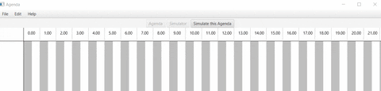
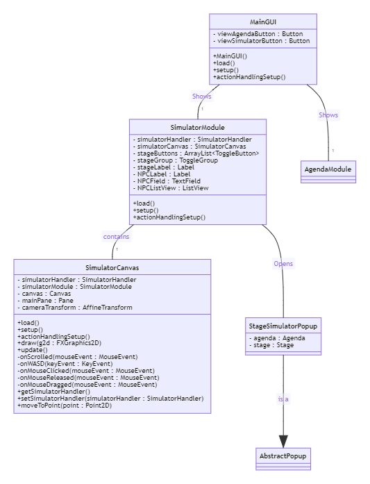
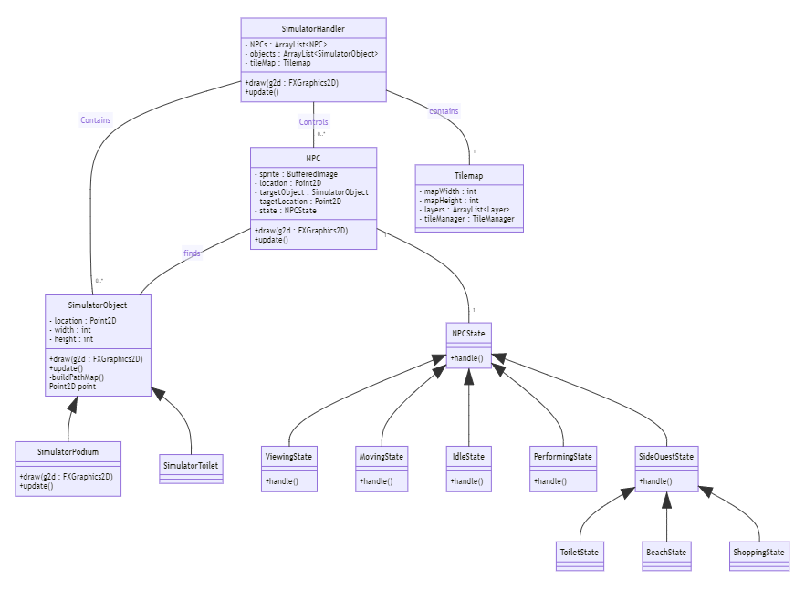
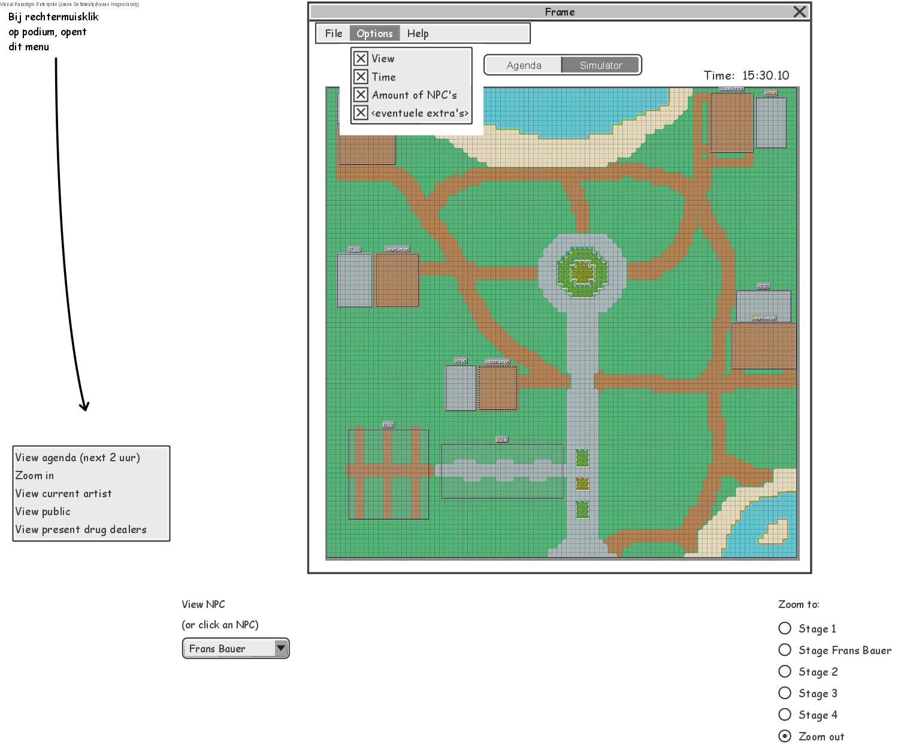
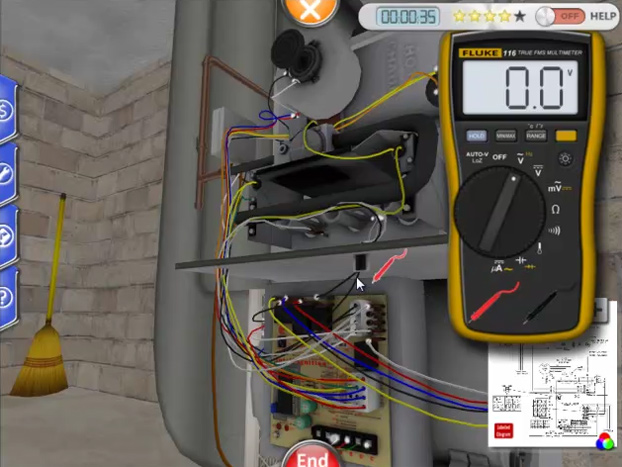
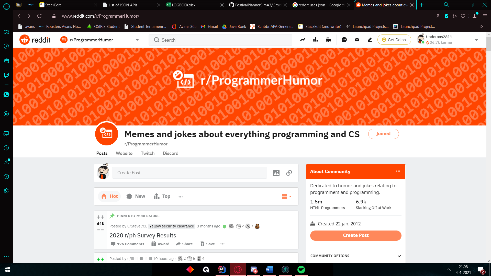
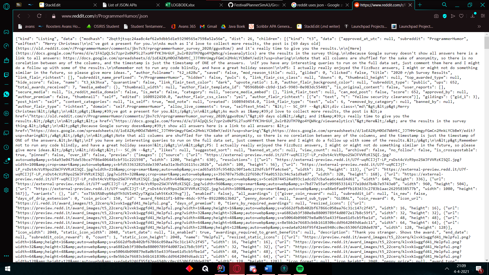

# Individueel Resultaat Festival Planner  
  
### Jason Setiowaty 2173605 TI1.3 23-TIVT1A3  
  
In dit document zal ik het hele proces van de derde periode genaamd: "Festival Planner" gaan beschrijven en daarbij wat dingen vertellen waar ik tegen aan liep.  
  
Alle bezigheden, moeilijkheden en keuzes die ik en en de groep hebben moeten maken staan in dit document. Alles wat hier beschreven staat is vanuit het oogpunt van Jason Setiowaty.  
  
In dit portfolio worden lesweek 3 t/m lesweek 9 opgenomen. Ook wordt er een reflectie met onderbouwing op het werken met .JSON bestanden gegeven.  
  
Elke week (van week 3 tot en met 9) zal ik het over de volgende punten gaan hebben:  
* Een reflectie over mijn bijdrage aan de proftaak.  
* Een reflectie over de technische en/of vakinhoudelijke bijdrage aan de proftaak  
* Wat is de situatie (context)?  
* Welke keuzemogelijkheden heb ik?  
* Welke keuze heb ik gemaakt?  
* Waarom heb ik deze keuze gemaakt?  
  
    
  
Verder zal ik nog mijn reflectie, inclusief onderbouwing, op een van de volgende 2 stellingen toevoegen, hierover zullen ongeveer 2 pagina's geschreven worden:  
  
* "In het bedrijfsleven wordt gebruik gemaakt van JavaFX”  
  
* “In het bedrijfsleven wordt steeds meer in software gesimuleerd” 

En tot slot zal ik nog een lijst met applicaties toevoegen die gebruik maken van het JSON formaat en een klein stukje uitleg over hoe ik weet dat deze dit formaat gebruiken
 
## Week 3  
  
#### Wat is de situatie?  
In deze eerste week van het project heb ik eerlijk gezegd vrij weinig gedaan. dit komt doordat ik wat problemen had met mijn laptop en hij om reparatie gestuurd moest worden... dit kostte mij 2 weken en hier ben ik zelf ook niet tevreden mee. Helaas had ik thuis geen andere pc die in staat is om gebruikt te worden voor school. (Ik had alleen nog maar een hele oude laptop, maar die doet er al meer dan een uur over om alleen maar op te starten, vervolgens internet openen kost nog een half uur. Dat is niet te doen).  
  
Deze week heb ik wel wat aan het project mee kunnen helpen op mijn telefoon door het schrijven van het PVA, en de vergaderingen ook op mijn telefoon via teams/discord.  
  
#### Welke keuzemogelijkheden heb ik?  
Deze week had ik dus niet veel keuze door onvoorziene omstandigheden. Het enige wat ik had kunnen doen was van tevoren zorgen dat ik een back-up laptop / pc heb. Maar aangezien ik ook niet kon voelen aankomen dat mijn "normale" laptop ineens problemen zou krijgen had ik hier natuurlijk niet aan gedacht.  
  
#### Welke keuze heb je gemaakt?  
Ik had hier niet echt een keus. Zonder laptop kom je niet ver. Wel heb ik geprobeerd om nog zo veel mogelijk op mijn telefoon te kunnen maken.  
  
#### Waarom heb je deze keuze gemaakt?  
Ik heb zo veel mogelijk op mijn telefoon gemaakt omdat dit het enige alternatief was wat ik had. Hierdoor hoopte ik de rest van de groep niet helemaal teleur te stellen omdat dit ook het begin van onze samenwerking was. Dat was natuurlijk geen goede eerste indruk.  
  
## Week 4  
#### Wat is de situatie?  
In deze week heb ik wederom niet heel veel aan het gezamelijke project kunnen doen.   
Ik heb de vergadering wel bijgewoond, en gelukkig begrepen mijn teamgenoten ook dat ik deze week niets aan het project kon doen aangezien ik nu dus 2 weken aan studieachterstand had om nog in te halen.   
  
#### Welke keuzemogelijkheden heb je?  
Ik had deze week eigenlijk 2 keuzemogelijkheden:  
* Optie 1: Verder met het project gaan en de andere vakken langzamerhand proberen in te halen.  
  
* Optie 2: Eventjes wat minder doen aan het project, alle achterstand snel weg werken, en dan met de rest mee gaan.  
  
#### Welke keuze heb je gemaakt?  
Ik heb gekozen om minder aan het project te doen deze week.  
  
#### Waarom heb je deze keuze gemaakt?  
Deze keuze heb ik gemaakt zodat ik de studieachterstand zo snel mogelijk weg kon werken en weer de benodigde kennis had om goed en efficiënt mee te kunnen helpen met het maken van de festival planner.   
  
## Week 5  
#### Wat is de situatie?  
In deze week hadden we weer een vergadering en waren we vooral bezig met de agenda module werkend krijgen. Ik heb me vooral gericht tot het toevoegen van artiesten. Hier liep ik tegen wat problemen op zoals artiesten die meerdere kopieën kunnen hebben. Ook wilden we foto's en sprites kunnen toevoegen aan artiesten. Dit is uiteindelijk ook gelukt, alleen duurde het wel wat langer dan ik wilde...  
#### Welke keuzemogelijkheden heb je?  
Ik had eigenlijk bijna alle denkbare mogelijkheden. Hierdoor was een keuze maken voor wat we wilde wel wat lastiger.  
  
#### Welke keuze heb je gemaakt?  
Uiteindelijk heb ik gekozen voor een extra pop up scherm waar je de naam kan invullen, met daar onder een foto en een sprite die ook meteen een preview geven als je een afbeelding geselecteerd hebt.  
Het pop up scherm ziet er als volgt uit:  
  
  
#### Waarom heb je deze keuze gemaakt?  
Ik heb deze keuze gemaakt omdat ik dan een extra venster had om zelf in te delen en niet bang hoefde te zijn om nog ander werk te verpesten doordat ik iets in een verkeerde manier toevoeg. Het leek mij dus de meest veilige optie.  
  
## Week 6  
#### Wat is de situatie?  
In deze week heb ik met Jesse klassendiagrammen gemaakt voor de GUI, eerst was het de bedoeling dat we alleen de back-end gingen doen, maar we kwamen er al snel achter dat we niet de back-end konden gaan maken zonder dat we de front-end hadden.  
  
#### Welke keuzemogelijkheden heb je?  
We hadden natuurlijk kunnen wachten tot iemand anders de front-end had gemaakt en daarna pas een ons stuk van de back-end gaan beginnen. Een andere optie had kunnen zijn dat we een taak zouden wisselen met de persoon die de front-end zou gaan maken. Maar in plaats daar van hadden we de taak van het maken van het klassendiagram van de front-end ook maar op ons genomen.  
  
Jesse en ik hebben dus de logica (back-end) en de GUI (front-end) klasse diagrammen gemaakt. Deze zal ik in de volgende alinea's gaan uitleggen hoe we ze hebben gemaakt.  
  
#### Welke keuze heb je gemaakt?  
Als eerste de GUI (front-end)  
  
  
  
Dit was de kleinste diagram aangezien hij ook alleen maar gegevens hoeft weer te geven, en niet ophalen, berekenen, aanmaken, of wat dan ook.  
Zoals te zien is hebben we een MainGUI die 2 knoppen aan maakt om tussen de agenda en simulator te wisselen, deze sturen ons dus weer door naar de AgendaModule, of de SimulatorModule, als we naar de SimulatorModule gaan kijken (waar Jesse en ik ook vooral op aan het focussen waren deze middag) hebben we een paar handlers, een canvas, en een paar NPC onderdelen. Onder de SimulatorModule hebben we een SimulatorCanvas staan die de verschillende onderdelen mooi op het scherm laat weergeven. (Verder hebben we ook nog een pop-up klasse om naar de agenda te wisselen)  
  
  
#### Waarom heb je deze keuze gemaakt?  
Alle keuzes die hierboven beschreven stonden hebben wij gemaakt door er over na te denken wat we allemaal nodig zouden kunnen hebben. Natuurlijk hadden we het zo gedetailleerd mogelijk geprobeerd te maken, maar we gingen er al van uit dat er iets vergeten zou kunnen worden en dus hebben we aan de groep door gegeven dat deze als voorbeeld genomen moeten worden, maar als er nog iets extra's nodig zou zijn dat dan gewoon toegevoegd mag worden.  
  
## Week 7  
#### Wat is de situatie?  
In deze week waren we al begonnen met het werken aan de GUI zelf. Ik zelf had me vooral gefocussed op het wisselen van agenda naar simulatie en de lay-out voor het bewegen naar een specifiek punt in de simulatie.
#### Welke keuzemogelijkheden heb je?  
Ook hier had ik weer alle mogelijkheden om het wisselen voor elkaar te krijgen, en om de punten weer te geven.  
#### Welke keuze heb je gemaakt?  
Dit vond ik een vrij lastige keuze om te maken, daarom heb ik hier eerst nog even met Stijn mee overlegd om na te denken wat voor ons de beste optie zou zijn en of het ook realistisch is om het zo te kunnen maken (of het dus niet te moeilijk zou gaan worden)
#### Waarom heb je deze keuze gemaakt?  

Samen met stijn hebben wij de keuze gemaakt om de locaties in een lijstje weer te geven, en om een kleiner venster in het midden van het scherm te plaatsen met daarin de geselecteerde module (agenda of simulatie) dit vonden wij een nette opmaak en niet al te moeilijk om te maken. Juist door dit simpele ontwerp vonden wij dat dit ook voor de gebruiker een prettig intuitief scherm zou opleveren.
  
## Week 8  
#### Wat is de situatie?  
In deze week moest de pathfinding gemaakt worden. Dit vonden wij allemaal erg interessant om te doen en meer over te leren. Dit hebben we dan ook met bijna iedereen samen gemaakt. Naar mijn mening was dit enorm lastig, omdat überhaupt de algoritmen van pathfinding zelf lastig zijn. Maar ook omdat we met ons allen bezig waren werd het wel heel gezellig en ging de productiviteit wel wat naar beneden dacht ik.
#### Welke keuzemogelijkheden heb je?  
Hier hadden wij niet heel veel opties, het pathfinding gedeelte moest gewoon gemaakt worden en werken. Daar is niet heel veel vrijheid in te vinden. Verder hadden we misschien wel wat minder mensen op het pathfinding kunnen zetten en de rest alvast iets anders laten doen.
#### Welke keuze heb je gemaakt?  
Uiteindelijk hadden wij alsnog ervoor gekozen om iedereen die interesse had mee te laten denken met het pathfinding.
#### Waarom heb je deze keuze gemaakt?  
Deze keuze hebben wij gemaakt zodat iedereen wel een beetje begreep hoe het werkte en omdat pathfinding echt wel een groot deel is van ons project. 

Natuurlijk kwamen we gedurende het maken hiervan veel bugs tegen maar die zullen we binnenkort er uit halen
(Collision werkte bijvoorbeeld niet helemaal lekker, zodra er een paar tegen elkaar aan liepen bevroren ze en zaten ze vast)
  
## Week 9  
#### Wat is de situatie?  
In deze week heb ik samen met Max aan de NPC states gewerkt. Dit bleek uiteindelijk toch iets lastiger te zijn dan we hoopten en daarom zijn we er ook langer mee bezig geweest.
#### Welke keuzemogelijkheden heb je?  
We hadden hier niet heel veel keuze, de states waren namelijk al van tevoren uitgedacht, nu moesten we ze alleen nog maar werkend krijgen. Met wat extra hulp van de rest van de groep was dit uiteindelijk gelukt.
#### Welke keuze heb je gemaakt?  
We hebben als keuze best vroeg om hulp geroepen en er nog wat anderen bij betrokken
#### Waarom heb je deze keuze gemaakt?
Deze keuze hebben wij gemaakt omdat wij er zelf niet meteen uit kwamen. In plaats van alles zelf maar te blijven proberen, vervolgens vast lopen en daardoor de code helemaal niet af hebben, leek het ons een beter idee om dan maar vrij vroeg om hulp te roepen zodat onze groepsgenoten ook nog wat tijd hadden om ons uit de brand te helpen. Dit bleek achteraf een hele goede keuze omdat we wat tips en extra uitleg kregen van de rest van het team.


## “In het bedrijfsleven wordt steeds meer in software gesimuleerd” 
Ik had twee keuzes om over te schrijven:

* "In het bedrijfsleven wordt gebruik gemaakt van JavaFX”  
* “In het bedrijfsleven wordt steeds meer in software gesimuleerd” 

Ik heb bewust gekozen voor de tweede optie aangezien dit mij veel makkelijker uit te leggen lijkt.
In het bedrijfsleven zijn best gevaarlijke beroepen. Hierdoor is het dus niet verstandig om een beginner zonder ervaring het werkveld in te sturen omdat dit simpelweg te riskant is. 
Laten we als voorbeeld nu eens elektricien nemen als beroep. Dit beroep klinkt in het begin misschien niet zo heel gevaarlijk, maar als je er over gaat nadenken kom je er al snel achter dat er soms een best hoge spanning door de draden loopt. 
Zoals in onderstaande afbeelding te zien is, is er voor deze nieuwe elektricien collega's een software simulatie gemaakt om te oefenen zonder ook maar enig risico te nemen op lichamelijke schade. Dit is dan natuurlijk ook al een stuk veiliger aangezien er niks fout kan gaan.



Deze elektricien kan nu veilig oefenen, maar dat is niet het enige beroep wat gebruik kan maken van software simulaties, eigenlijk zou het het beste zijn als alle gevaarlijke beroepen op deze manier trainen, van brandweer tot aan gevechtspiloot bij het leger. Op deze manier is het misschien ook voor de nieuwe medewerker fijner omdat hij of zij niet bang hoeft te zijn dat er iets fout gaat. Mocht dit het geval zijn reset je de simulatie weer gewoon en kan de medewerker het nog een keer proberen. Ook zorgt dit er voor dat de simulaties gemaakt moeten worden en dat ik na deze opleiding misschien daar wel een leuk salaris aan zou kunnen verdienen ;-)  

## JSON Formaat in bekende applicaties

Buiten het gebruik van software simulaties, zijn er ook veel grote bedrijven die gebruik maken van het JSON formaat net zoals wij deden gedurende deze periode.

Volgens Al Sweigart, de schrijver van ["Automate the Boring Stuff with Python"](https://automatetheboringstuff.com/list-of-json-apis.html), maken Youtube, Google maps, en Reddit gebruik van een JSON formaat.

### Youtube
Youtube maakt gebruik van JSON voor de zoekresultaten. Ik heb van een Michael Wanyoike een voorbeeld stukje code gevonden. Hij had dit beschreven op [zijn sitepoint pagina](https://www.sitepoint.com/youtube-json-example/) Dit ziet er als volgt uit:
```json
{
  "kind": "youtube#searchListResponse",
  "etag": "\"m2yskBQFythfE4irbTIeOgYYfBU/PaiEDiVxOyCWelLPuuwa9LKz3Gk\"",
  "nextPageToken": "CAUQAA",
  "regionCode": "KE",
  "pageInfo": {
    "totalResults": 4249,
    "resultsPerPage": 5
  },
  "items": [
    {
      "kind": "youtube#searchResult",
      "etag": "\"m2yskBQFythfE4irbTIeOgYYfBU/QpOIr3QKlV5EUlzfFcVvDiJT0hw\"",
      "id": {
        "kind": "youtube#channel",
        "channelId": "UCJowOS1R0FnhipXVqEnYU1A"
      }
    },
    {
      "kind": "youtube#searchResult",
      "etag": "\"m2yskBQFythfE4irbTIeOgYYfBU/AWutzVOt_5p1iLVifyBdfoSTf9E\"",
      "id": {
        "kind": "youtube#video",
        "videoId": "Eqa2nAAhHN0"
      }
    },
    {
      "kind": "youtube#searchResult",
      "etag": "\"m2yskBQFythfE4irbTIeOgYYfBU/2dIR9BTfr7QphpBuY3hPU-h5u-4\"",
      "id": {
        "kind": "youtube#video",
        "videoId": "IirngItQuVs"
      }
    }
  ]
}
```

Hier is dus te zien dat de gegevens ook in categoriën opgeslagen worden, het soort, de tag, en het id in dit geval.

### Google Maps
Dezelfde beste man heeft ook [een zelfde stukje geschreven over Google maps](https://www.sitepoint.com/google-maps-json-file/). Wederom is hier heel mooi het JSON formaat terug te vinden.
```json
{
  "markers": [
    {
      "name": "Rixos The Palm Dubai",
      "position": [25.1212, 55.1535],
    },
    {
      "name": "Shangri-La Hotel",
      "location": [25.2084, 55.2719]
    },
    {
      "name": "Grand Hyatt",
      "location": [25.2285, 55.3273]
    }
  ]
}
```
Zoals hier boven te zien is word bij google maps bij je markers de naam van de locatie opgeslagen, samen met de locatie zelf in een x en een y coördinaat.

### Reddit
Ik gebruik reddit persoonlijk echt dagelijks, hierdoor wist ik toevallig al van deze mogelijkheid.
Als je op een willekeurige pagina op reddit gaat staan:



Dan zie je de pagina zoals het hoort. Maar zodra je achter de normale link "https://www.reddit.com/r/ProgrammerHumor/" .json schrijft als volgt: https://www.reddit.com/r/ProgrammerHumor/.json, dan zal het meteen omgezet worden naar een .json bestand zoals hieronder te zien is:



Dit vind ik een hele makkelijke manier om een .json te krijgen wat het heel erg gebruiksvriendelijk maakt.
Hier is nog een extra .gif om te demonstreren hoe simpel en snel het is om een .json te krijgen van een reddit pagina:


Zoals hier te zien is staat er erg veel data in opgeslagen, van de banner van de subreddit, tot aan de awards op een post.

Al deze grote en bekende bedrijven gebruiken dus ook nog een .JSON formaat om data op te slaan, dit laat dan ook mooi zien hoe breed het is en hoe het allemaal gebruikt kan worden. 