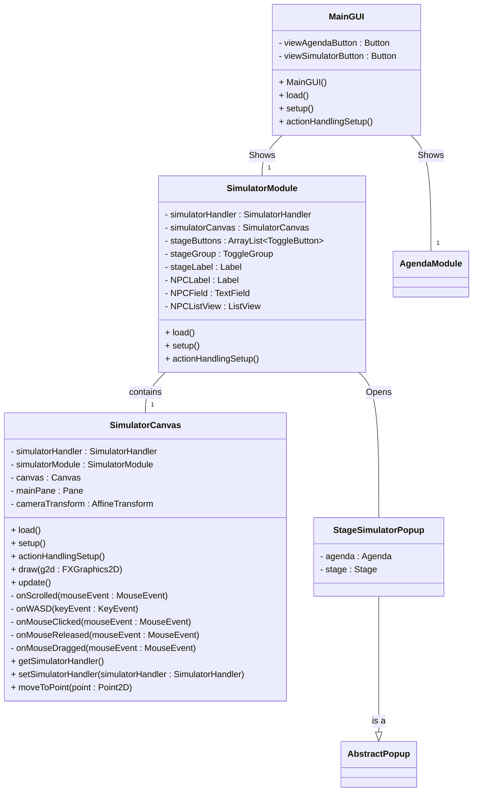
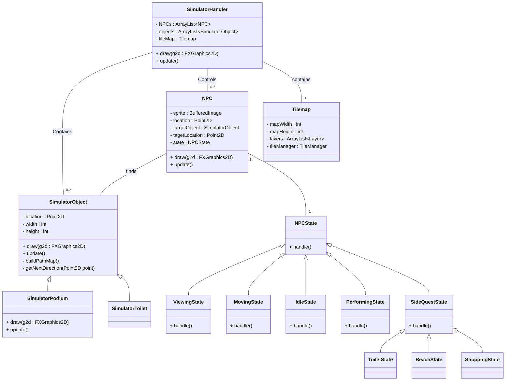

# Individueel Resultaat Festival Planner

### Jason Setiowaty 2173605 TI1.3 23-TIVT1A3

In dit document zal ik het hele proces van de derde periode genaamd: "Festival Planner" gaan beschrijven en daarbij wat dingen vertellen waar ik tegen aan liep.

Alle bezigheden, moeilijkheden en keuzes die ik en en de groep hebben moeten maken staan in dit document. Alles wat hier beschreven staat is vanuit het oogpunt van Jason Setiowaty.

In dit portfolio worden lesweek 3 t/m lesweek 9 opgenomen. Ook wordt er een reflectie met onderbouwing op het werken met .JSON bestanden gegeven.

Elke week (van week 3 tot en met 9) zal ik het over de volgende punten gaan hebben:

* Een reflectie over mijn bijdrage aan de proftaak.

* Een reflectie over de technische en/of vakinhoudelijke bijdrage aan de proftaak

* Wat is de situatie (context)?

* Welke keuzemogelijkheden heb ik?

* Welke keuze heb ik gemaakt?

* Waarom heb ik deze keuze gemaakt?

  

Verder zal ik nog mijn reflectie, inclusief onderbouwing, op een van de volgende 2 stellingen toevoegen, hierover zullen ongeveer 2 pagina's geschreven worden:

* "In het bedrijfsleven wordt gebruik gemaakt van JavaFX”

* “In het bedrijfsleven wordt steeds meer in software gesimuleerd”

*(Als bewijs hiervoor zal er nog een lijstje komen met applicaties die JavaFX gebruiken.)*
 
## Week 3

#### Wat is de situatie?
In deze eerste week van het project heb ik eerlijk gezegd vrij weinig gedaan. dit komt doordat ik wat problemen had met mijn laptop en hij om reparatie gestuurd moest worden... dit kostte mij 2 weken en hier ben ik zelf ook niet tevreden mee. Helaas had ik thuis geen andere pc die in staat is om gebruikt te worden voor school. (Ik had alleen nog maar een hele oude laptop, maar die doet er al meer dan een uur over om alleen maar op te starten, vervolgens internet openen kost nog een half uur. Dat is niet te doen).

Deze week heb ik wel wat aan het project mee kunnen helpen op mijn telefoon door het schrijven van het PVA, en de vergaderingen ook op mijn telefoon via teams/discord.

#### Welke keuzemogelijkheden heb ik?
Deze week had ik dus niet veel keuze door onvoorziene omstandigheden. Het enige wat ik had kunnen doen was van tevoren zorgen dat ik een back-up laptop / pc heb. Maar aangezien ik ook niet kon voelen aankomen dat mijn "normale" laptop ineens problemen zou krijgen had ik hier natuurlijk niet aan gedacht.

#### Welke keuze heb je gemaakt?
Ik had hier niet echt een keus. Zonder laptop kom je niet ver. Wel heb ik geprobeerd om nog zo veel mogelijk op mijn telefoon te kunnen maken.

#### Waarom heb je deze keuze gemaakt?
Ik heb zo veel mogelijk op mijn telefoon gemaakt omdat dit het enige alternatief was wat ik had. Hierdoor hoopte ik de rest van de groep niet helemaal teleur te stellen omdat dit ook het begin van onze samenwerking was. Dat was natuurlijk geen goede eerste indruk.

## Week 4
#### Wat is de situatie?
In deze week heb ik wederom niet heel veel aan het gezamelijke project kunnen doen. 
Ik heb de vergadering wel bijgewoond, en gelukkig begrepen mijn teamgenoten ook dat ik deze week niets aan het project kon doen aangezien ik nu dus 2 weken aan studieachterstand had om nog in te halen. 

#### Welke keuzemogelijkheden heb je?
Ik had deze week eigenlijk 2 keuzemogelijkheden:
* Optie 1: Verder met het project gaan en de andere vakken langzamerhand proberen in te halen.

* Optie 2: Eventjes wat minder doen aan het project, alle achterstand snel weg werken, en dan met de rest mee gaan.

#### Welke keuze heb je gemaakt?
Ik heb gekozen om minder aan het project te doen deze week.

#### Waarom heb je deze keuze gemaakt?
Deze keuze heb ik gemaakt zodat ik de studieachterstand zo snel mogelijk weg kon werken en weer de benodigde kennis had om goed en efficiënt mee te kunnen helpen met het maken van de festival planner. 

## Week 5
#### Wat is de situatie?
In deze week hadden we weer een vergadering en waren we vooral bezig met de agenda module werkend krijgen. Ik heb me vooral gericht tot het toevoegen van artiesten. Hier liep ik tegen wat problemen op zoals artiesten die meerdere kopieën kunnen hebben. Ook wilden we foto's en sprites kunnen toevoegen aan artiesten. Dit is uiteindelijk ook gelukt, alleen duurde het wel wat langer dan ik wilde...
#### Welke keuzemogelijkheden heb je?
Ik had eigenlijk bijna alle denkbare mogelijkheden. Hierdoor was een keuze maken voor wat we wilde wel wat lastiger.

#### Welke keuze heb je gemaakt?
Uiteindelijk heb ik gekozen voor een extra pop up scherm waar je de naam kan invullen, met daar onder een foto en een sprite die ook meteen een preview geven als je een afbeelding geselecteerd hebt.
Het pop up scherm ziet er als volgt uit:

#### Waarom heb je deze keuze gemaakt?
Ik heb deze keuze gemaakt omdat ik dan een extra venster had om zelf in te delen en niet bang hoefde te zijn om nog ander werk te verpesten doordat ik iets in een verkeerde manier toevoeg. Het leek mij dus de meest veilige optie.

## Week 6
#### Wat is de situatie?
In deze week heb ik met Jesse klassendiagrammen gemaakt voor de GUI, eerst was het de bedoeling dat we alleen de back-end gingen doen, maar we kwamen er al snel achter dat we niet de back-end konden gaan maken zonder dat we de front-end hadden.

#### Welke keuzemogelijkheden heb je?
We hadden natuurlijk kunnen wachten tot iemand anders de front-end had gemaakt en daarna pas een ons stuk van de back-end gaan beginnen. Een andere optie had kunnen zijn dat we een taak zouden wisselen met de persoon die de front-end zou gaan maken. Maar in plaats daar van hadden we de taak van het maken van het klassendiagram van de front-end ook maar op ons genomen.

Jesse en ik hebben dus de logica (back-end) en de GUI (front-end) klasse diagrammen gemaakt. Deze zal ik in de volgende alinea's gaan uitleggen hoe we ze hebben gemaakt.

#### Welke keuze heb je gemaakt?
Als eerste de GUI (front-end)

Dit was de kleinste diagram aangezien hij ook alleen maar gegevens hoeft weer te geven, en niet ophalen, berekenen, aanmaken, of wat dan ook.
Zoals te zien is hebben we een MainGUI die 2 knoppen aan maakt om tussen de agenda en simulator te wisselen, deze sturen ons dus weer door naar de AgendaModule, of de SimulatorModule, als we naar de SimulatorModule gaan kijken (waar Jesse en ik ook vooral op aan het focussen waren deze middag) hebben we een paar handlers, een canvas, en een paar NPC onderdelen. Onder de SimulatorModule hebben we een SimulatorCanvas staan die de verschillende onderdelen mooi op het scherm laat weergeven. (Verder hebben we ook nog een pop-up klasse om naar de agenda te wisselen)

#### Waarom heb je deze keuze gemaakt?
Alle keuzes die hierboven beschreven stonden hebben wij gemaakt door er over na te denken wat we allemaal nodig zouden kunnen hebben. Natuurlijk hadden we het zo gedetailleerd mogelijk geprobeerd te maken, maar we gingen er al van uit dat er iets vergeten zou kunnen worden en dus hebben we aan de groep door gegeven dat deze als voorbeeld genomen moeten worden, maar als er nog iets extra's nodig zou zijn dat dan gewoon toegevoegd mag worden.

## Week 7
#### Wat is de situatie?
#### Welke keuzemogelijkheden heb je?
#### Welke keuze heb je gemaakt?
#### Waarom heb je deze keuze gemaakt?

## Week 8
#### Wat is de situatie?
#### Welke keuzemogelijkheden heb je?
#### Welke keuze heb je gemaakt?
#### Waarom heb je deze keuze gemaakt?

## Week 9
#### Wat is de situatie?
#### Welke keuzemogelijkheden heb je?
#### Welke keuze heb je gemaakt?
#### Waarom heb je deze keuze gemaakt?