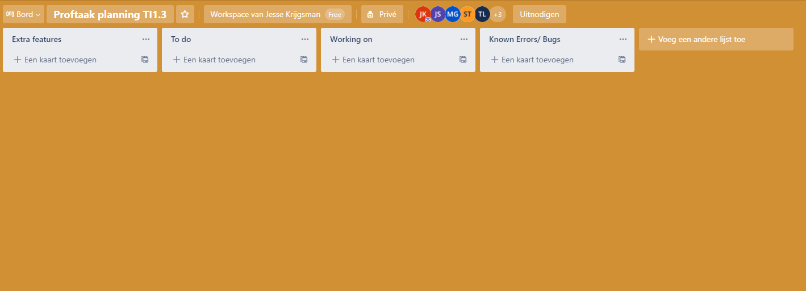

# Portfolio Individueel resultaat
### Jesse Krijgsman 2166189 TI 1.3 A3

In dit document wordt het proces van het ontwerpen, maken, testen en alle andere noodzakelijkheiden omtrent de festival planner.
Alle bezigheden, moeilijkheden en keuzes die ik en wij hebben moeten maken zijn opgenomen. Alles wat hier beschreven staat is vanuit het oogpunt van 
mij, Jesse Krijgsman. In dit portfolio worden lesweek 3 t/m lesweek 9 opgenomen. Ook wordt er een reflectie met onderbouwing op 
het werken met .JSON bestanden gegeven.

Er worden voor elke lesweek de volgernde punten behandeld:
* Een reflectie over mijn bijdrage aan, en het doorlopen proces van, het project.
* Een reflectie over de technische en/of vakinhoudelijke problomen
    * Wat is de situatie (context)?
    * Welke keuzemogelijkheden heb je?
    * Welke keuze heb je gemaakt?
    * Waarom heb je deze keuze gemaakt?

##Week 3

#### Reflectie proces

Deze week zijn we begonnen met het demostreren van onze AgendaModule. De Senior was tevreden met hoe het er op het moment voor staat, de code ziet er goed uit. 
Er zijn nog wel dingen die opgelost moeten worden. Na de demonstratie hebben wij een vergadering gehouden met de plannen van deze week.

Als planner binnen de groep heb ik na de vergadering laten zien hoe we gebruik gaan maken van Trello om onze taken bij te houden.
Dit is naast het Excel sheet dat we al gebruiken voor de planning. Ik ben niet georganiseerd te noemen, als planner probeer ik het deze periode goed te doen.
Hieronder is een afbeelding te zien van de nieuwe trello pagina, zodat we alle taken goed georganiseerd bij kunnen houden.

#### Reflectie vakinhoudelijk

* ##### Wat is de situatie?
