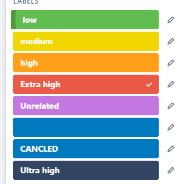
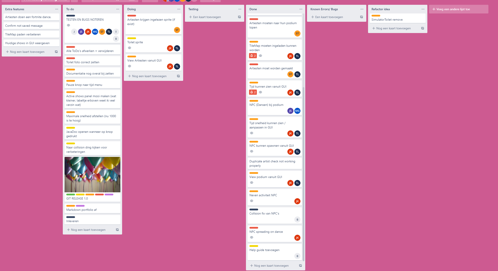
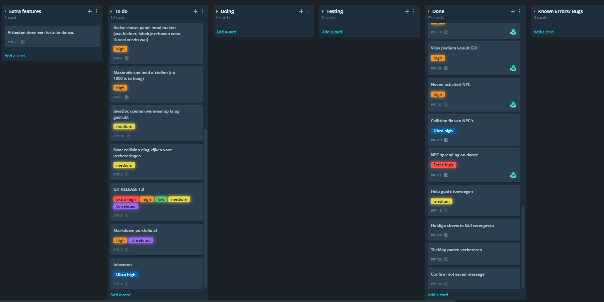
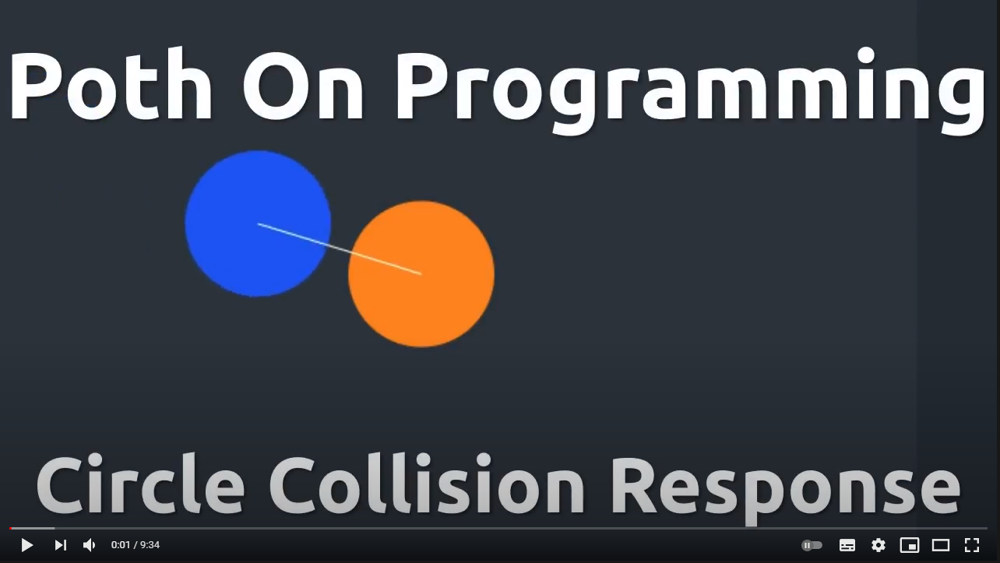
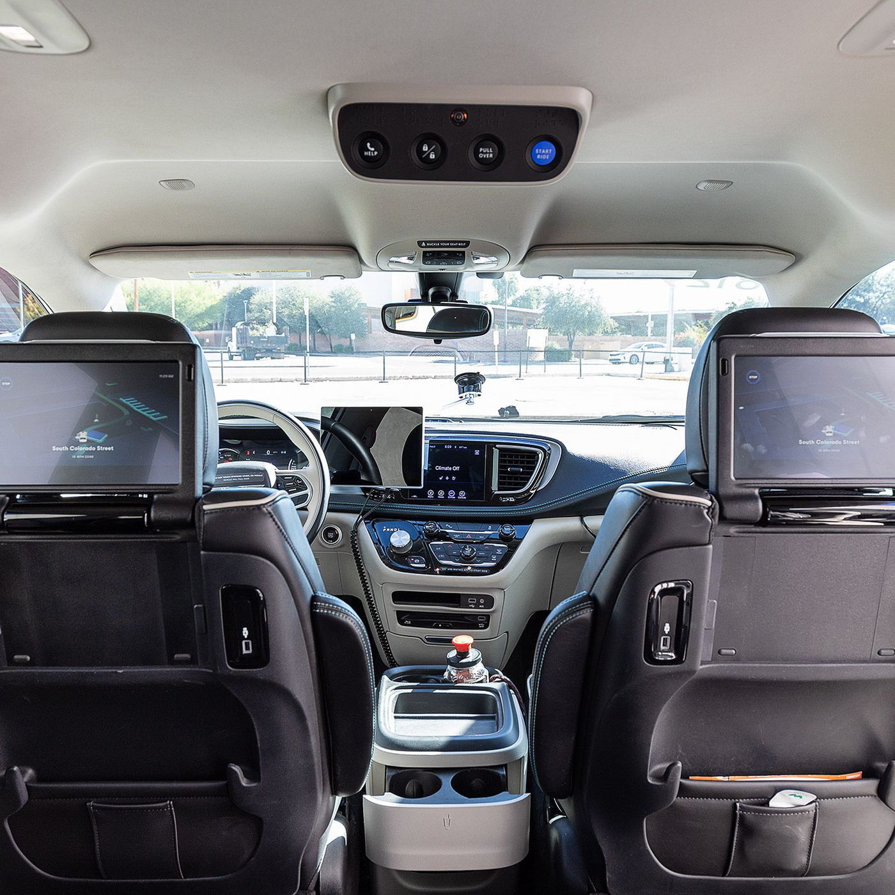

# Portfolio Individueel resultaat

### Jesse Krijgsman 2166189 TI 1.3 A3

In dit document wordt het proces van het ontwerpen, maken, testen en alle andere noodzakelijkheden omtrent de festival
planner. Alle bezigheden, moeilijkheden en keuzes die ik en wij hebben moeten maken zijn opgenomen. Alles wat hier
beschreven staat is vanuit het oogpunt van mij, Jesse Krijgsman. In dit portfolio worden lesweek 3 t/m lesweek 9
opgenomen. Ook wordt er een reflectie met onderbouwing op het werken met .JSON bestanden gegeven.

Er worden voor elke lesweek de volgende punten behandeld:

* Een reflectie over mijn bijdrage aan, en het doorlopen proces van, het project.
* Een reflectie over de technische en/of vakinhoudelijke problemen.
    * Wat is de situatie (context)?
    * Welke keuzemogelijkheden heb je?
    * Welke keuze heb je gemaakt?
    * Waarom heb je deze keuze gemaakt?

---

# Week 3

---

### Reflectie proces

Deze week zijn we begonnen met het demonstreren van onze AgendaModule. De Senior was tevreden met hoe het er op het
moment voor staat, de code ziet er goed uit. Er zijn nog wel dingen die opgelost moeten worden. Na de demonstratie
hebben wij een vergadering gehouden met de plannen van deze week.

Als planner binnen de groep heb ik na de vergadering laten zien hoe we gebruik gaan maken van Trello om onze taken bij
te houden. Dit is naast het Excel sheet dat we al gebruiken voor de planning. Ik ben niet georganiseerd te noemen, als
planner probeer ik het deze periode goed te doen. Hieronder is een afbeelding te zien van de nieuwe trello pagina, zodat
we alle taken goed georganiseerd bij kunnen houden.


---

### Reflectie vakinhoudelijk

Inhoudelijk zijn we deze week vooral bezig geweest met aanpassingen aan onze agenda module. Na de start van deze week
hebben we onze module gepresenteerd aan de senior Johan, hij was zeer positief over ons resultaat. Maar er stonden nog
wat punten op die toegevoegd moeten worden één voorbeeld hiervan is het aangeven wanneer een artiest een dubbele boeking
heeft staan.

Deze week heb ik mij vooral bezig gehouden met en inzoomen en schalen van AgendaCanvas. Dit was geen verplichting
volgens de opdracht, maar het is wel iets wat wij als groep graag zouden willen hebben. Dit om te voorkomen dat er witte
vlakken ontstaan als het canvas te groot wordt gemaakt

Bij dit proces zijn veel moeilijkheden waar ik er hier graag twee zou willen uitlichten:

+ De functionaliteit van het inzoomen tijdens scrollen.
+ Het meeschalen tijdens het vergroten van de stage.

---

##### De functionaliteit van het inzoomen tijdens scrollen

In de week voorgaand aan week 3 heb ik, samen met teun, gewerkt aan AgendaCanvas. Dit is de klasse waarin het canvas
voor de agenda module staat. Deze klasse heeft een Rooster als attribuut en vertaald deze naar een rooster op het
scherm. Ook zit er in deze klasse de manier om te scrollen. Zowel verticaal als horizontaal.

In deze week zijn we bezig geweest met het toevoegen van inzoomen in het canvas. De eerste vraag die naar boven kwam was
de vraag of het inzoomen zowel horizontaal als verticaal moest zijn, of dat het alleen over de horizontale is gaat. De
keuze is gemaakt om alleen horizontaal in te zoomen, zodat het mogelijk wordt om de hele tijdlijn te zien in één scherm
zonder dat de podia heel klein worden weergeven.

We hadden al de methode `public boolean transformInBounds(AffineTransform transform)` gemaakt voor het implementeren van
het normale scrollen. Daarom was het de planning om het inzoomen ook via deze manier te laten werken. De methode staat
hieronder ook weergeven:

```java
    /**
 Calculates if the given translate will fit within the set bounds.
 <p>
 Currently only works on translations, scale not yet implemented.
 @param transform  AffineTransform that is proposed
  * @return true if the given translate is in bounds
 */
private boolean cameraInBounds(AffineTransform transform){
        return(this.cameraTransform.getTranslateX()+transform.getTranslateX()<=1&&
        this.cameraTransform.getTranslateX()+transform.getTranslateX()>=-(this.endX-this.startX-this.canvas.getWidth())&&
        this.cameraTransform.getTranslateY()+transform.getTranslateY()<=1&&
        this.cameraTransform.getTranslateY()+transform.getTranslateY()>=-(this.endY-this.startY-this.canvas.getHeight())
        );
        }
```

Helaas kwam ik in de knoei met het inzoomen via `AffineTransform`. Het schalen was geen probleem, het probleem kwam met
het checken of het schalen wel binnen het veld past. De waarden waarop het canvas begint of in afgelopen veranderen
flink als je gaat inzoomen. Ik kreeg het niet voor elkaar om dit goed te krijgen. Het gebeurde steeds dat, of ik kon
veel te ver naar links of rechts doorscrollen na het inzoomen, of de camera wou niet meer verder dan 11 uur door
scrollen.

Ik heb besloten om het inzoomen via een andere manier te doen, niet via een `AffineTransform`. `AgendaCanvas` Heeft nu
een attribuut die het inzoomen bijhoudt als een factor, hiermee voorkomen we het inBounds probleem. Dit omdat er tijdens
het tekenen van het canvas rekening wordt gehouden met deze factor en de breedte van het canvas dus automatisch mee
schaalt.

Het resultaat van het inzoomen staat hieronder in deze mooie gif gedemonstreerd.


---

##### De functionaliteit van het mee schalen tijdens het vergroten van het window.

Het tweede probleem waar we meezaten is het feit dat: wanneer het windows wordt vergroot tot buiten de grenzen van de
agenda het verder wit blijft. Dit is geen mooie oplossing en breekt ook een beetje de illusie van het programma. Het
probleem is ook duidelijk te zien in de gif die hieronder staat.


In het klasse `AgendaCanvas` zat al een methode die de bounds van het canvas berekend, deze heb ik de weken hiervoor
gemaakt. Deze methode deed op het moment niks anders de de bounds naar statische waarden zetten. Nu is de methode
aangepast.

Eerst berekend de methode een schalings factor, dit is gebaseerd op een tijdlijn van 24 uur (zoals de opdracht) en een
standaard breedte van een uur van 60 pixels (dit is eerder gekozen om de minuten goed te representeren). Door deze
deling wordt er bepaald welke schaal er nodig is om te zorgen dat het gehele scherm gevuld is met de periode van 0 tot
24 uur.

```java
double monitorToScale=(this.canvas.getWidth()+startX)/(24*60*scale);
```

Hierna wordt er door de methode gekeken of de schaal groter is dan 1. Als dit het geval is dan valt het canvas dus
binnen het veld van het venster. In dat geval moet de schaal worden aangepast door de methode.

```java
if(monitorToScale>1){
        this.scale=(this.canvas.getWidth()+startX)/(24*60);
        }
```

De nieuwe bounds worden op basis van de schaal berekend en het scalen werkt volledig. Hieronder staat de volledig
methode ook aangegeven:

```java
/**
 * Sets the boundaries of the agendaCanvas.
 * <p>
 * Initializes <code>this.startX</code>, <code>this.endX</code>, <code>this.startY</code>, <code>this.endY</code> based on the calculated boundaries.
 */
private void calculateBounds(){
        this.startX=-100;
        this.startY=-50;

        double monitorToScale=(this.canvas.getWidth()+startX)/(24*60*scale);
        if(monitorToScale>1){
        this.scale=(this.canvas.getWidth()+startX)/(24*60);
        }

        if(this.canvas.getHeight()>this.usedStages.size()*80){
        this.endY=(int)this.canvas.getHeight();
        }else{
        this.endY=this.usedStages.size()*80+50;
        }

        this.endX=(int)(60*this.scale*24);
        }
```

Nu schaal het rooster mee met het venster als deze te groot wordt. Het restultaat staat hieronder met een gifje. Beloofd
dat ik voor deze week geen gif bestanden meer zal gebruiken, het begint toch wat te druk te worden ;)


---
De kat van week 3 is (All royalties to Max van Gils):


---

# Week 4

---

### Reflectie proces

Deze project week zijn wij begonnen met een Tutor gesprek. Deze week stond op de planning om het ontwerp te maken voor
de rest van het project. Het simulator gedeelte moest hierbij worden uitgedacht. Na de vergadering en het opdelen van de
taken hebben zijn we met de hele groep bezig geweest. Later hebben Jason en ik de andere twee klasse diagrammen die op
de planning stonden gemaakt. De Klasse diagrammen die gemaakt moesten worden zijn:

+ Klasse Diagram met de TileMap en onderliggende code
+ Klasse Diagram met de logica achter het aansturen van applicatie
+ Klasse Diagram met de opbouw en werking van de GUI applicaties

Later in de week zijn wij er achter gekomen dat objecten ook uit een Json bestand moeten worden gelezen. Hierna heb ik
deze ook kort toegevoegd in het TileMap klasse diagram

De Klasse diagrammen die wij hebben gemaakt in deze ontwerpfase staat hieronder gegeven:


Na het senior gesprek zijn er een paar kleine aanpassingen gemaakt, maar hij was grotendeels positief.

---

### Reflectie vakinhoudelijk

Achtergrond voor deze week: Deze week zijn wij bezig met het ontwerp zoals in het vorige stukje uitgelegd.
Vakinhoudelijk zijn wij deze week bezig geweest met en implementeren van de TileMap klassen die wij hiervoor hebben
ontworpen. Hierna moest onze gemaakt Tilemap Json bestand worden uitgelezen.

##### Uitlezen Json-bestand

Ik wil het in de reflectie van deze week hebben over één probleem waar ik tegen aan liep tijdens het uitlezen van een
Json bestand. In ons ontwerp is er voor gekozen om alle uitgelezen tiles in een in een HashMap op te slaan Hierbij wordt
als key het Id nummer van de Tile opgeslagen en als value de Tile zelf. Het idee hier achter is dat wij dus niet elke
tile hoeven in te laden. Dit scheelt in tijd een zeker ook in het gebruik van het werkgeheugen.

Hieronder staat een stukje uit de klasse die deze tiles moet uitlezen:

```java
JsonArray tileSets = root.getJsonArray("tilesets");

        //loops through all tileSets
        for (int i = 0; i < tileSets.size(); i++) {
        JsonObject tileSet = tileSets.getJsonObject(i);

        int tileWidth = tileSet.getInt("tilewidth");
        int tileHeight = tileSet.getInt("tileheight");
        int collums = tileSet.getInt("columns");

        //Loading image in tileSet
        BufferedImage tileImage = ImageIO.read(getClass().getResourceAsStream(tileSet.getString("image")));
        
        //only loop through used images for efficiency
        JsonArray tiles = tileSet.getJsonArray("tiles");
        for (int q = 0; q < tiles.size(); q++) {
            JsonObject tile = tiles.getJsonObject(q);
            int id = tile.getInt("id");
            
            //only loops through used images for efficiency
            Tile tileObject = new Tile(tileImage.getSubimage(
                    (tileWidth + 1) * (id % collums),        //
                    (tileHeight + 1) * (id / collums),       // Voodoo magic splitting the images based on id
                    tileWidth,                               //
                    tileHeight), id);                        //

                    tileManager.addTile(id, tileObject);
                }
            }
```

In de code is te zien dat de bedoeling is dat het programma door elke tileset loopt. Voor elke tileSet loopt hij door alle tiles
deze tile wordt dan gemaakt op basis van het id en toegevoegd aan de TileManager die dit allemaal bijhoudt.
Echter liepen we hier tegen problemen aan. Nadat we eidenlijk het opslitten van de images op basis van het id werkend kreeg was 
onze map nogsteeds vrij leeg. Na veel zoeken ben ik er achter gekomen dat de tiles die in de tileset worden aangegeven niet alle tiles
zijn maar slechts de tiles die aan een texture gekoppeld zijn.

Na overleg met de Senior blijkt het dat dit ook klopt. We kunnen door door alle tiles in elke layer te lopen kunnen we dit wel bereiken 
waardoor de alleen door de gebruikte tiles lopen. Volgende week zal ik behandelen hoe wij dit probleem hebben opgelost

---
De kat van week 4 is (All royalties to Max van Gils):


---

# Week 5

---

### Reflectie proces

De week hiervoor hebben wij de ontwerpen gemaakt voor de verdere klassen en GUI's die wij nodig hebben. Dit betreft vooral de
simulatie module met alle onderliggende logica. Ook de tile map die uitgelezen worden uit een Json bestand zijn gemodelleerd.

Deze project week begon met een demo over hoe je NPC's zou kunnen implementeren. Op donderdag heeft de senior naar onze ontwerpen
gekeken en deze beoordeeld. Er waren een aantal dingen waar wij wel over hebben gedacht, alleen niet helemaal duidelijk genoteerd hadden.
Een voorbeeld hiervan waren de state klassen die de een NPC aansturen afhankelijk van wat zijn staat is. Hierbij hadden wij niet helemaal
duidelijk gemaakt wat de klassen precies moesten doen. Na het doorspreken van ons idee heeft de Senior het goedgekeurd.

Het idee is dat de klasse de correcte methode aanroepen binnen de NPC zelf en dit dus niet zelf afhandelen. Op het moment dat
de taak is afgerond zal de state een state terug geven. Dit wordt de nieuwe state van de NPC worden. Als de taak niet is afgerond zal
het zichzelf terug geven, anders een andere state.

Ook was het wat onnodig dat wij aparte klasse hebben gemaakt voor een normale NPC en een Artiesten NPC. Zonder dat er echt
veel anders was aan de klassen. Na dit gesprek hebben wij dit ook aangepast.

Na het Senior gesprek hebben wij een vergadering gehouden waar besproken is hoe wij als groep en als project verder willen.
Ook hebben wij taken voor deze week verdeeld. Verder is er niet veel te zeggen over het proces. Het is verder redelijk normaal
verlopen.

---
### Reflectie Vakinhoudelijk

Deze week zou ik terug komen op hoe ik het probleem met het inlande van de tile heb opgelost. Tijdens het Senior gesprek is 
dit punt ook naar voren gekomen. Zoals ik van te voren ook al het vermoede had, zijn de tiles die in het JSON object met tilesets
voorkomen niet alle tiles die daadwerkelijk gebruikt worden. De Senior stelde voor dat we door alle layers heen konden lopen en
door elke tile toe te voegen aan een hashSet ervoor konden zorgen dat elke tile maar één maal voor zou komen.

Ik ben deze week bezig geweest met het implementeren van dit idee, echter liepen we tegen een ander probleem aan. Nog steeds niet
alle tile kwamen tevoorschijn, ook zagen zij er niet goed uit. Zie hier onder voor een foto hoe het er uitzag:


Dit is hoe de applicatie er uitzag, na hier nog wat meer tijd in te stoppen ben ik er nog niet achter gekomen. Als groep hebben wij
besloten dat dit punt niet heel belangrijk was om naar te kijken. Het bespaart slechts een klein beetje geheugen, terwijl de applicatie
niet veel geheugen in beslag neemt.

Wij hebben toen besloten dat het beter is om te focussen op het werken aan de andere taken van deze week. Ook begonnen wij tegen
probelemen aan te lopen met performance, en was het slimmer om op performance verbeteringen te foccussen.

Verder wil ik het in de reflectie van deze week hebben over twee onderwerpen. Deze week zijn Teun en ik bezig geweest met het
implementeren van het SimulatorCanvas. En het performace probleem waar wij tegenaan liepen en hoe we dat hebben opgelost.

---
##### Het SimularCanvas

Zoals in de ontwerpfase is bedacht, moest er een SimulatoCanvas komen. Het idee van deze klasse is dat deze klasse het canvas
waarop onze simulatie 'getekend' wordt moet voorstellen. Het taak van deze klasse is dus, gegeven een TileMap, het tekennen op het
scherm. Ook is deze klasse verantwoordelijk voor het bewegen van het canvas door het gebruik van WASD of door het slepen van de muis,
voor het inzoomen van het canvas en het afhandelen van de correcte ScreenSpace punt omzetten naar een WorldSpace punt.

Het tekenen van de TileMap zelf in deze klasse is een eitje. Door de manier waarop wij de TileMap hebben geïmplementeerd 
hoeven wij alleen nog de draw methode in deze klasse aan te roepen. Zie deze code:

```java
this.tileMap.draw(fxGraphics2D);
```

De grote uitdaging was het bewegen over het scherm en het inzoomen. In de reflectie van week 3 heb ik het gehad over de
`CameraInBounds()` methode, deze moesten wij deze week weer gebruiken. Echter was het nodig om ook het inzoomen hierin te verwerken.
Dit was, zoals te lezen bij week 3, niet te geluk toen.
Hieronder staat de code waarmee wij het nu wel werkend hebben gekregen:

```java
private boolean cameraInBounds(AffineTransform transform) {
        return ((this.cameraTransform.getTranslateX() + transform.getTranslateX()) / this.cameraTransform.getScaleX() <= 1 &&
                (this.cameraTransform.getTranslateX() + transform.getTranslateX()) / this.cameraTransform.getScaleX() >= -((this.endX - this.startX) - (this.canvas.getWidth() / this.cameraTransform.getScaleX())) &&
                (this.cameraTransform.getTranslateY() + transform.getTranslateY()) / this.cameraTransform.getScaleY() <= 1 &&
                (this.cameraTransform.getTranslateY() + transform.getTranslateY()) / this.cameraTransform.getScaleY() >= -((this.endY - this.startY) - (this.canvas.getHeight() / this.cameraTransform.getScaleY())) &&
                (this.cameraTransform.getScaleX() * transform.getScaleX()) < 2.5 &&
                (this.cameraTransform.getScaleX() * transform.getScaleX()) > 0.5
        );
    }
```

Wat wij vorige keer fout hebben gedaan is dat wij de waarden van de nieuwe transform wel deelden door de schaal, alleen het nieuwe eind van het scherm niet.
Hierdoor kreeg je het probleem dat het scherm of niet ver genoeg of te veer naar links of rechts ging nadat er was gezoomt. Door beide
waarde te delen door de huidige schaal lossen wij dit probleem op.

Het bewegen van het scheerm d.m.v. slepen was niet heel bijzonder omdat wij dit ookal meerdere malen hebben gehad bij 2DGraphics.
Ik zal het in deze reflectie dus ook niet behandelen. Wel is het bewegen door het gebruik van WASD interessant om te laten zien.

Op het moment dat er op een toets wordt gedruk wordt onze methode aangeroepen door deze regel: `this.canvas.setOnKeyPressed(this::onWASD);`.
De methode `onWASD()` staat hieronder gegeven.

```java
private void onWASD(KeyEvent keyEvent) {
        double verticalPixels = 0;
        double horizontalPixels = 0;

        switch (keyEvent.getCode()) {
            case UP:
            case W:
                verticalPixels = CAMERA_SPEED;
                break;
            case LEFT:
            case A:
                horizontalPixels = CAMERA_SPEED;
                break;
            case DOWN:
            case S:
                verticalPixels = -CAMERA_SPEED;
                break;
            case RIGHT:
            case D:
                horizontalPixels = -CAMERA_SPEED;
                break;
        }

        AffineTransform transform = new AffineTransform();
        transform.translate(horizontalPixels, verticalPixels);
        if(cameraInBounds(transform)) {
            this.cameraTransform.translate(horizontalPixels, verticalPixels);
        }
    }
```

Oorspronkelijk probeerden wij de toets waarop gedrukt was uit te lezen met de `getCharacter()` methode. Dit gaf een lege waarde
terug en wij liepen hier vast. Het bleek dat wij de `getCode()` konder gebruiken om de key uit te lezen. Omdat deze code een 
Enum waarde is hebben wij gekozen om het met een Switch-case af te handelen. Het attribuut cameraTransform wordt getranslate 
in de richting afhankelijk van op welke knop is gedrukt. 

Leuk om in deze methode ui te lichten is dat er staat 
```java
case UP:
case W:
verticalPixels = CAMERA_SPEED;
break;
```

en ook zo verder voor de andeere character. Ik wist niet dat dit kon en kan mij niet herrineren dat wij dit gehad hebben.
Als je na een case geen break zet wordt de volgende case ook uitgevoerd. Dus door bij de case UP niks te zetten en deze boven de 
case 'W' te zetten gebeurd er exact hetzelfde als er op het pijltje omhoog wordt gedrukt als waneer het op de 'W' toets wordt gedrukt.

De complete werking van het cavas is hieronder te zien in een gif.


---
#### Buffering images

Het is misschien te zien in de gif die in het vorge stukje stond, maar we beginnen wel te lopen tegen performance problemen.
Tijdens het scrollen door de tileMap draaide onze applicatie ongeveer met 30fps, echter bleef hij soms hangen en hadden we last van
een lag-spike. Soms duurde het tot 5 seconde voordat de volgende frame geladen kon worden, 02 fps. Dit konden wij zien door
elke update aanroep 1/deltaTime uit te printen.

Van onze senior hadden wij tijdens het gesprek het al over performance gehad en stelde hij voor om de layers in de TileMap
te gaan bufferen. Dit hebben wij nog niet eerder in de les gehad, dus we moesten redelijk zelf uitzoeken hoe dit werkt.

Wij hebben in de klasse TileLayer het attribuut imageLayer toegevoegd: `private BufferedImage imageLayer;`.
Met de onderstaande code worden alle verschillende Tiles in de Layer getekend naar het plaatje. 

```java
/**
     * Buffers a new BufferedImage based on <code>this.tiles</code>.
     * @return  a new BufferedImage base on this layer
     */
    private BufferedImage constructImageLayer() {
        BufferedImage imageLayer = new BufferedImage(this.width * this.tileWidth, this.height * tileHeight, BufferedImage.TYPE_INT_ARGB);
        Graphics2D g2d = imageLayer.createGraphics();

        for (int y = 0; y < height; y++) {
            for (int x = 0; x < width; x++) {
                if (tiles[y][x] == null) {
                    continue;
                }
                tiles[y][x].draw(g2d, x * tileWidth,y * tileHeight);
            }
        }

        return imageLayer;
    }
```
De methode loopt door elke tile heen en tekend deze naar de `BufferedImage`. In de draw methode van Layer wordt dan
alleen nog dit plaatje getekend. Er wordt niet meer door elke Tile in de klasse gelopen om getekend te worden.

```java
AffineTransform tx = new AffineTransform();
g2d.drawImage(this.imageLayer, tx, null);
```

Dit betekend dat als er dingen veranderen in onze TileMap dit niet getekend wordt. de methode hierboven moet dan eerst opnieuw
worden aangeroepen. Dit is voor ons geen probleem omdat er in onze TileMap geen animaties of beweging zit.

Na deze aanpassing kregen wij tijdens het slepen door het canvas een vaste 60 fps. Dit heeft dus heel veel gescheeld in onze
applicatie. Zonder deze werking hadden wij eigenlijk niet verder gekund.

---
De kat van week 5 is (All royalties to Max van Gils):


---

# Week 6

---

### Reflectie proces

Proces matig is deze week ook niet heel spannend geweest. Deze week hebben wij als groep een Tutor gesprek gehad, een vergadering
die wordt bijgewoond door onze tutor. In de vergadering hebben wij het opstart college besproken en wat andere zaken.
Als planner heb ik zoals elke week weer de planning voor deze week doorgenomen en besproken. Er zijn toen taken verdeeld over
wie wat moest gaan doen.

Na de vergadering hebben wij als groep door de feedback die wij over ons PVA hebben gehad gelopen. We hebben als groep
gekeken wat er precies verandert moest worden, en afgesproken wie wat gaat aanpassen. 

We hebben een groot deel van de middag met zijn allen gewerkt aan de pathfinding. Dit is misschien niet heel efficiënt maar hier
hadden wij voor gekozen zodat iedereen in dit belangrijke stuk van het project kon meedenken en meekijken. Ik denk dat dit een goede keuze
is geweest, ondanks de extra man uren die het kostte. Iedereen weet nu hoe dit belangrijke stuk in elkaar steekt, en iedereen is
het eens met de code die is gebruikt.

---
### Reflectie Vakinhoudelijk

In het opstart college deze week is het gegaan over het implementeren van pathfinding in ons festival. Tijdens het maken van 
de TileMap hebben wij hier al over nagedacht, alle paden die wandelbaar zijn hadden wij op een aparte laag gemaakt.

Toen wij zijn begonnen met het maken van pathfinding hebben wij deze layer een speciefieke naam gegeven. Elke layer die loopbare
tiles bevat heeft de naam "PathLayer", door tijdens het uitlezen van het JSON-bestand de check op deze naam weten wij elke laag
loopbare tiles bevat.

Dit wordt in de klasse `TileMap` opgeslagen in een attribuut. Dit is het attribuut in de klasse
```java
private TileLayer pathFindingLayer;
```

Dit betekent wel dat, voor ons project, wij vast zitten aan slechts één layer met loopbare-tiles. Als groep hebben wij besloten
dat dit geen probleem is, omdat, wij niet het idee hebben dat wij meerdere pathfinding layers willen hebben. Dit scheelde ons tijd in
het implementeren en dus hebben wij de keuzen gemaakt om het op deze manier te doen.

De `JsonConverter` die wij hebben geschreven kijkt nu of de laag die hij uitleest een PathFinding layer is, als dat het geval is wordt
dat doorgegeven aan het TileMap object die wordt gevormd.

```java
        if (layerName.equals("PathLayer")) {
            tileMap.setPathFindingLayer(tileLayer); 
        }
```

Dit is al de code die nodig was in de `JsonConverter`, zoals de te zien is echt maar een heel klein stukje die toegevoegd moest worden.
Pas hierna begon het leuk te worden. Tijdens de ontwerp fase van de simulator hebben wij gedacht over Pathfinding, echter 
wisten wij nog niet hoe dit precies zou moeten gebeuren (omdat we het college nog niet hadden gehand).

#### Pathfinding in SimulatorObject

Hieronder staat eerst het nieuwe klasse diagram over onze logic gegeven.


Wat er is veranderd in dit klasse diagram t.o.v. het vorige diagram, is dat de PathFinding klasse verdwenen is.
Deze hebben wij verwijderd omdat wij niet meer vonden dat dit nodig was om de NPC aan te sturen. De klasse die nu de pathfinding
bijhoud is de abstracte klasse Simulator Object.

Waarom hebben wij hiervoor gekozen? In de pathfinding methode die wij gebruiken wordt er tijdens het inladen van een TileMap
een pad vanuit elk punt op het scherm naar elk object berekend. Een NPC die naar een bepaald object wil kan dan aan de hand
van de map naar het object waar het heel wil bepalen welke ruote er wordt genomen.

Omdat er naar elk `SimularorObject` Die wij hebben een aparte route moet komen hebben wij gekozen om de map ook in dit object 
op te slaan, een NPC heeft tevens al een attribuut doet aangeeft naar welk object het wil gaan. 

De code die wij geschreven hebben staat hieronder, hiermee wordt de map met pathdinding berekend. Dit gebeurt slechts één maal

```java
protected void buildPathMap() {
        this.pathMap = new Point[collisionLayer.getWidth()][collisionLayer.getHeight()];
        for (int x = 0; x < collisionLayer.getWidth(); x++) {
            for (int y = 0; y < collisionLayer.getHeight(); y++) {
                this.pathMap[x][y] = null;
            }
        }

        Point thisLocation = new Point((int)this.location.getX() + (collisionLayer.getTileWidth() / 2), (int)this.location.getY() + (collisionLayer.getTileHeight() / 2));

        Queue<Point> todoQueue = new LinkedList<>();
        ArrayList<Point> visited = new ArrayList<>();

        this.pathMap[(int)Math.floor(this.location.getX() / collisionLayer.getTileWidth())]
                [(int)Math.floor(this.location.getY() / collisionLayer.getTileHeight())] =
                thisLocation;


        todoQueue.add(thisLocation);
        visited.add(thisLocation);

        Point[] offsets = {new Point(collisionLayer.getTileHeight(), 0), new Point(-collisionLayer.getTileHeight(), 0),
        new Point(0, collisionLayer.getTileWidth()), new Point(0, -collisionLayer.getTileWidth())};

        while (!todoQueue.isEmpty()) {

            Point current = todoQueue.remove();

            for (Point offset : offsets) {

                Point newPoint = new Point(current.x + offset.x, current.y + offset.y);
                if (
                        newPoint.getX() < 0 ||
                                newPoint.getY() < 0 ||
                                newPoint.getX() >= collisionLayer.getTileWidth() * collisionLayer.getWidth() ||
                                newPoint.getY() >= collisionLayer.getTileHeight() * collisionLayer.getHeight()
                ) {
                    continue;
                }
                if (visited.contains(newPoint)) {
                    continue;
                }
                if (collisionLayer.getTiles()[(int) Math.floor(newPoint.getY() / collisionLayer.getTileHeight())][(int) Math.floor(newPoint.getX() / collisionLayer.getTileWidth())] == null) {
                    continue;
                }

                this.pathMap[(int) Math.floor(newPoint.getY() / collisionLayer.getTileHeight())][(int) Math.floor(newPoint.getX() / collisionLayer.getTileWidth())] = current;
                visited.add(newPoint);
                todoQueue.add(newPoint);
            }

        }

    }
```

De code lijkt zeer op de code die de senior heeft laten zien tijdens de uitleg over het pathfinding. Waar wij echter voor hebben gekozen
is om in elke tile stukje niet een heat value op te slaan, om vervolgens een richting te bepalen aan de hand van deze waarde. Maar 
om de locatie van de parent van dit vakje. Hierdoor wordt er verwezen naar de tile waar het algorithme voor pathfinding vandaan kwam.

Omdat onze NPC, naar onze artistieke keuze, alleen over de horizontale en verticale as bewegen is het in dit geval ook geen probleem dat, 
er niet in diagonalen kan worden gewezen. Onze NPC kunnen deze route toch niet lopen.

In de code doorlopen wij, vanaf het startpunt, elk direct omliggend punt. Als deze nog niet eerder bezocht is en als het punt
een valide punt is wordt de locatie waar van het vorige punt opgeslagen.

Hieronder is een foto te zien waar er voor elk vakje een lijn wordt geteken van de tile naar de route die er
gelopen moet worden.


Deze map is voor het podium dat rechts bovenin de map ligt.

#### Locatie naar NPC's

Wij hebben er voor gekozen om de pathfinding map niet op te slaan in de NPC, maar om dit door het `SimulatorObject` af te handelen.
In deze klasse is een methode `getNextPoint()` toegevoegd. Deze methode, gegeven een punt, geeft aan naar welk punt er gelopen moet
worden om richting het object te lopen.

De NPC vraagt aan het `SimulatorObject` waar hij naartoe wil waar hij heen moet lopen. Het geeft dan zijn huidige locatie mee.
Om te voorkomen dat een NPC vast komt als hij op het gras terecht komt wordt er, als de NPC op een punt buiten het pad staat, gewezen
naar het object zelf. De NPC zal dan over het gras in een directe lijn naar het object gaan lopen. Als de NPC
weer op het pad terecht komt zal het weer volgens het pad gaan lopen.

Dit leek ons als groep de beste optie om te voorkomen dat NPC vast komen te zitten als zij buiten de paden terecht komen.

De methode kijkt welk punt er is opgeslagen in de PathMap op de huidige locatie in geeft deze terug.

```java
 public Point2D getNextDirection(Point2D currentPoint) {
        Point toPoint = this.pathMap[(int)Math.floor(currentPoint.getY() / collisionLayer.getTileHeight())][(int)Math.floor(currentPoint.getX() / collisionLayer.getTileWidth())];
        if (toPoint == null) {
            toPoint = this.pathMap[(int)Math.floor(this.location.getX() / collisionLayer.getTileWidth())]
                    [(int)Math.floor(this.location.getY() / collisionLayer.getTileHeight())];
        }

        return new Point2D.Double(toPoint.x, toPoint.y);
    }
```

Een simpele methode om het punt uit te lezen uit de map en deze terug te geven. Hetgeen wat wel verbeter zou kunnen worden
is het omzetten van het punt naar een tile nummer, dit zou misschien ook in een aparte methode kunnen.

Hieronder staat een gif om te laten zien dat NPC daadwerkelijk naar hun locatie lopen. De zwarte lijnen geven de lijnen
voor de PathFinding map aan. De witte lijnen zijn de target locaties waar de NPC naartoe willen lopen.


---

# Week 7

---

### Reflectie proces

Deze projectweek zijn wij niet begonnen met een opstart college. Al het materiaal voor de rest van het project is al behandeld.
Op donderdag ochtend begonnen wij als groep met een gesprek met de senior. De senior was goed te spreken over de status van het object.
Zoals wij zelf ook al aangaven bevestigde hij dat wij vrij ver zijn met het project, maar dat er nog veel moet gebeuren.

Een belangrijk punt van het proces van deze week is dat ik de voorzitter in de vergadering was. Ik heb hier niet veel bijzonders over
te zeggen, het ging goed. We hebben alle punten die besproken moesten worden besproken. De vergadering hebben we kunnen afsluiten na 46 minuten.
Dit is prima binnen de 45 minuten die ervoor gepland was. Ik had weer een planning voor deze week klaar staan. Deze hebben wij in
de vergadering besproken en we hebben de taken verdeeld.

---

### Reflectie Vakinhoudelijk

Deze week zijn wij weer flink bezig geweest met het project. Er zijn twee onderdelen die ik wil behandelen, dit zijn twee onderdelen
waar ik aan heb gewerkt. Dit zijn: De afhandeling van tijd en de refactor van MainGUI.

#### Tijd afhandeling

Om de simulatie te besturen is het natuurlijk nodig dat er een in-game tijd wordt bijgehouden. Volgens ons ontwerp is het de bedoeling dat
dit volledig door de `SimulatorHandler` klasse wordt gedaan.
Deze klasse bevat een `LocalTime` attribuut die de huidige tijd bijhoudt.

Zoals hieronder ook te zien is, wordt elke keer dat de update methode wordt aangeroepen de in-game tijd verhoogd.

```java
this.time = this.time.plusSeconds((long) (deltaTime * this.speed));
```
Deze ene regel zorgt ervoor dat de tijd wordt opgehoogd.

Om de snelheid van de simulatie te kunnen regelen is er een speed attribuut. Deze geeft aan hoeveel in-game seconden één echt seconde voorsteld.
In het code stuk hierboven is ook te zien dat de echte tijd (deltaTime) wordt vermenigvuldigd met dit speed attribuut.

```java
private double speed; //value in game second per real second (s/s)
```

Alle onderdelen die wordt bestuurd door de `SimulatorHandler` gebruiken dit attribuut om hun snelheid te bepalen. Voor
de NPC geld dat zijn deze speed waarde ook gebruiken om te lopen. Hun loopsnelheid is afhankelijk van de snelheid van de tijd.

Dit is een voorbeeld van hoe de snelheid van een NPC wordt vastgesteld.
```java
this.position.getY() - (this.SPEED * this.gameSpeed));
```

Het is op deze manier ook gemakkelijk om de snelheid of tijd runtime aan te passen.

#### Refactor van MainGUI

Er waren een aantal problemen waar wij tegen aan liepen. Hierom was het nodig om de `MainGUI` klasse te gaan refactoren.
De redenen zijn:
 + Tijdens het opstarten van de applicatie was er voor een aantal seconde een blank scherm. Dit komt omdat de SimulatorModule werdt 
   opgestart. Hierin wordt onze TileMap uitgelezen en alle verschillende pathfinding naar de object berekend. Dit kost een aantal seconde.
   Wij vonden het beter als dit pas gebeurt zodra de gebruiker een agenda heeft gemaakt.
 + Er moeten uit de agenda verschillende waarden gelezen worden, bijvoorbeeld de verschillende podia. Deze waarden bepalen wat
   er in de simulatie moet gebeuren. Om te voorkomen dat deze waarden steeds opnieuw worden berekend, en ook om te voorkomen dat
   de agenda en de handler met elkaar in contact staan (design keuze) moest er een manier komen om een simulatie te starten met een agenda.
 + De `SimulatorModule` en `AgendaModule` stonde met elkaar in contact. Dit wilden wij eigenlijk voorkomen aangezien `MainGUI` boven deze klassen staan, en ze bijhoudt

Wat hebben wij veranderd: 
In plaats van dat de twee module elkaar aanroepen als er tussen deze twee gewisseld moet worden. Gebeurd dit nu via callbacks.

```java
/**
     * Sets the current scene to the scene of <code>this.simulatorModule</code>.
     */
    public void loadSimulatorCallBack() {
        //Setting w/h
        this.stage.setWidth(1100);
        this.stage.setHeight(800);

        this.stage.setScene(this.simulatorModule.getSimulatorScene());
    }

    /**
     * creates a new <a href="{@docRoot}/FestivalPlanner/GUI/SimulatorGUI/SimulatorModule.html">Simulatormodule</a> if
     * <code>this.simulatorModule</code> is null.
     * <b>
     * Else it calls the {@link SimulatorModule#resetHandler()} method.
     */
    public void constructSimulatorCallBack(AgendaModule agendaModule) {
        if (this.simulatorModule == null) {
            this.simulatorModule = new SimulatorModule(this, stage, agendaModule);
            simulatorModule.load();
        } else {
            this.simulatorModule.resetHandler();
        }
    }

    /**
     * Sets the current scene to the scene of <code>this.agendaModule</code>.
     */
    public void loadAgendaCallBack() {
        if (this.agendaModule == null) {
            this.agendaModule = new AgendaModule(this, stage);
            SaveSettingsHandler.firstLaunchSettingsCreation();
            agendaModule.load();
        }

        //Setting stage width/height
        this.stage.setWidth(1450);
        this.stage.setHeight(350);

        this.stage.setScene(this.agendaModule.getAgendaScene());
    }
```

Als het nodig is om naar de agenda of simulator te gaan kan een klasse één van deze callbacks aanroepen. De MainGUI is nu verantwoordelijk
voor het zorgen dat dit ook echt gebeurt. Ook is een een callback waarmee de simulatorModule kan worden herstart met nieuwe waarden.
Hierdoor kan een simulatie opnieuw worden gestart met verschillende agenda waarden.

---

# Week 8

---

### Reflectie proces

Deze week was de laatste week voor het project. Wij liepen goed op schema, maar er moest nog veel gebeuren om het project af te
ronden. Wij hebben met de groep deze week ook een vergadering gehouden. Deze vergadering was minder formeel dan de voorgaande vergaderingen, 
maar er is uitgebreid besproken wat er moest gebeuren. 

Als planner heb ik de planning in overleg met de groep opgesteld. De afgelopen weken hebben wij vaak de planning in Excel gemaakt.
De planning hebben wij vervolgens ook in Trello gezet. Het viel mij wel op dat wij Trello eigenlijk niet veel gebruikt hebben.
Voor deze week was het echter noodzakelijk dat alles wat op de planning stond gebeurt, en alle fouten en dingen die wij tegen zouden komen
moeten ook gelijk deze week gebeuren. Daarom heb ik in overleg besloten dat wij voor deze week exlusief met Trello gaan werken.

Naast de vijf borden die al op de planning stonden (Zie reflectie week3) zijn er deze week wat uitbreidingen geweest in Trello.
Voor het overzicht krijgt elke kaart nu ook een label die de prioriteit of waarde van de kaart aangeeft. Zie de foto hieronder:



Hieronder staat een foto hoe het bord er tegen het eind van het project er uitziet. Met aan elke kaart een persoon en een label gekoppeld.



Het werk op deze manier is erg goed bevallen. Het heeft zijn nadelen voor een groot product, maar voor een eindsprint zoals in
deze laatste week is een Trello bord heel handig.

Ook ben ik er achter gekomen dat je via gitkraken je git-project aan een bord kan koppelen:



Voor volgende periode wil ik hier zeker naar kijken hoe dit in elkaar steekt.

---

### Reflectie proces

Deze week is er heel veel gebeurd aan de code. Ik ga deze ook niet uitlichten in de reflectie van deze week. Voor deze week wil
ik alleen de nieuwe collision methode voor ons project laten zien.
Niet omdat de code voor de collision zeer goed werkt, of geweldig is. Maar om wat ik er door heb geleerd.

##### Collision

Het idee voorde collision: Op het moment dat een NPC na het bewegen in aanraking komt met een andere NPC is het de bedoeling dat
De NPC terug gezet wordt het aantal pixels dat hij binnen de collision circkel van de ander NPC zit. Hierdoor staan ze niet meer in 
aanraaking. Om te voorkomen dat NPC stil komen te staan op de plek zodra twee NPC een andere kan op willen was het de bedoeling dat:

De NPC die de collision veroorzaakt wordt niet terug gezet met het aantal pixels dat hij is binnen gedrongen maar slechts de helft.
De NPC waarmee er aanraking is wordt ook met de helft verschoven, maar dan in de tegengestelde richting. Hierdoor duwt de NPC
als het ware de andere NPC een klein stukje. Deze NPC zal vervolgens mogenlijk weer terug duwen. De bedoeling van dit systeem is
dat een NPC niet vast komt te zitten maar dat er altijd beweging is.

Omdat wij er voor gekozen hebben om onze NPC slecht vier richtingen te geven (boven, rechts, onder, links) ging ik er vanuit
dat ik ook geen rekening hoefte te houden met de angle tussen NPC1 en NPC2. De onderstaande code heb ik geschreven voor de collision:

```java
switch (this.direction) {
            case UP:

                double penetrationUp = (this.position.getY() - (this.COLLISION_RADIUS / 2f)) - (otherNPC.position.getY() + (otherNPC.COLLISION_RADIUS / 2f));
                this.position = new Point2D.Double(this.position.getX(), this.position.getY() - (penetrationUp / 2f));
                otherNPC.position = new Point2D.Double(otherNPC.position.getX(), otherNPC.position.getY() + (penetrationUp / 2f));

                break;
            case DOWN:

                double penetrationDown = (this.position.getY() + (this.COLLISION_RADIUS / 2f)) - (otherNPC.position.getY() - (otherNPC.COLLISION_RADIUS / 2f));
                this.position = new Point2D.Double(this.position.getX(), this.position.getY() - (penetrationDown / 2f));
                otherNPC.position = new Point2D.Double(otherNPC.position.getX(), otherNPC.position.getY() + (penetrationDown / 2f));

                break;
            case LEFT:

                double penetrationLeft = (this.position.getX() - (this.COLLISION_RADIUS / 2f)) - (otherNPC.position.getX() + (otherNPC.COLLISION_RADIUS / 2f));
                this.position = new Point2D.Double(this.position.getX() - (penetrationLeft / 2f), this.position.getY());
                otherNPC.position = new Point2D.Double(otherNPC.position.getX() + (penetrationLeft / 2f), otherNPC.position.getY());

                break;
            case RIGHT:

                double penetrationRight = (this.position.getX() + (this.COLLISION_RADIUS / 2f)) - (otherNPC.position.getX() - (otherNPC.COLLISION_RADIUS / 2f));
                this.position = new Point2D.Double(this.position.getX() - (penetrationRight / 2f), this.position.getY());
                otherNPC.position = new Point2D.Double(otherNPC.position.getX() + (penetrationRight / 2f), otherNPC.position.getY());

                break;

        }
```

Voor elke richting die de NPC kan hebben is er een case in de switch case. Er wordt vervolgens berekend hoever de NPC radius binnen de
radius van de andere NPC in binnen gedrongen. Dan wordt NPC1 de helft van deze afstand terug gezet en NPC2 de helft naar voren.

En deze code werkt. Alleen kwam ik er achter dat, ondanks dat NPC alleen over de asses kunen bewegen, zij wel onder een hoek konden colliden.
Dit zorgte voor problemen. Het was dus tijd om collision anders te gaan doen, bovendien is de code hierboven niet echt mooi.

Ik heb veel geprobeerd, bijvoorbeeld met een angle via:
```java
double angle = Math.atan2(this.position.getY() - ontherNPC.postion.getY(), this.podistion.getX() - otherNPC.location.getX());
```

Met een hoek werdt het toch zeer complex, en alleen kwam ik er niet uit om het goed te krijgen. Maar toen vondt ik een geweldige uitleg
online die uitleg gaf over hoe je collision met 2 circels kan afhandelen. Deze code was zo imeens veel simpeler dan ik mij ooit had voorgesteld, 
dat toen ik het zag ik mij gewoon dom voelde dat ik hier niet aan hebt gedacht.

Je berekend simpel de X afstand die er in binnen gedrongen en de Y afstand die er in binnen gedrongen. Dan verplaats je de NPC met 
de vector die je daar uit krijgt. Super simpel. Voor credits heb ik de video ook hieronder er in gezet:

[](https://www.youtube.com/watch?v=nlwtgvZCz0k&t=3s "collision")

De code werk niet altijd zonder problemen, maar de oplossing in zoveel makkelijker dan ik mij ooit had voor kunnen stellen dat 
ik in dit portfolio moest behandelen.

```java
    /**
     * Moves the <b>NPC</b> away from the others to make sure no collisions are happening.
     * <p>
     * It does this one by one; there can never be two <b>NPC</b>s moving at the same time.
     * In order to do this we check the boolean isSeparating for every <b>NPC</b> in the list given as a parameter.
     * @param otherNPC  The NPC that has collision with this
     */
    private void separateNPC(NPC otherNPC) {

        double distance = this.position.distance(otherNPC.position);

        double xFactor = (this.position.getX() - otherNPC.position.getX()) / distance;
        double yFactor = (this.position.getY() - otherNPC.position.getY()) / distance;

        this.position = new Point2D.Double(otherNPC.position.getX() + ((this.COLLISION_RADIUS) * xFactor),
                otherNPC.position.getY() + ((this.COLLISION_RADIUS) * yFactor)
        );

        otherNPC.position = new Point2D.Double(this.position.getX() - ((this.COLLISION_RADIUS) * xFactor),
                this.position.getY() - ((this.COLLISION_RADIUS) * yFactor)
        );
        
    }

```

---
# Reflectie op de gegeven stelling

###### In het bedrijfsleven wordt steeds meer in software gesimuleerd.

---

Met software is het mogelijk om veel verschillende scenario's te simuleren. Met de opkomst van kunstmatige intelegentie kan er
ook steeds complexere situaties worden gesimuleerd. In het volgende stuk zal het gaan over het simuleren van situaties met software
in het algemeen. Hierna wordt simulatie in het bedrijfsleven behandeld. Er worden een aantal voorbeelden uitgelicht. Deze reflectie
sluit af met de conclusie die ik uit dit onderzoek heb getrokken.

#### Simulaties in situaties
Het woord simulatie is natuurlijk een heel breed woord. Er zijn ontiegelijk veel verschillende situaties die met computers of
software kan worden gesimuleerd. Er kan met computers een simulatie worden gemaakt hoe verschillende materialen zich gedragen
in een situatie. Zo kan bijvoorbeeld gesimuleerd worden wanneer een bepaald materiaal en onder een kracht zal breken.

Een belangrijke applicatie van simulatie voor Nederland is het simuleren van het water. Een groot deel van Nederland ligt onder
de watergrens. Om te voorkomen dat Nederland overstroomt of dat de dijken breken worden er simulaties gemaakt over wat er 
gebeurt tijdens een overstroming. [1]

#### Gebruik van simulaties in bedrijven

In het bedrijfsleven wordt ook veel gebruik gemaakt van simulaties. Dit kan op vele manieren, zoals ook voor deze proftaak geld, 
zijn er bedrijven die zich specialiseren in het maken van simulaties. Hier verdienen zij hun geld mee. Deze simulaties worden 
gemaakt in opdracht voor een klant, dit kan een ander bedrijfs zijn maar ook bijvoorbeeld de overheid. Simulaties kunnen alle kanten 
op. Het kunnen simulaties voor een evenement, voor de economie of voor nieuwe producten zijn. Dit zijn nog maar een paar voobeelden.

Ook maken veel bedrijven die niet als hoofdproduct simulaties verkopen maken gebruik van simulaties. Het eerste voorbeeld dat misschien
naar voren komt zijn vliegtuig fabriekanten. Voor het goedkeuren van nieuwe vliegtuigen moet veel getest worden. Zeker in de 
begin fase is het voor sommige testen te gevaarlijk om deze in het echt te doen. Om er zeker van te zijn dat het vliegtuig werkt
kan een vlucht worden gesimuleerd, een simulatie is een stuk minder duur dan als een test fout gaat en een vliegtuig schade
oploopt. Ook piloten worden in een simulator opgeleid voordat zijn met een echt vliegtuig mogen vliegen. [2]

In het hoofdstuk hieronder wordt het bedrijf Waymo, die zelfrijdende auto's ontwikkeld, behandelen.

#### Waymo

Het bedrijf Waymo is een amerikaans bedrijf dat bezig is met het ontwikkelen van een zelfrijdende auto. Hiervoor is natuurlijk
goede software nodig. De software leert hoe het de auto moet besturen door te kijken naar mensen die de auto besturen.
Echter zijn er heel veel uren en kilometers nodig om dit te leren. Waymo heeft een simulator ontwikkeld die het verkeer nabootst.

 

[3]

In de afbeelding die hierboven staat is een stukje van de simulatie te zien. De software die de auto bestuurd 'denkt' dat 
waar het nu rijdt de gewone wereld is en probeerd de auto te besturen. In de werkelijkheid bevindt de software zich in een ander
programma, een programma de het verkeer simuleerd. Omdat deze simulaties zich allemaal in de computer afspeelt kan het
leren veel sneller gaan, er kunnen veel meer virtuele kilometers worden afgelegd in een uur dan wanneer de auto in de echte
wereld zou rijden.

Volgens Waymo ervaart de software ongeveer 100 jaar aan rij-ervaring voor slechts één dag in de simulatie. Zonder de simulatie 
zou het nooit mogelijk zijn geweest dat de auto van Waymo nu al zelfstandig door de stad rijdt.



Zonder iemand achter het stuur rijd deze auto al door een aantal steden in amerika heen. Allemaal door de simulatie van het 
verkeer waardoor de auto sneller kan leren.

#### reflectie

Zoals uit de bovenstaande onderbouwing wel op te maken is. Denk ik dat simulaties in het het bedrijfsleven heel belangrijk zijn.
Ook wordt het alleen maar belangrijker nu er steeds meer taken worden gedaan met de computer. Een simulatie bied een goede
manier om een probleem te testen of op te lossen zonder dat hier heel veel materieel in gestoken hoeft worden. Van tevoren
kan beter worden ingeschat, d.m.v. het draaien van simulaties, welke problemen kunnen optreden en hoe deze opgelost kunnen worden.

>-- [1] Leidraad_voor_het_maken_van_overstromingssimulaties. (2018, February). Deltares. https://www.google.com/url?sa=t&rct=j&q=&esrc=s&source=web&cd=&ved=2ahUKEwjQ4K26rNrvAhWogf0HHfnyC-QQFjAGegQIChAD&url=https%3A%2F%2Fwww.helpdeskwater.nl%2Fpublish%2Fpages%2F139608%2F20180207_leidraad_voor_het_maken_van_overstromingssimulaties_-_groene_versie_def.pdf&usg=AOvVaw2Z5ZnpDwe0HPuYbDXFQkmC
>
>-- [2] Flight Simulation Company. (n.d.). Home. Retrieved March 31, 2021, from https://www.fsctraining.com
>
>-- [3] Waypoint - The official Waymo blog: Off road, but not offline: How simulation helps advance our Waymo Driver. (n.d.). Waymo Blog. Retrieved March 31, 2021, from https://blog.waymo.com/2020/04/off-road-but-not-offline--simulation27.html
> 
>-- Hawkins, A. J. (n.d.). Waymo simulated real-world crashes to prove its self-driving cars can prevent deaths. The Verge. Retrieved March 31, 2021, from https://www.theverge.com/2021/3/8/22315361/waymo-autonomous-vehicle-simulation-car-crash-deaths
> 
>-- Markgraf, B. (2016, October 26). Application of Simulation by Managers of Business Organizations. Small Business - Chron.Com. https://smallbusiness.chron.com/application-simulation-managers-business-organizations-81404.html

---
# Applicaties die JSON gebruiken.

Applicaties die gebruik maken van de JSON-datastructuur
- CSVJSON
- Tiled
- Numidian JSON
- JSON Mate
- AJAX

