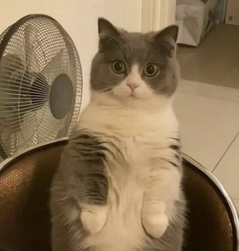
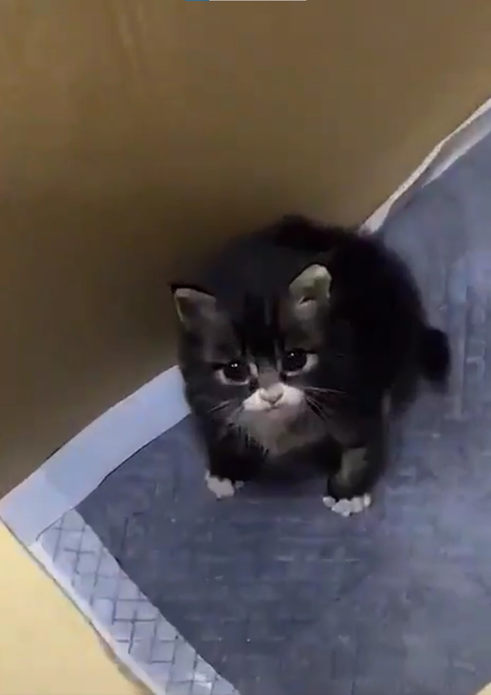
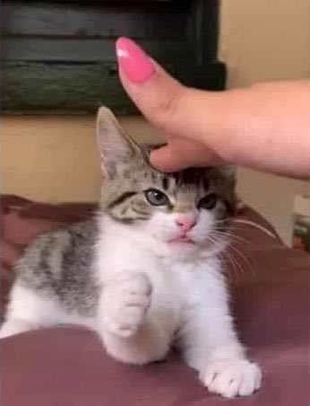
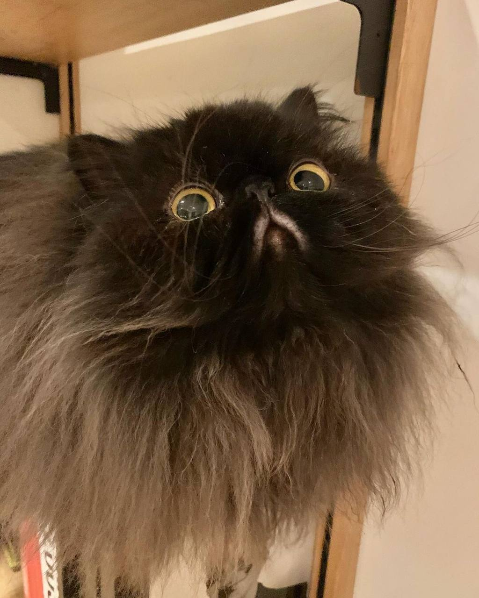

# Portfolio Individueel Resultaat Festival Planner
### Max van Gils 2168341 TI1.3 23TIVT1A3

Dit document is de documentatie van het leerprocess van mij in het project "Festival Planner".
Ik ga alles beschrijven waar ik tegenaan loop en wat ik voor keuzes maak in het project.
<br/> Dit portfolio bevat reflecties van lesweek 3 t/m lesweek 8, hierin reflecteer ik over mijn eigen inbreng in het project,
en een technisch problemen die ik tegenkom en de oplossing die ik ervoor vind.
<br/> Daarnaast zal dit document ook informatie bevatten met voorbeelden van applicaties die het JSON formaat gebruiken, waarom deze applicaties JSON gebruiken, 
en een reflectie op de volgende stelling: "In het bedrijfsleven wordt steeds meer in software gesimuleerd".
<br/> Ik ga daarnaast de week evalueren in 1 zin.
Ook zal ik elke week een foto van een kat toevoegen om gemotiveerd te blijven.


# Wekelijkse reflecties

## Week 3

### Reflectie

Tijdens het senior-gesprek kregen we te horen dat we al heel ver liepen met het project en waren er maar een paar klijne dingen die nog moesten gebeuren.
Dat is natuurlijk super fijn!
<br/> Tijdens het plannen van deze week is er gekozen om mij maar op één taak te zetten.
Ik moest het deel "Project organisatie" van het PVA nakijken en verbeteren waar nodig.

Bij mijn deel was er dus niet veel te doen. Ik had mijn deel daarom ook al binnen een uur.
<br/> Daarna heb ik nog over het PVA heen gekeken of ik nog duidelijk foute dingen kon vinden, dit was echter niet van toepassing.

### Evaluatie in 1 zin

Lekker rustig weekje waar voor ander werk veel tijd was.

### Kat van de week




## Week 4

### Reflectie

In week 4 heb ik vooral, samen met projectlid Teun, gewerkt aan het ontwerp van de GUI van de simulator en van de Tilemap.

Hieronder is te zien hoe het ontwerp van de GUI er uit ziet.


Degene die er niet aan gewerkt hebben, hebben hun feedback er over gegeven en er is wat onenigheid over de zoom.
<br/> Daarom hebben we besloten om tijdens het coderen goed met elkaar te communiceren en kleine veranderingen gelijkmatig te maken.

In de bijlage is ook te zien hoe de tilemap er uit ziet, naast een paar abnormaliteiten ziet het er naar mijn mening goed uit.
<br/> Deze kleine dingen worden hopelijk een komede week nog verandert.

### Evaluatie in 1 zin

Ontwerp ziet er goed uit maar nog niet helemaal perfect.

### Kat van de week



## Week 5

### Reflectie

Deze week heb ik samen met Berend gewerkt aan de NPC's in de simulator. Hier kwamen een paar moeilijkheden hun hoofden laten zien.
<br/> De mederheid van de code kon worden overgetypt van het opstartcollege, echter wilde wij een aander soort NPC dan die van het opstartcollege.

Het voorbeeld had een "Top-Down" npc die roteerde met de angle waarmee zij liepen. Wij wilde een soort pokémon style gebruiken.
<br/> Samen met deze beslissing hebben we ook besloten om de NPC maar in 4 richtingen te laten lopen ipv 360 graden. 
<br/> Hiervoor hebben wij een enum aangemaakt met de direction en hebben we aangegeven, we hebben van deze Enum een variabel gemaakt.
Deze variabel passen we dan aan tijdens het lopen van de NPC, deze checkt de draw-methode dan en tekent de bijbehoorende sprite waardoor de NPC zich omdraait.

Een probleem waar we tegenaan liepen was dat de NPC niet goed naar zijn doel kon lopen.
In eerste instantie wilde wij dat de NPC eerst over de kortste as liep en daarna de langste, maar bij het omdraaien deed de NPC raar en draaide rond voor eeuwig.
<br/> We hebben een aantal uur verschillende oplossingen geprobeerd zoals;

<ul><li> Een if-statement die niet alleen kijkt welke as de langste en kortste is, maar die ook kijkt naar of een van die assen gelijk of dicht bij 0 is.
Dit had echter weinig tot geen effect op het gedrag van NPC.

<li> I.p.v. een if-statement een do-while methode. Dit zorgde er voor dat het gedrag van de andere funties storing kreeg, 
ook had het weinig positieve invloed op het gedrag van de NPC zelf.
</ul>

Uiteindelijk hebben we dus besloten om de NPC eerst de x-as over te laten lopen en daarna de y-as, onafhankelijk van welke de korste en langste is.
Omdat de bedoeling is dat de NPC met pathfinding gaan wandelen, hoop ik dat dit geen invloed zal hebben op het gedrag van de NPC's dan.

### Evaluatie in 1 zin

NPC klasse werkt goed, alleen iets te lang gewerkt aan een, uiteindelijk, opgegeven functie.

### Kat van de week




## Week 6

### Reflectie

Van Katja hebben we deze week feedback ontvangen op ons PVA. Hierdoor hebben we daar aan gewerkt.
Tijdens het werken hieraan heb ik in de call gezeten met de Jesse, die bezig was met de pathfinding van de NPC's.
Hier heb ik mijn hulp zo vaak mogelijk aangeboden.
<br/> Het verwerken van de feedback van Katja ging redelijk goed, een paar puntjes waren erg klein maar andere dingen, 
zoals de inconstitente layout, waren dingen waarin ik de mening deel dat dit onacceptabel is en waar ik beter op gelet had moeten hebben.

Verder heb ik niet veel kunnen helpen met het project wat jammer is.

### Evaluatie in 1 zin

PVA feedback is goed weggewerkt, er moet nog naar een paar puntjes op de i gekeken en dan kan het ingeleverd worden.

### Kat van de week




## Week 7

### Reflectie

Deze week heb ik samen met Jason de puntjes op de i van het pva gezet, hieronder viel: de layout overal hetzelfde maken,
spelfouten wegwerken, en grammatica verbeteren. Hierna was het PVA klaar en werd het ingeleverd.
<br/> Daarna heb ik gewerkt aan de module om de agenda uit te lezen voor de simulatie, in het begin was de bedoeling van de opdracht niet helemaal duidelijk voor mij.
Navragen aan een groepsgenoot verduidelijkte dit en daarna was een eenvoudige module om te maken en
hierdoor kwamen er gelukkig geen andere complicaties bij kijken.
<br/> De staten waarin de NPC's kunnen zitten is ook een onderdeel waar ik aan heb gewerkt deze week.
In een overleg met onder andere Jesse en Jason zijn een paar mogelijkheden voor de aanpak besproken, deze mogelijkheden waren:

<ul><li> In de state handlers attributen laten aanpassen van de NPC.
</ul> Hiervoor zouden we veel attributen public moeten maken en een boel niewe methodes moeten schrijven

<ul><li> Een soort callback maken.
</ul> Hiervoor hoefden we niet veel werk te doen; er moest alleen een callback systeem gemaakt moeten worden.

De keuze was dus snel gemaakt en we besloten om het laatste te maken.
<br/> De opzet van de NPC states bestondt al in de vorm van een abstracte klasse. Hierop heb ik relevante states klassen gebouwd.
<br/> De klasse van de staat waarin de NPC loopt zie je hieronder:
```java
public class MovingState extends NPCState {
    @Override
    public void handle(NPC npc) {
        npc.walkOnAxis();
    }
}
```
Wat hier in staat stond eerst in de NPC klasse zelf, maar hierdoor was het niet mogelijk voor de NPC om iets anders te doen behalve lopen.
Nu staat daar enkel:
```java
this.npcState.handle();
```
en wordt alleen de relevante acties uitgevoerd.

### Evaluatie in 1 zin

Jammer dat ik niet alleen alles kon doen, daarnaast wel lekker gewerkt.

### Kat van de week


# Literatuuronderzoeken

## "In het bedrijfsleven wordt steeds meer in software gesimuleerd"

Het simuleren van bepaalde onderdelen van het bedrijfsleven is belangrijk en 
door de steeds ontwikkelende technologie van niet alleen hardware maar ook software wordt dit steeds gemakkelijker.
<br/> De technologie waar ik het over ga hebben is vooral gericht op VR, oftewel Virtual Reality.
Waar een paar jaar geleden alleen nog aan de mislukte Nintendo console werd gedacht, 
heeft VR zich in rap tempo ontwikkelt tot een technologie die zelfs in de bedrijfssector wilt gebruiken.


### Voorbeelden van toepassing van VR-simulaties.

Een paar bekende bedrijven die VR gebruiken zijn:
<ul><li> Boeing;
<li> Porsche;
<li> Walmart.
</ul>

Een gebruiks situatie waarin simulatie, en VR, gebruikt kan worden is om werknemers te trainen voor situaties die erg duur zijn om in het echt uit te voeren. 
<br/>Boeing gebruikt bv. VR om werknemers voor te bereiden op het maken van vliegtuigen. 
Door dit te simuleren kan een werknemer op elk moment elk onderdeel naar wens 'in elkaar zetten'.
Hierdoor is de training van een monteur veel korter en goedkoper.
<br/>Het inzetten van VR-training voor het grond team op een vliegveld is ook een goed voorbeeld van VR in het bedrijfsleven.
Het trainen van een verkeersleider komt alleen met een combinatie van praktijk en theorie tot een goed einde, 
maar praktijk is moeilijk te verkrijgen zonder er fysiek te staan, hierin komt VR goed te pas.


### Waarom wordt VR-simulatie in het bedrijfsleven nog niet veel gebruikt?

Hoewel er al bedrijven zijn die VR-simulatie al gebruiken is het nog een heel klein percentage.
Een grote oorzaak hiervan is dat het niet voor alles is te gebruiken, voor kantoorbanen is het niet praktisch om training in VR te doen.
<br/> Wel kan er voor dit soort banen, en vooral nu in de Covid-pandemie, VR worden gebruikt om samen te werken.
Hiervoor zijn er applicaties ontwikkelt zodat het lijkt alsof je alsnog in de zelfde kamer zit, ook al wordt er vanuit huis gewerkt.
<br/> Ook is het een dure investering voor iets dat vaak geen duidelijke opbrengst heeft. Hier hebben vooral kleine bedrijven last van.
Hoewel VR-apparaten steeds goedkoper worden kost een VR-headset vaak al meer dan 400 p.p., vervanginen of reperaties niet meegerekend.

## Applicaties die JSON gebruiken.

Applicaties die gebruik maken van de JSON-datastructuur
<ul><li> Tiled
<li> CSVJSON
<li> Numidian JSON
<li> JSON Mate
</ul>