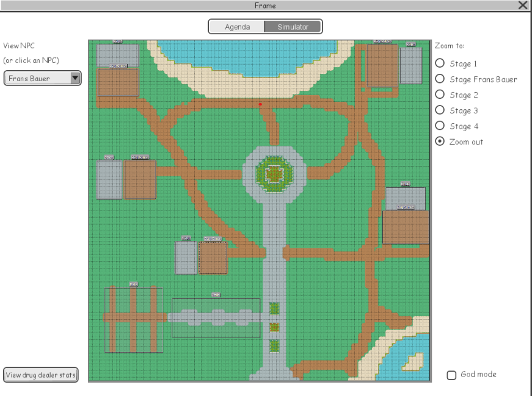
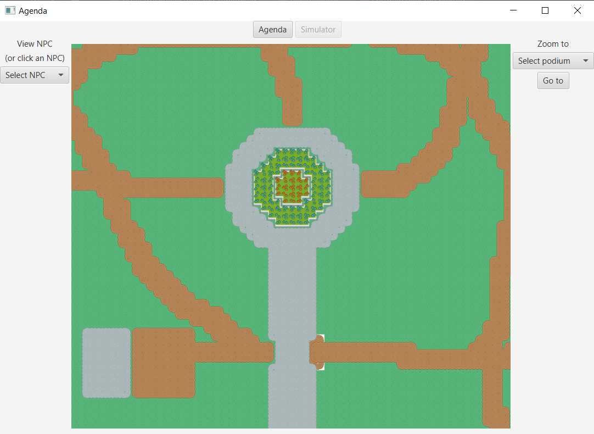

# Portfolio Individueel resultaat
### Stijn van Tilburg 2171448 TI 1.3 A3

In dit document word het leerproces omtrent de proftaak "Festival Planner"
van de student Stijn van Tilburg beschreven. Er zal vanaf de 3de week van de proftaak
wekelijks een update over het leerproces van de student zijn. In deze wekelijkse
reflectie zal worden beschreven tegen welk probleem de student is aangelopen
en hoe de student tot de oplossing is gekomen. Dit zal worden gedaan door dingen te 
beschrijven zoals: 

- Wat is de situatie(context)?
- Welke keuzemogelijkheden heb je?
- Welke keuze heb je gemaakt?
- Waarom heb je deze keuze gemaakt?

Daarnaast zullen er nog 2 pagina's toegevoegd worden rondom de volgende onderwerpen:

+ De student zijn reflectie, inclusief onderbouwing, op één van de volgende 
stellinen: 
  - “In het bedrijfsleven wordt gebruik gemaakt van JavaFX”
  - “In het bedrijfsleven wordt steeds meer in software gesimuleerd”
   
+ een lijst met applicaties die gebruik maken van het JSON formaat. De
  student geeft ook aan waarom dat hij denkt dat JSON wordt gebruikt.
  
Vanaf dit punt zal alles worden beschreven vanuit het oogpunt van de Student Stijn van Tilburg.
  
## Week 3
 
Op dit punt van het project was de agenda kant van ons project al bijna
helemaal af, dus gingen we functies toevoegen om te zorgen dat de gebruiker
minder fouten kon maken. Het probleem waar ik aan werkte was dat het momenteel
mogelijk was om dezelfde artiest op meerdere podia tegelijk in te plannen.

Dan kwam nu de probleem analyse, wat zijn de mogelijke manieren om dit op te lossen?

Oplossing 1:  Als je een show maakt en de tijd aanpast word de lijst van artiesten 
   omgebouwd zodat je alleen de beschikbare artietsen ziet.

Oplossing 2:  Je slaat in elke artiest op wanneer ze spelen en controleert daarmee
of ze al aan het spelen zijn op een gegeven moment.

Oplossing 3:  wanneer en show word gemaakt/bewerkt haal je alle shows op die spelen
 rond een overlappende tijd en haalt de artiesten die dan spelen op.

Natuurlijk heeft elke oplossing zo zijn voordelen en nadelen, daar gaan
we nu naar kijken.

Nadelen:
1. 1. Dit vereist het volledig ombouwen van de manier hoe we onze artiesten
   opslaan voor de ComboBox.
   2.  Vanwege dat we onze tijd parsen uit een textvak zal dit ook elke keer
   moeten worden gedaan zodra je de tijd aanpast om dit te laten werken.
   Dit zou betekenen dat zodra je iets fout tiept je meteen een error krijgt,
   en dat we dus daar een work around voor moeten maken om het goed te laten werken.
   3. Dit kan verwarend zijn voor de gebruiker omdat er niet word uitgelegd
   waarom die artiesten zich niet in de lijst bevinden.
   4. Als de tijd verandert word moet de artiesten lijst geleegd worden om
   dit te laten werken.
   
2. 1. We moeten de artiets nu naderhand veranderen.
   2. De artiest slaat informatie op die niet heel logisch is om op te
   slaan in een artiest.
   3. Je slaat informatie dubbel op want de agenda weet al in welke shows de
   artiest speelt
3. 1. Minst efficient van alle methodes.
   
Voordelen: 
1.  Voorkomt fouten I.P.V ze aan te geven

2.  Zelfde functionaliteit als de 3de methode maar sneller.

3.  Er hoeft maar in 1 klasse gewerkt te worden.

Als we kijken naar deze voor- en nadelen Zien we dat het enige echte probleem
van oplossing 3 is dat het niet zo snel werkt als de andere manieren, terwijl
het wel voorkomt dat er in extra in anderman's klasse's moet worden gewerkt.
Dat is een enorm voordeel terwijl het nadeel van efficientie niet van groot
belang is bij dit onderdeel. Hierdoor vallen oplossing 1 en 2 alebei tekort
omdat er teveel onnodig gesleutel is in andere klassen.

De daadwerkelijke implementatie ziet eruit als volgt:

```java
private boolean containsDuplicateArtist() {
        try {
            this.attemptedStartTime = LocalTime.parse(this.startTimeTextField.getText());
            this.attemptedEndTime = LocalTime.parse(this.endTimeTextField.getText());

            this.selectedShowArtistArrayList.clear();
            this.selectedShowArtistArrayList.addAll(this.artistsList.getItems());

            for (Show show : this.agendaModule.getAgenda().getShows()) {
                if (show.getStartTime().isBefore(this.selectedShow.getEndTime()) &&
                        show.getEndTime().isAfter(this.selectedShow.getStartTime()) &&
                        !show.equals(this.selectedShow)
                ) {
                    ArrayList<Artist> artistsFromShow = show.getArtists();
                    for (Artist artist : this.selectedShowArtistArrayList) {
                        if (artistsFromShow.contains(artist)) {
                            AbstractDialogPopUp.showDuplicateArtistPopUp();
                            return true;
                        }
                    }
                }
            }
        } catch (Exception e) {
            AbstractDialogPopUp.showExceptionPopUp(e);
        }
        return false;
    }
```

Deze methode word aangeroepen wanneer een show word aangemaakt of bewerkt
We beginnen door alle benodigde informatie op te halen. Daarna gaan we kijken
naar alle shows en controleren we of onze starttijd voor hun eindtijd
is en of onze eindtijd voor hun starttijd is. Als dat alebei waar is dan hebben
de shows overlap in tijd. Daarna halen we alle artiesten van die show op
en kijken we of er in die lijst een artiest zit die ook in de show die we proberen
te maken/bewerken zit. als dat correct is returnen we true en laten we een
een popup zien die je vertelt wat je fout doet want dan probeer
je een artiest in te plannen op hetzelfde moment bij 2 shows.

## Week 4 

We kwamen erachter dat we een heel belangrijk onderdeel waren vergeten, 
namelijk het bewerken van al bestaande podiums en artiesten. En het
was mijn taak om dit op te lossen. Maar nou stond ik voor een echt probleem.
De podiums en artiesten zitten heel diep in ons project verwikkeld, het is niet
mogelijk om dit te bewerken zonder veel aan oude code te zitten.
Ik realiseerde me dat ik hier zo voorzichtig in moest gaan werken alsof
ik door een gebeid met landmijnen aan het lopen was.

Maar dan nu nadenken over hoe ik het ging implementeren? 
Als ik gewoon de oude artiest verwijder en de nieuwe toevoeg 
worden ze ook meteen uit alle shows gehaald. Het is natuurlijk veel leuker
als ze in de shows blijven wanneer je ze bewerkt dat ze wel in de shows blijven
Ik dacht dat de mallelijkste manier om dat te bereiken was om
setters aan alle atributen van artiesten en podiums te geven, en
te zorgen dat die werden aangeroepen wanneer je een podium of
artiest probeert aan te passen.

```java
public void editArtist(String originalName, Artist editedArtist) {
        Artist oldArtist = getArtist(originalName);

        oldArtist.setName(editedArtist.getName());
        oldArtist.setPicture(editedArtist.getPicture());
        oldArtist.setSprite(editedArtist.getSprite());
    }
```

Simpel toch? Blijkbaar niet want toen ik het had uitgewerkt werkte het niet.
Maar de artiesten werden aangepast, dat wist ik zeker. Maar waarom was het
dan zo dat in de comboboxen de oude naam bleef staan. Als ik een artiest of
podium ergens aan toe wou voegen werd de nieuwe toegevoegd.

Het was tijd om na te denken over elke levenskeuze die me in deze 
positie heeft gebracht.

Dus ging ik een opsomming maken van wat er nou aan de hand was.

* De artiesten worden aangepast maar het lijkt alsof de oude blijft staan.

* In de agenda staat eerst nog de oude artiest todat je erop klikt zodat
hij updated.

Het leek dus alsof een stuk van de informatie niet goed aangepast werd.
Maar hoe kon dat, om daarachter te komen ging ik goed nadenken . Hoe 
verspreiden we de informatie over de artiesten en podiums? Waar word alle
informatie opgeslagen?

We slaan de informate op in manager klassen, dus het moest daar zitten. 
En dat was wanneer ik het eindelijk begreep. We hebben HashMaps die de
podiums en artiesten opslaan, en om de podiums en artiesten op te vragen moet
je de naam geven. Maar die naam word niet verandert wanneer je de artiest
verandert.

We gebruiken zelfs de keyset op sommige plaatsen zodat daar geen onnodige
informatie is, maar dat betekende dus dat ze ook alleen de oude namen kregen.

Maar de keys in een HashMap zijn final, dus hoe pas ik zoiets aan?

 ```java
    public void editArtist(String originalName, Artist editedArtist) {
        Artist oldArtist = getArtist(originalName);

        oldArtist.setName(editedArtist.getName());
        oldArtist.setPicture(editedArtist.getPicture());
        oldArtist.setSprite(editedArtist.getSprite());

        this.artists.remove(originalName);
        this.artists.put(oldArtist.getName(),oldArtist);
    }
```

We verwijderen de key en value, en stoppen de key en met de nieuwe value erin.

Doordat we de oude artiest veranderen en meegeven blijft de artiest staan
bij alle shows waar de artiest origineel was gepland

Alhoewel dit alleen voor de artiest is gebeurt er hetzelfde bij de podium
maar dan met de variabelen van een podium.

Hoe kon het gebeuren dat ik zoeits over het hoofd zag?

Ik was veelste gefocussed op het veranderen van de informatie binnen
de artiesten en podiums, ik had ook meteen moeten nadenken over hoe die
informatie werd verspreden.

## Week 5

Deze week was het tijd om te zorgen dat het agenda gedeelte en het
simulator gedeelte zichtbaar was in hetzelfde venster. Hiervoor was al
een design gemaakt, dus aan ons (Ik heb hierbij samengewerkt met Jason)
de taak om het een realiteit te maken. De moeilijkheid deze week zat niet
in de code maar in de keuzes die we moesten maken.

##### Simulator design



Als we naar dit design kijken zien we onderaan 2 functies die optioneel zijn
dus die knoppen hebben we niet erin geprogrammeerd totdat we zeker
weten dat die functies in het programma komen.

De eerste stap die we nomen was nadenken over hoe we de knoppen bovenaan
om te wisselen wouden realiseren. Het was belangrijk dat er maar in knop
te gelijk ingedrukt was, en dat de andere knop aangaf op een manier dat
hij ingedrukt was.

Ons eerste idee was om een Toggle Button te gebruiken. Die knop had alles
wat we wouden, zolang we zorgde dat het naast elkaar kwam zou het exact zijn
wat we willen. Maar toen kwamen we voor een probleem, het was niet 
mogelijk om te zorgen dat je een knop niet kon in drukken zonder hem
vervaagd te maken. Dat was natturlijk niet wat we wouden en het haalde al
het nut van Toggle Buttons te gebruiken weg.

We konden dit op te lossen door de actie van de uigedrukte knop indrukken
de knop uitdrukken te maken. Of we moesten kiezen om normale knoppen te
gebruiken en te accepteren dat ze vervaagd eruit gingen zien om aan
te geven dat ze ingedrukt waren.

We hebben ervoor gekozen om normale knoppen te gebruiken en te 
accepteren dat ze er vervaagd uit gingen zien. Als anderen het er niet mee 
eens waren dat kregen we het wel te horen, we waren op dit punt al 
2 uur bezig alleen hiermee!

##### Uiteindelijke design Simulator



Zoals te zien is hebben we het design van de zoom to podium verandert.
Dit hebben we gedaan omdat we niet weten of de gebruiker alle podiums wilt
gebruiken. Bij het oude design zouden daar dan onnodige radiobuttons zitten,
En dat terwijl radiobuttons in mijn mening er slechter uitzien hierbij
dan een ComboBox

De rest van de code is niets bijzonders, wel hebben we nog wat design 
improvements gemaakt. We hadden bijvoorbeeld twee ObservableLists, de 
eerste met alle podia en de tweede met alle artiesten. Maar die 
ObservableList werd opgeslaen in onze AgendaGui. Dat is een heel slechte plek
om zoiets op te slaan. We hebben gezorgd dat dat nu in hun eigen manager
word opgeslagen (waar het hoort).

## In het bedrijfsleven wordt steeds meer in de software gesimuleerd.

Dat dit waar is, is geen geheim meer. Of het nou gaat om
het simuleren van een hartklep, of het simuleren van natuurrampen. het 
is heel duidelijk dat er steeds meer gebruik word van simulaties door 
bedrijven voor enorm veel verschillende doeleindes.

##### Wat zijn de voordelen van simulaties gebruiken in het bedrijfsleven?
Simulaties zijn enorm flexibel, je kunt ze voor enorm veel verschillende
doeleindes gebruiken. Wil je weten of een festival goed genoeg is beschermt tegen een brand?
Simulaties kunnen het antwoord bieden. Wil je testen hoe goed een product
in elkaar zit voordat het gemaakt is? Simulaties kunnen het antwoord bieden.

Als we dan verder gaan met het laatste voorbeeld, die informatie is goud waard.
Een simulatie kan inzicht geven in de werking en gedrag van een ontwerp 
zonder het te moeten produceren. Dat bespaart bedrijven enorm veel moeite en kosten.
Het produceren van een product geberut pas laat in de 
ontwerpproces, terwijl het verbeteren van het product het best kan in de
eerste fase van het ontwerpproces. Door het simuleren is het wel mogelijk om
die ontwerpfouten de vinden tijdens de eerste processen. Dit bespaard enorm
veel tijd en geld

Ook zorgen simulaties ervoor dat veranderingen makkelijk uit te testen zijn.
Er zit een enorm vershil tussen het zien van een product op papier en het 
kunnen uit testen. Doormiddel van simulaties word het uittesten van
programmas veel makkelijker waardoor de kwaliteit van het design veel makkelijker
omhoog kan gaan. Maar dit is niet alleen belangrijk voor de het uit 
testen van de kwaliteit. Hoe weet je of een product goed genoeg is om te 
voldoen aan de eisen die je bedrijf stelt? Normaal is dit alleen mogelijk 
door het te maken. Maar via simulaties kun je dus ook heel simpel testen of
een product goed genoeg is om op de markt te vrengen, ook dit bespaart veel
tijd en geld.

##### Waarom zijn simulaties in het bedrijfsleven in opkomst en niet al veelgebruikt onderdeel.

Dat software development beschikbaar is tot bedrijven is nog relatief nieuw.
Zeker wanneer je realiseert dat de meeste directeurs van bedrijven oudere mensen
zijn, de mensen die het meeste moeite hebben met de overstap naar technologie
in bedrijven. Zelfs als iedere directeur begreep wat de voordelen waren van een team
verantwoordelijk hiervoor hebben zijn, betekent dat niet dat ze begreipen 
hoe het ook gerealiseerd in hun bedrijf kan worden. Langzaam maar zeker worden
de oude bedrijven geleerd dat het toch echt tijd is voor een overstap. 
Maar ook is het zo dat de meeste software ontwikkeld voor bedrijven
veel tijd nodig heeft voordat het gebruikt word. Sommige overheid projecten
duren 20 jaar voordat ze gebruikt word. Tegen die tijd is de software natuurlijk
al enorm veroudert. En zelfs als er een team is die de software kan maken
is het nog maar de vraag hoe goed de software is.
 
Omdat software zoiets nieuws is, is het zo dat het vaak nog fout begrepen word. maar naarmate de
jaren vooruit gaan zal sofware steeds beter begrepen worden.
Momenteel kun je duidelijk merken dat Steeds meer bedrijven beginnen door
te hebben wat de kracht van software is, en hoe je ermee om moet gaan.
Lanzaam maar zeker begint software Development zijn troon bovenaan het
bedrijfsleven te nemen.


