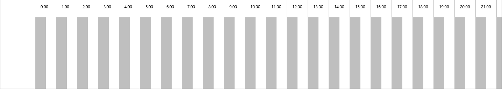
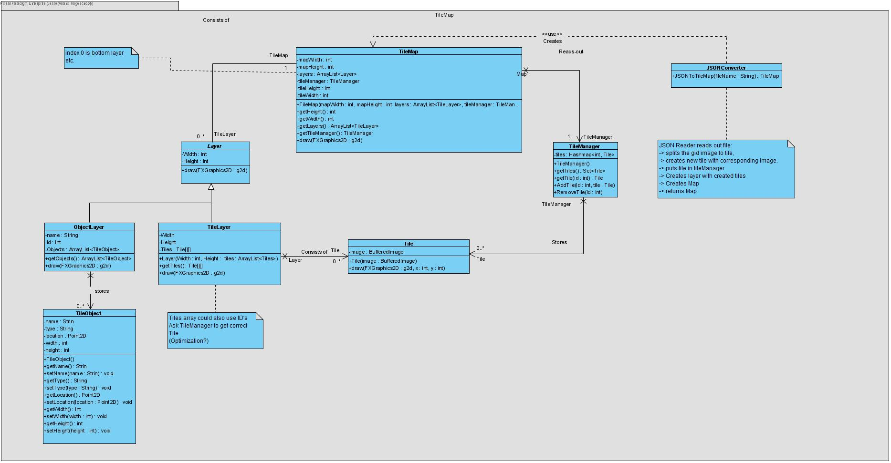
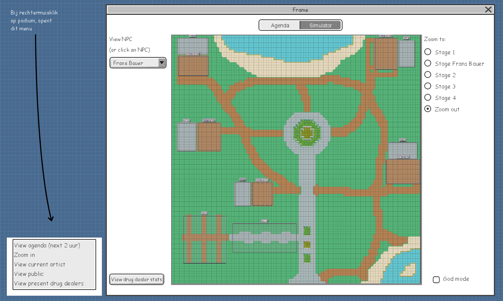

# Portfolio Individueel resultaat
### Teun Leenders 2171232 TI 1.3 A3

Alle ervaringen, meningen en standpunten in dit bestand zijn, waarbij niet anders vermeld, van de
auteur Teun Leenders. Dit portfolio bevat een wekelijkse reflectie van week 3 t/m 7 over mijn 
bijdrage aan de proftaak en de procesontwikkelingen hierbij.  
Verder komt er bij deze reflectie op het proces ook een reflectie op mijn technische en 
vakinhoudelijke bijdrage.   
Bij deze reflecties komen antwoorden op de volgende vragen aan bod.

   * Wat is de situatie (context)?
   * Welke keuzemogelijkheden heb je?
   * Welke keuze heb je gemaakt?
   * Waarom heb je deze keuze gemaakt?

Hiernaast komt er na de bovenstaande onderdelen een reflectie op de volgende stelling: "In het 
bedrijfsleven wordt gebruik gemaakt van JavaFX".

Tot slot volgt er een lijst met applicaties die gebruik maken van het JSON formaat. Inclusief een 
toelichting waarom ik denk dat JSON wordt gebruikt.

---
# Week 3
### Procesreflectie

Op dit punt in het project was het eerste deel, de agenda module bijna af, er moesten nog een paar 
dingetjes gebeuren. Jesse en ik zijn vooral bezig geweest met de AgendaCanvas. Hieraan wilden we een 
aantal functies toevoegen. De belangrijkste functies waren het netjes afdrukken van de agenda 
op het canvas het scrollen hierover.
Jesse en ik hebben hierbij alles samen gedaan. Dit vind ik achteraf gezien een goede keuze omdat we
door af te wisselen met programmeren langer door konden en sneller problemen op konden lossen. Hierdoor
ging het denkproces ook een stuk sneller.

### Vakinhoudelijke reflectie

Het belangrijkste waar we aan gewerkt hebben was het zoomen en het horizontaal en verticaal scrollen over het
FXGraphics Canvas. Het Canvas ziet er als volgt uit:

De tijden in dit canvas gingen van 00.00 uur tot 23.59. Hoe meer podia toegevoegd worden, hoe groter de agenda verticaal
wordt. Hier moest rekening mee gehouden worden om het navigeren door de agenda zo intuïtief mogelijk te maken.  
Qua ontwerp hebben we gekozen om met het scrollwiel verticaal te scrollen over het Canvas. Hiernaast kan er horizontaal 
gescrolld worden met shift + scrollwiel. Verder wordt het horizontaal zoomen gedaan met alt + scrollwiel. 

Het eerste probleem wat we tegenkwamen bij het implementeren van deze ideeën was het feit dat het mogelijk is om buiten de agenda
te scrollen. Dit is natuurlijk niet de bedoeling. De functie begint dus bij de volgende `cameraInBounds` methode.

    private boolean cameraInBounds(AffineTransform transform) {
        return (this.cameraTransform.getTranslateX() + transform.getTranslateX() <= 1 &&
                this.cameraTransform.getTranslateX() + transform.getTranslateX() >= -(this.endX - this.startX - this.canvas.getWidth()) &&
                this.cameraTransform.getTranslateY() + transform.getTranslateY() <= 1 &&
                this.cameraTransform.getTranslateY() + transform.getTranslateY() >= -(this.endY - this.startY - this.canvas.getHeight())
        );
    }

Deze methode wordt aangeroepen bij het transformeren van de Canvas met een AffineTransform. Deze AffineTransform wordt meegegeven
aan de methode. Vervolgens wordt er gecontroleerd of deze de camera met transform nog wel binnen de agenda blijft. Zo ja, geeft de methode
true terug, anders false.

De bovenstaande methode wordt gebruikt voor de kern van de functionaliteit, namelijk de setOnScroll die hieronder wordt weergegeven.
 
     private void setOnScroll(ScrollEvent scrollEvent) {
        AffineTransform transform = new AffineTransform();

        if (scrollEvent.isAltDown()) {
            double zoomFactor = 1 + (scrollEvent.getDeltaY()/1000);
            transform.scale(zoomFactor, 1);
            this.scale *= zoomFactor;
            this.cameraTransform.translate(-this.cameraTransform.getTranslateX(), -this.cameraTransform.getTranslateY());
        } else {
            double scrollPixelsY = scrollEvent.getDeltaY() / 1.5;
            double scrollPixelsX = scrollEvent.getDeltaX() / 1.5;
            transform.translate(scrollPixelsX, scrollPixelsY);
            if (cameraInBounds(transform)) {
                this.cameraTransform.translate(scrollPixelsX, scrollPixelsY);
            }
        }

        draw(new FXGraphics2D(this.canvas.getGraphicsContext2D()));
    }
   
Deze methode zorgt ervoor dat er middels een AffineTransform horizontaal gezoomd kan worden als alt ingedrukt is.
Dit gebeurt doordat een  `double zoomFactor = 1 + (scrollEvent.getDeltaY()/1000)` bepaald hoeveel er gezoomd moet worden.
Dit wordt vervolgens afgehandeld.

Als alt niet ingedrukt is wordt er gescrolld. Op dezelfde manier als het zoomen worden er 2 doubles `scrollPixelsY` en `scrollPixelsX`
aangemaakt. Hierin wordt ook rekening gehouden met de gevoeligheid door `scrollEvent.getDeltaY() / 1.5;` te gebruiken.
Als laatste wordt er rekening gehouden met de eerder besproken `cameraInBounds` methode.

---
Ik heb hier geleerd hoe ik op een nette manier, rekening houdend met eventuele bounds, over een FXGraphics Canvas kan navigeren.
Ik vind dat we na veel iteraties op het coderen goede effectieve methodes hebben geschreven en ben blij met dit resultaat.

--- 
# Week 4
### Procesreflectie

De applicatie bestaat uit twee delen. Enerzijds de *agenda* waarin het festival gepland wordt en anderzijds de *simulator* waarin de planning
vanuit de agena gesimuleerd wordt.  
De agenda is nu grotendeels af dus week stond in het teken van het ontwerpen van het simulator gedeelte. We hebben taken verdeeld voor het ontwerpen van
de simulator. Er moest een klassendiagram komen van de frontend (de GUI), een klassendiagram voor het uitlezen van de tilemaps en een klassendiagram voor 
de backend (de functionaliteiten) van de simulator. Tot slot was er ook een wireframe nodig van de GUI op dezelfde manier als we deze hebben opgesteld van 
de agenda in week 1.  

In de planning hebben we afgesproken dat Stijn, Jesse, Max en ik met zijn vieren het klassendiagram voor het uitlezen van de tilemaps zouden opstellen. 
Berend was deze week ziek dus we hebben hem niet ingepland. Verder hebben Max en ik de wireframe van de GUI opgesteld.

Achteraf was het een goede keuze om gezamelijk het klassendiagram van de tilemap op te stellen. De senior had ons in het college hier uitleg over gegeven 
maar het bleef een ingewikkeld onderwerp. Daarom was het fijn dat iedereen meedacht en hielp met het uitdenken van de structuur.  
Ook was het een goede keuze om samen met Max het wireframe op te stellen. Dit was achteraf best lastig omdat we nog niet goed wisten wat voor functies er 
in de simulator moesten komen. Om deze rede was het fijn om hier met zijn tweeën over na te denken.

### Vakinhoudelijke reflectie

We hebben deze week, op wat kleine bugfixes na, geen code geschreven. Daarentegen gaat het technische gedeelte nu over het modelleren van het volgende 
deel van ons programma.

Het klassendiagram over de tilemaps ziet er uit als volgt: 

Het inlezen begint bij de rechterkant van het klassendiagram in de JSONConverter. Deze klasse heeft één methode, `public TileMap JSONToTileMap(String fileName)`.
Zoals in de note in het klassendiagram te zien is, zorgt deze methode ervoor dat het meegegeven .json bestand de klasse omgezet wordt naar een TileMap.
Deze TileMap heeft onder anderen een lijst van Layers, bestaande uit de onderliggende klassen.

Na verschillende iteraties is dit het eindontwerp. Ik heb niet het gevoel dat we hier later iets aan hoeven te veranderen. Ik ben blij dat we wat extra moeite hebben
gestoken in het ontwerpen van deze klasse omdat dit een essentiele functie is om het programma te laten functioneren. Ook scheelt dit werk in de toekomst omdat deze 
klasse waarschijnlijk niet meer gerefactored hoeft te worden.

---
Verder hebben Max en ik een visueel ontwerp (wireframe) gemaakt van de GUI, deze ziet er als volgt uit:

Ik verwacht dat we hiervoor nog een nieuwe versie moeten maken als we meer weten over welke functies we in de GUI willen hebben en wat er mogelijk is.
Voorlopig kunnen we hier wel goed mee vooruit dus ik ben redelijk tevreden.

---
# Week 5
### Procesreflectie
Deze week begonnen we met het gezamelijk doornemen van de documentatie van het project. Berend had namelijk een aantal stukken belangrijke code 
geschreven waar iedereen van op de hoogte gebracht moest worden. Dit is verder goed verlopen en het is goed om te weten dat iedereen nu weet hoe
de code van het programma globaal in elkaar zit. Hierna was het eindelijk tijd om aan de simulator te beginnen. Het plan was er, er was al wat 
backend code geschreven dus we waren er klaar voor. Deze week hadden Jesse en ik een vergelijkbare taak gekregen met onze taak van week 3. De tilemap
kon namelijk al getekend worden maar hier kon nog niet over genavigeerd worden. Onze taak was dus het inzoomen, panning (horizontaal scrollen) en 
de camera over de tilemap laten bewegen. Het was goed om dit samen met Jesse te doen, de techniek hierachter was namelijk niet heel anders dan wat we 
in week 3 al geleerd hadden. 

### Vakinhoudelijke reflectie
Voor Jesse en mij was dit een vervolg op de uitdaging die we twee weken geleden hadden. Het navigeren over een Canvas. Dat ging dit keer ook een stuk 
soepeler dan de eerste keer natuurlijk. 

We begonnen met dezelfde `cameraInBounds` methode die we de vorige keer gebruikten. Deze methode hebben we wel wat aangepast om het zoomen te verbeteren.

    private boolean cameraInBounds(AffineTransform transform) {
        return ((this.cameraTransform.getTranslateX() + transform.getTranslateX()) / this.cameraTransform.getScaleX() <= 1 &&
                (this.cameraTransform.getTranslateX() + transform.getTranslateX()) / this.cameraTransform.getScaleX() >= -((this.endX - this.startX) - (this.canvas.getWidth() / this.cameraTransform.getScaleX())) &&
                (this.cameraTransform.getTranslateY() + transform.getTranslateY()) / this.cameraTransform.getScaleY() <= 1 &&
                (this.cameraTransform.getTranslateY() + transform.getTranslateY()) / this.cameraTransform.getScaleY() >= -((this.endY - this.startY) - (this.canvas.getHeight() / this.cameraTransform.getScaleY())) &&
                (this.cameraTransform.getScaleX() * transform.getScaleX()) < 4 &&
                (this.cameraTransform.getScaleX() * transform.getScaleX()) > 0.5
        );
    }

Verder hebben wij het scrollen geïmplementeerd door middel van een switch case. Ik weet dat het vaak niet slim is om een switch case te gebruiken maar voor dit geval leek dit mij de meest efficïente manier.
De methode staat hieronder beschreven.

    private void onWASD(KeyEvent keyEvent) {
        double verticalPixels = 0;
        double horizontalPixels = 0;

        switch (keyEvent.getCode()) {
            case UP:
            case W:
                verticalPixels = CAMERA_SPEED;
                break;
            case LEFT:
            case A:
                horizontalPixels = CAMERA_SPEED;
                break;
            case DOWN:
            case S:
                verticalPixels = -CAMERA_SPEED;
                break;
            case RIGHT:
            case D:
                horizontalPixels = -CAMERA_SPEED;
                break;
        }

        AffineTransform transform = new AffineTransform();
        transform.translate(horizontalPixels, verticalPixels);

        this.cameraTransform.translate(horizontalPixels, verticalPixels);
    }
    
Deze methode maakt het mogelijk om met de knoppen W, A, S en D te navigeren over de tilemap. Het enige wat hierbij niet is gelukt is het diagonaal over de tilemap bewegen. Dit komt doordat dit in de switch case juist lastig 
te realiseren is. De oplossing hiervoor blijft dus voorlopig het snel indrukken van twee verschillende knoppen.  
Hiernaast hebben we ook nog de mogelijkheid toegevoegd om met de muis de tilemap over het scherm te slepen. Hiervoor gebruikten we dezelfde techniek als we bij 2dGraphics geleerd hebben, dit is dus voor dit project niet heel interessant.
Het inzoomen hebben we verder op dezelfde manier gedaan als bij het `AgendaCanvas` alleen nu over beide assen tegelijk. 
Hieronder is een demonstratie te zien van het navigeren over de tilemap.

 
 
 

