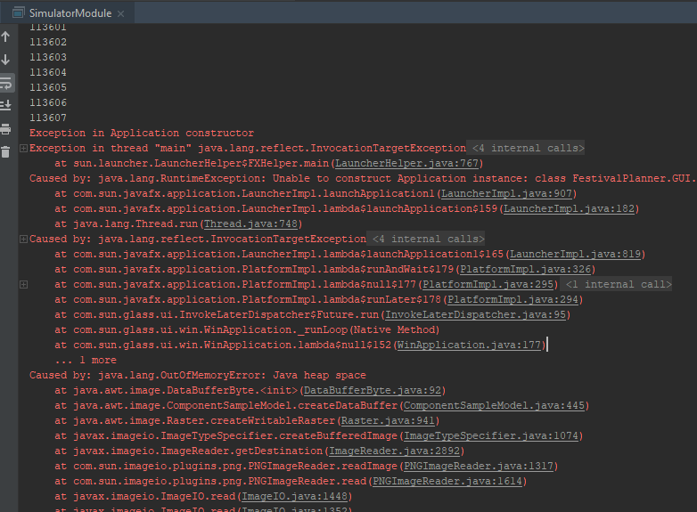

# Portfolio Individueel resultaat
### Teun Leenders 2171232 TI 1.3 A3

Alle ervaringen, meningen en standpunten in dit bestand zijn, waarbij niet anders vermeld, van de
auteur Teun Leenders. Dit portfolio bevat een wekelijkse reflectie van week 3 t/m 7 over mijn 
bijdrage aan de proftaak en de procesontwikkelingen hierbij. <br>
Verder komt er bij deze reflectie op het proces ook een reflectie op mijn technische en 
vakinhoudelijke bijdrage. <br> 
Bij deze reflecties komen antwoorden op de volgende vragen aan bod.

   * Wat is de situatie (context)?
   * Welke keuzemogelijkheden heb je?
   * Welke keuze heb je gemaakt?
   * Waarom heb je deze keuze gemaakt?

Hiernaast komt er na de bovenstaande onderdelen een reflectie op de volgende stelling: "In het 
bedrijfsleven wordt gebruik gemaakt van JavaFX".

Tot slot volgt er een lijst met applicaties die gebruik maken van het JSON formaat. Inclusief een 
toelichting waarom ik denk dat JSON in de benoemde gevallen wordt gebruikt.

---
# Week 3
### Procesreflectie

Op dit punt in het project was het eerste deel, de agenda module bijna af, er moesten nog een paar 
dingetjes gebeuren. Jesse en ik zijn vooral bezig geweest met de AgendaCanvas. Hieraan wilden we een 
aantal functies toevoegen. De belangrijkste functies waren het netjes afdrukken van de agenda 
op het canvas het scrollen hierover.
Jesse en ik hebben hierbij alles samen gedaan. Dit vind ik achteraf gezien een goede keuze omdat we
door af te wisselen met programmeren langer door konden en sneller problemen op konden lossen. Hierdoor
ging het denkproces ook een stuk sneller.

### Vakinhoudelijke reflectie

Het belangrijkste waar we aan gewerkt hebben was het zoomen en het horizontaal en verticaal scrollen over het
FXGraphics Canvas. Het Canvas ziet er als volgt uit:


De tijden in dit canvas gingen van 00.00 uur tot 23.59. Hoe meer podia toegevoegd worden, hoe groter de agenda verticaal
wordt. Hier moest rekening mee gehouden worden om het navigeren door de agenda zo intuïtief mogelijk te maken. <br>
Qua ontwerp hebben we gekozen om met het scrollwiel verticaal te scrollen over het Canvas. Hiernaast kan er horizontaal 
gescrolld worden met shift + scrollwiel. Verder wordt het horizontaal zoomen gedaan met alt + scrollwiel. 

Het eerste probleem wat we tegenkwamen bij het implementeren van deze ideeën was het feit dat het mogelijk is om buiten de agenda
te scrollen. Dit is natuurlijk niet de bedoeling. De functie begint dus bij de volgende `cameraInBounds` methode.

    private boolean cameraInBounds(AffineTransform transform) {
        return (this.cameraTransform.getTranslateX() + transform.getTranslateX() <= 1 &&
                this.cameraTransform.getTranslateX() + transform.getTranslateX() >= -(this.endX - this.startX - this.canvas.getWidth()) &&
                this.cameraTransform.getTranslateY() + transform.getTranslateY() <= 1 &&
                this.cameraTransform.getTranslateY() + transform.getTranslateY() >= -(this.endY - this.startY - this.canvas.getHeight())
        );
    }

Deze methode wordt aangeroepen bij het transformeren van de Canvas met een AffineTransform. Deze AffineTransform wordt meegegeven
aan de methode. Vervolgens wordt er gecontroleerd of deze de camera met transform nog wel binnen de agenda blijft. Zo ja, geeft de methode
true terug, anders false.

De bovenstaande methode wordt gebruikt voor de kern van de functionaliteit, namelijk de setOnScroll die hieronder wordt weergegeven.
 
     private void setOnScroll(ScrollEvent scrollEvent) {
        AffineTransform transform = new AffineTransform();

        if (scrollEvent.isAltDown()) {
            double zoomFactor = 1 + (scrollEvent.getDeltaY()/1000);
            transform.scale(zoomFactor, 1);
            this.scale *= zoomFactor;
            this.cameraTransform.translate(-this.cameraTransform.getTranslateX(), -this.cameraTransform.getTranslateY());
        } else {
            double scrollPixelsY = scrollEvent.getDeltaY() / 1.5;
            double scrollPixelsX = scrollEvent.getDeltaX() / 1.5;
            transform.translate(scrollPixelsX, scrollPixelsY);
            if (cameraInBounds(transform)) {
                this.cameraTransform.translate(scrollPixelsX, scrollPixelsY);
            }
        }

        draw(new FXGraphics2D(this.canvas.getGraphicsContext2D()));
    }
   
Deze methode zorgt ervoor dat er middels een AffineTransform horizontaal gezoomd kan worden als alt ingedrukt is.
Dit gebeurt doordat een  `double zoomFactor = 1 + (scrollEvent.getDeltaY()/1000)` bepaald hoeveel er gezoomd moet worden.
Dit wordt vervolgens afgehandeld.

Als alt niet ingedrukt is wordt er gescrolld. Op dezelfde manier als het zoomen worden er 2 doubles `scrollPixelsY` en `scrollPixelsX`
aangemaakt. Hierin wordt ook rekening gehouden met de gevoeligheid door `scrollEvent.getDeltaY() / 1.5;` te gebruiken.
Als laatste wordt er rekening gehouden met de eerder besproken `cameraInBounds` methode.

---
Ik heb hier geleerd hoe ik op een nette manier, rekening houdend met eventuele bounds, over een FXGraphics Canvas kan navigeren.
Ik vind dat we na veel iteraties op het coderen goede effectieve methodes hebben geschreven en ben blij met dit resultaat.

--- 
# Week 4
### Procesreflectie

De applicatie bestaat uit twee delen. Enerzijds de *agenda* waarin het festival gepland wordt en anderzijds de *simulator* waarin de planning
vanuit de agena gesimuleerd wordt. <br>
De agenda is nu grotendeels af dus week stond in het teken van het ontwerpen van het simulator gedeelte. We hebben taken verdeeld voor het ontwerpen van
de simulator. Er moest een klassendiagram komen van de frontend (de GUI), een klassendiagram voor het uitlezen van de tilemaps en een klassendiagram voor 
de backend (de functionaliteiten) van de simulator. Tot slot was er ook een wireframe nodig van de GUI op dezelfde manier als we deze hebben opgesteld van 
de agenda in week 1. <br>

In de planning hebben we afgesproken dat Stijn, Jesse, Max en ik met zijn vieren het klassendiagram voor het uitlezen van de tilemaps zouden opstellen. 
Berend was deze week ziek dus we hebben hem niet ingepland. Verder hebben Max en ik de wireframe van de GUI opgesteld.

Achteraf was het een goede keuze om gezamelijk het klassendiagram van de tilemap op te stellen. De senior had ons in het college hier uitleg over gegeven 
maar het bleef een ingewikkeld onderwerp. Daarom was het fijn dat iedereen meedacht en hielp met het uitdenken van de structuur. <br>
Ook was het een goede keuze om samen met Max het wireframe op te stellen. Dit was achteraf best lastig omdat we nog niet goed wisten wat voor functies er 
in de simulator moesten komen. Om deze rede was het fijn om hier met zijn tweeën over na te denken.


### Vakinhoudelijke reflectie

We hebben deze week, op wat kleine bugfixes na, geen code geschreven. Daarentegen gaat het technische gedeelte nu over het modelleren van het volgende 
deel van ons programma.

Het klassendiagram over de tilemaps ziet er uit als volgt: 


Het inlezen begint bij de rechterkant van het klassendiagram in de JSONConverter. Deze klasse heeft één methode, `public TileMap JSONToTileMap(String fileName)`.
Zoals in de note in het klassendiagram te zien is, zorgt deze methode ervoor dat het meegegeven .json bestand de klasse omgezet wordt naar een TileMap.
Deze TileMap heeft onder anderen een lijst van Layers, bestaande uit de onderliggende klassen.

Na verschillende iteraties is dit het eindontwerp. Ik heb niet het gevoel dat we hier later iets aan hoeven te veranderen. Ik ben blij dat we wat extra moeite hebben
gestoken in het ontwerpen van deze klasse omdat dit een essentiele functie is om het programma te laten functioneren. Ook scheelt dit werk in de toekomst omdat deze 
klasse waarschijnlijk niet meer gerefactored hoeft te worden.

---
Verder hebben Max en ik een visueel ontwerp (wireframe) gemaakt van de GUI, deze ziet er als volgt uit:


Ik verwacht dat we hiervoor nog een nieuwe versie moeten maken als we meer weten over welke functies we in de GUI willen hebben en wat er mogelijk is.
Voorlopig kunnen we hier wel goed mee vooruit dus ik ben redelijk tevreden.

---
# Week 5
### Procesreflectie
Deze week begonnen we met het gezamelijk doornemen van de documentatie van het project. Berend had namelijk een aantal stukken belangrijke code 
geschreven waar iedereen van op de hoogte gebracht moest worden. Dit is verder goed verlopen en het is goed om te weten dat iedereen nu weet hoe
de code van het programma globaal in elkaar zit. Hierna was het eindelijk tijd om aan de simulator te beginnen. Het plan was er, er was al wat 
backend code geschreven dus we waren er klaar voor. Deze week hadden Jesse en ik een vergelijkbare taak gekregen met onze taak van week 3. De tilemap
kon namelijk al getekend worden maar hier kon nog niet over genavigeerd worden. Onze taak was dus het inzoomen, panning (horizontaal scrollen) en 
de camera over de tilemap laten bewegen. Het was goed om dit samen met Jesse te doen, de techniek hierachter was namelijk niet heel anders dan wat we 
in week 3 al geleerd hadden. 

### Vakinhoudelijke reflectie
Voor Jesse en mij was dit een vervolg op de uitdaging die we twee weken geleden hadden. Het navigeren over een Canvas. Dat ging dit keer ook een stuk 
soepeler dan de eerste keer natuurlijk. 

We begonnen met dezelfde `cameraInBounds` methode die we de vorige keer gebruikten. Deze methode hebben we wel wat aangepast om het zoomen te verbeteren.

    private boolean cameraInBounds(AffineTransform transform) {
        return ((this.cameraTransform.getTranslateX() + transform.getTranslateX()) / this.cameraTransform.getScaleX() <= 1 &&
                (this.cameraTransform.getTranslateX() + transform.getTranslateX()) / this.cameraTransform.getScaleX() >= -((this.endX - this.startX) - (this.canvas.getWidth() / this.cameraTransform.getScaleX())) &&
                (this.cameraTransform.getTranslateY() + transform.getTranslateY()) / this.cameraTransform.getScaleY() <= 1 &&
                (this.cameraTransform.getTranslateY() + transform.getTranslateY()) / this.cameraTransform.getScaleY() >= -((this.endY - this.startY) - (this.canvas.getHeight() / this.cameraTransform.getScaleY())) &&
                (this.cameraTransform.getScaleX() * transform.getScaleX()) < 4 &&
                (this.cameraTransform.getScaleX() * transform.getScaleX()) > 0.5
        );
    }

Verder hebben wij het scrollen geïmplementeerd door middel van een switch case. Ik weet dat het vaak niet slim is om een switch case te gebruiken maar voor dit geval leek dit mij de meest efficïente manier.
De methode staat hieronder beschreven.

    private void onWASD(KeyEvent keyEvent) {
        double verticalPixels = 0;
        double horizontalPixels = 0;

        switch (keyEvent.getCode()) {
            case UP:
            case W:
                verticalPixels = CAMERA_SPEED;
                break;
            case LEFT:
            case A:
                horizontalPixels = CAMERA_SPEED;
                break;
            case DOWN:
            case S:
                verticalPixels = -CAMERA_SPEED;
                break;
            case RIGHT:
            case D:
                horizontalPixels = -CAMERA_SPEED;
                break;
        }

        AffineTransform transform = new AffineTransform();
        transform.translate(horizontalPixels, verticalPixels);

        this.cameraTransform.translate(horizontalPixels, verticalPixels);
    }
    
Deze methode maakt het mogelijk om met de knoppen W, A, S en D te navigeren over de tilemap. Het enige wat hierbij niet is gelukt is het diagonaal over de tilemap bewegen. Dit komt doordat dit in de switch case juist lastig 
te realiseren is. De oplossing hiervoor blijft dus voorlopig het snel indrukken van twee verschillende knoppen. <br>
Hiernaast hebben we ook nog de mogelijkheid toegevoegd om met de muis de tilemap over het scherm te slepen. Hiervoor gebruikten we dezelfde techniek als we bij 2dGraphics geleerd hebben, dit is dus voor dit project niet heel interessant.
Het inzoomen hebben we verder op dezelfde manier gedaan als bij het `AgendaCanvas` alleen nu over beide assen tegelijk.<br>
Hieronder is een demonstratie te zien van het navigeren over de tilemap.


---
# Week 6
### Procesreflectie
Aan het begin van de vergadering gaf Berend aan dat hij wat minder aanwezig zou zijn bij projectwerk vanwege privéomstandigheden. Als evaluator vind ik niet dat dit slechte gevolgen heeft voor het project. Het werk van Berend was de 
afgelopen weken namelijk niet zo goed uitgebalanceerd. Het is in mijn ogen dus niet erg voor het project dat hij nu wat minder beschikbaar is.

Deze week stond verder in het teken van pathfinding; de NPC's (bezoekers) moeten over de paden de snelste weg naar een doel locatie kunnen vinden. Ik vond dat ik de afgelopen weken niet al te veel aan code in het programma geschreven had 
en ik heb dus voorafgaand aan het plannen aangegeven dat ik wel bereid was om wat meer werk op mezelf te nemen. <br>
Deze week heb ik mij, naast het oplossen van wat andere bugs, vooral bezig gehouden met het implementeren van de pathfinding voor NPC's samen met Jason en Jesse.

### Vakinhoudelijke reflectie
Ik heb niet het grootste deel geschreven aan code voor pathfinding, dat deed Jesse samen met Jason. Ik ben vooral bezig geweest met het goed uitlezen van de tilemaps. Met de tilemap komt namelijk een pathlayer mee. Deze pathlayer beschrijft 
waar de paden zijn op de tilemap. Over deze layer moeten dus locaties kunnen worden opgevraagd. Deze functie heb ik geïmplementeerd in de TileMap klasse.

Verder heb ik geholpen met de kern methode van de pathfinding. Deze staat hieronder beschreven.

    public Point2D getNextDirection(Point2D currentPoint) {
        Point toPoint = this.pathMap[(int)Math.floor(currentPoint.getY() / collisionLayer.getTileHeight())][(int)Math.floor(currentPoint.getX() / collisionLayer.getTileWidth())];
        if (toPoint == null) {
            toPoint = this.pathMap[(int)Math.floor(this.location.getX() / collisionLayer.getTileWidth())]
                    [(int)Math.floor(this.location.getY() / collisionLayer.getTileHeight())];
        }

        return new Point2D.Double(toPoint.x, toPoint.y);
    }

Deze methode geeft het volgende punt op de tilemap aan een NPC waar deze naartoe moet lopen. Deze methode wordt dus iedere stap aangeroepen. Dit zorgt ervoor dat de NPC's het kortste pad kiezen naar hun `targetObject`.

Als laatste heb ik gekeken naar optimalisaties bij het lopen van de NPC's. Dit heb ik samen met Max gedaan door middel van een stresstest. We hebben de collision uitgezet en gekeken hoeveel NPC's we konden laten lopen tegelijk.
Bij het testen hiervan waren we positief verrast over het aantal NPC's dat tegelijk kan lopen. De tilemap zit eerder vol dan dat je performance issues ervaart. Wel kwamen we erachter dat het opstarten, naarmate er meer NPC's werden
gespawned, steeds langer duurde. In de onderstaande afbeelding is te zien dat het erg veel RAM geheugen kost om een groot aantal NPC's te laden.



Later zijn we er in het senior gesprek achtergekomen dat dit kwam doordat de sprites (afbeeldingen) van de NPC's iedere keer opnieuw werden geladen. Ik ben van plan dit op te lossen door het inladen van de sprites te verplaatsen
naar een statische klasse en dit dus maar één keer te doen en vervolgens door te verwijzen naar de ingeladen afbeelding.

---
# Week 7
### Procesreflectie
Deze week was het tutorgesprek niet verplicht. Deze hebben we daarentegen wel zelfstandig gevoerd en daar ben ik blij mee. Dit zorgt ervoor dat iedereen de juiste focus vasthoudt, op de hoogte is en goed aan de slag kan. <br>
Allereerst moest het PVA ingeleverd worden dus dit hebben we direct na de vergadering doorgelezen en hier heb ik nog wat verbeteringen bij aangebracht. 

Verder had deze week een aantal taken gekregen tijdens de planning. Op dit punt spawnden de NPC's op willekeurige plekken over de hele tilemap. Dit moest gebeuren bij de ingang. Het was mijn taak om ervoor te zorgen dat de bezoekers 
bij de ingang verschijnen, maar niet allemaal op exact dezelfde plek. Ook moest ik nog het vastgestelde probleem oplossen van het inladen van de sprites. Dit is ook bij de vergadering besproken en ik heb de taak gekregen om dit te regelen.

Achteraf was het laatste veel meer werk dan gedacht. Ik heb het uiteindelijk wel in mijn eentje kunnen regelen maar met meer pijn en moeite dan ik gewild zou hebben. Dit had ik liever samen met iemand gedaan.

### Vakinhoudelijke reflectie
##### NPC spawn
Het spawnen van de NPC's heb ik opgelost door het spawnen op te splitsen in twee methoden.

    private void setupNPC(double timePast) {

        this.currentNPCSpawnTime -= timePast;

        if (this.currentNPCSpawnTime < 0) {
            if (this.npcList.size() < this.NPCAmount) {
                spawnNPC();
            }
            this.currentNPCSpawnTime = this.NPC_SPAWN_TIME;
        }

    }

Hierboven staat de eerste methode `setupNPC`. Deze wacht tot de spawntime voorbij is en als er nog niet voldoende NPC's zijn, roept deze de methode `spawnNPC` aan. Deze staat hieronder beschreven.

    private void spawnNPC() {
        Random r = new Random();
        Point2D location = new Point2D.Double(this.spawn.location.getX() + Math.random() * this.spawn.width, this.spawn.location.getY() + Math.random() * this.spawn.height);
        NPC npc = new NPC(location, r.nextInt(NPC.getCharacterFiles()));
        npc.setGameSpeed(this.speed);
        if (!npc.checkCollision(this.allNPCList)) {
            this.npcList.add(npc);
            this.allNPCList.add(npc);
        }
    }

Deze methode doet het meeste werk. Eerst wordt de locatie bepaald. Deze is op een random locatie binnen de uitgelezen spawn. Voordat ik dit kon doen, moest ik eerst in de tilemap aangeven waar de spawn was
en hier een layer van maken. Als de locatie verkregen is, wordt er een nieuwe NPC aangemaakt. Deze krijgt de locatie mee en een random sprite. Vervolgens krijgt de NPC een snelheid meegegeven en de NPC wordt 
toegevoegd als deze niet in de weg staat bij anderen. Achteraf gezien is het misschien niet heel efficiënt om deze collision check als laatst te doen.

Het kostte mij niet al te veel moeite om dit in mijn eentje op te lossen en ik ben ook blij met de manier waarop ik het heb aangepakt.

##### Sprite Images laden
Mijn andere taak was om ervoor te zorgen dat de sprites niet steeds opnieuw geladen moesten worden. Dit heb ik als volgt aangepakt.

Ik heb de klasse ImageLoader aangemaakt. Deze heeft de volgende statische methode.

    public static void loadImages() {
        for (int i = 0, characterFilesLength = characterFiles.length; i < characterFilesLength; i++) {
            String characterFile = characterFiles[i];

            ArrayList<ArrayList<BufferedImage>> allFourSpriteSheets = new ArrayList<>(4);

            try {
                BufferedImage image = ImageIO.read(ImageLoader.class.getResourceAsStream("/characters/" + characterFile + ".png"));

                //Initialise values.
                ArrayList<BufferedImage> spritesLeft = new ArrayList<>(4);
                ArrayList<BufferedImage> spritesDown = new ArrayList<>(4);
                ArrayList<BufferedImage> spritesUp = new ArrayList<>(4);
                ArrayList<BufferedImage> spritesRight = new ArrayList<>(4);

                //Calculate width and height per sprite / tile.
                int width = image.getWidth() / npcTileX;
                int height = image.getHeight() / npcTileY;

                //Split up the images.
                splitImages(image, spritesLeft, 0, width, height);
                splitImages(image, spritesDown, 1, width, height);
                splitImages(image, spritesUp, 2, width, height);
                splitImages(image, spritesRight, 3, width, height);

                //Add the images to the ArrayList.
                allFourSpriteSheets.add(spritesLeft);
                allFourSpriteSheets.add(spritesDown);
                allFourSpriteSheets.add(spritesUp);
                allFourSpriteSheets.add(spritesRight);

                lists[i] = allFourSpriteSheets;
            } catch (IOException e) {
                AbstractDialogPopUp.showExceptionPopUp(e);
            }
        }
    }

Het moeilijke aan dit probleem was het feit dat er vier ArrayLists gemaakt moesten worden. De rede dat het langer duurde dan ik had gewild was dat doordat ik moest eindigen met vier lijsten van vier spritesheets. Dit maakte het zo ingewikkeld voor mij 
dat het probleem lastig te overzien was. In mijn ogen is er achteraf gezien geen andere of betere manier om het door mij gestelde doel te bereiken.

De volgende keer kan ik in ieder geval twee dingen anders doen. Ten eerste, zoals ik al eerder vermeld had, was het beter als ik hier met iemand anders aan gewerkt had. Dit zorgt ervoor dat ik het overzicht beter had kunnen bewaren en samen een beter
plan had kunnen uitdenken. Het gaat natuurlijk niet altijd het geval zijn dat ik de hulp van iemand anders kan inroepen om een functie te bouwen. Daarom is het tweede verbeterpunt het uitwerken van een plan vooraf. Ik weet van mijzelf bij andere dingen dat ik 
er baat bij heb als ik voor het uitvoeren een plan bedenk en dat uit ga werken op papier of digitaal. Hierdoor bewaar ik makkelijker het overzicht. Zo'n plan had ik hier ook beter op kunnen stellen en uit kunnen werken in bijvoorbeeld Visual Paradigm.

De klasse heeft verder de methode splitImages en getLists, maar omdat ik aan splitImages niks veranderd heb en getLists automatisch te genereren is, verwerk ik deze niet verder in mijn reflectie. <br>

---
# Stelling: "In het bedrijfsleven wordt gebruik gemaakt van JavaFx"
Het is uiteraard onbetwistbaar dat deze stelling waar is. JavaFx wordt namelijk gebruikt in het bedrijfsleven, dat is een simpel antwoord. <br>
Gelukkig kunnen we op deze stelling ook een genuanceerder antwoord geven. We kunnen namelijk antwoord geven op de volgende vragen.

### Is JavaFx populair in het bedrijfsleven?
Er is één ding zeker over deze vraag, het is namelijk niet het populairste UI framework. Swing is een veel populairder framework dan JavaFx maar dat wil niet zeggen dat Swing altijd beter is. Swing wordt vaker gebruikt en wordt ook ondersteund door meer Java
versies dan JavaFx. Ook is Swing erg snel en veel mensen zijn er fan van. Daarentegen vinden mensen JavaFx over het algemeen makkelijker om te leren. Het grote voordeel is dat deze twee frameworks te combineren zijn als er de juiste Java versie wordt gebruikt.
Dit is dus volgens veel mensen om desktop programming te doen. Over web programming hebben we het in deze reflectie niet omdat dit niet gedaan kan worden met JavaFx.

Hoe populair het framework is, is dus lastig te zeggen. Onder [deze](https://jaxenter.com/20-javafx-real-world-applications-123653.html) link is een lijst met JavaFx programma's te vinden. Dit kan een beter idee geven van de populariteit.


### Wat zijn de meningen over JavaFx?
Zoals te verwachten, zijn de meningen erg verdeeld. Sommige mensen vinden dat JavaFx een uitgestorven framework is en de industrie niet gehaald heeft. Dit komt vaak doordat de ontwikkeling van JavaFx lang heeft geduurd en omdat de uiteindelijke versie niet helemaal
aan de gegeven beloftes voldoet. Aan de andere kant zijn mensen helemaal weg van JavaFx, het is gemakkelijk te leren, werkt op desktop op zowel Windows als op Mac en Linux en het is ook nog eens te combineren met Swing. <br>
Het is dus duidleijk dat de meningen er behoorlijk over verschillen. Wel is het een feit dat, wat je mening over JavaFx ook is, er zijn absoluut succesvolle programma's geschreven met JavaFx. 

---
# JSON
Hier volgt een lijst met applicaties die gebruik maken van het JSON formaat, inclusief onderbouwing waarom deze het JSON formaat gebruiken.

#### Google Maps
De Google Maps API maakt gebruik van het .json formaat om bijvoorbeeld markers op te slaan. Het .json bestand ziet er als volgt uit.

````java
{
  "markers": [
    {
      "name": "Rixos The Palm Dubai",
      "position": [25.1212, 55.1535],
    },
    {
      "name": "Shangri-La Hotel",
      "location": [25.2084, 55.2719]
    },
    {
      "name": "Grand Hyatt",
      "location": [25.2285, 55.3273]
    }
  ]
}
````

Ik denk dat Google Maps voor dit doeleinde JSON bestanden gebruikt om twee redenen. De eerste rede is dat het makkelijk is om met dit soort bestanden te werken. Ze zijn makkelijk om te genereren, bewerken en op te slaan. Ideaal voor een database of API.
De andere rede is dat deze .json bestanden makkelijk te verwerken zijn in een HTML script.

### YouTube
Een groot deel van de data(op de video's zelf na) die opgeslagen wordt door YouTube, wordt opgeslagen in JSON files. Dit komt doordat YouTube helemaal geen ingewikkelde data gebruikt. Waar het hier om gaat zijn search queries, id's en tags. De manier waarop
JSON om kan gaan met dit soort data is ideaal voor YouTube.

### Tiled
Deze hoort uiteraard ook in de lijst. Tiled maakt intensief gebruik van het JSON formaat om tilemaps op te slaan. Het programma kan haar tilemaps ook in andere formaten opslaan zoals .xml maar er is een goede rede dat JSON een optie is.
Deze rede zijn wij natuurlijk zelf. Het is ons gelukt om een tilemap te laden vanuit een JSON bestand en hier allerlei gave dingen mee te doen. 


